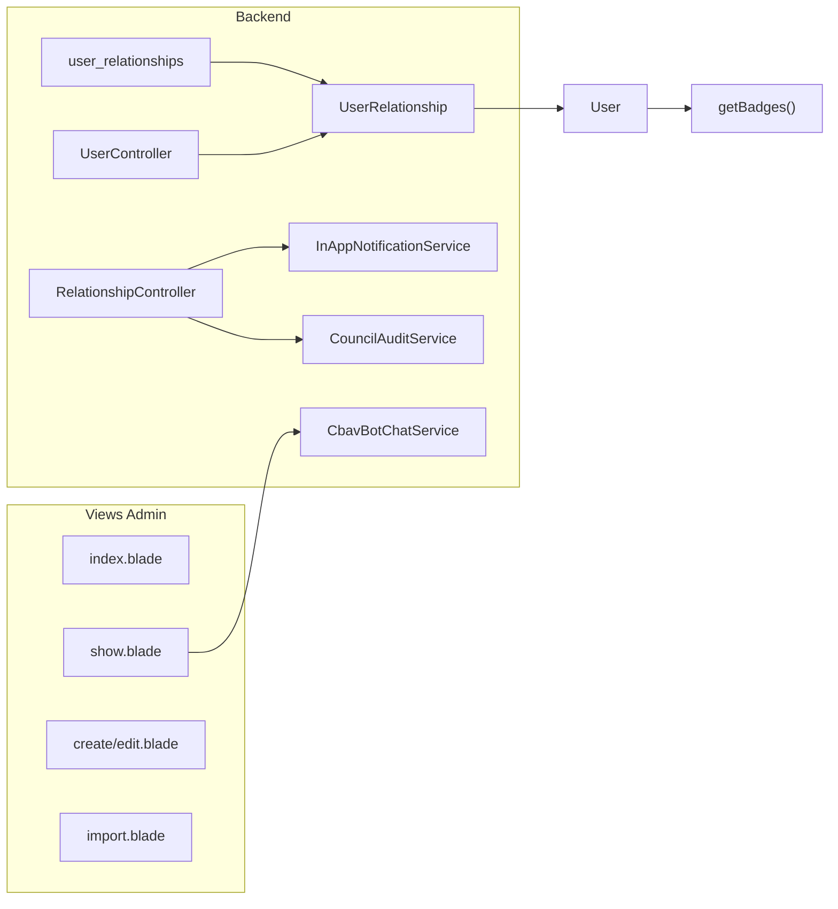

# PROJETO: Upgrade "Family Tree" & User Management Premium - VertexCBAV
# OBJETIVO: Implementar sistema de parentesco profissional, visual e seguro nas views de Users.

Atue como Engenheiro de Software Sênior. Quero um upgrade de ponta a ponta no gerenciamento de membros (`Modules\Admin\resources\views\users`), transformando o perfil estático em um hub de relacionamentos familiares.

## 1. Estrutura de Dados (Backend)
- Crie a migração `user_relationships`: `user_id`, `related_user_id` (nullable), `related_name` (string, para não-membros), `relationship_type` (pai, mãe, cônjuge, filho, irmão, etc), e `status` (pending, accepted, rejected).
- Implemente a lógica de **Convite de Parentesco**: Quando o Usuário A marca o Usuário B como "Pai", o Usuário B recebe uma notificação via `InAppNotificationService` para aceitar ou recusar o vínculo.

## 2. Refinamento das Views (Frontend Premium)

### index.blade.php (Lista de Membros)
- Adicione uma coluna discreta "Família" que mostra ícones de quantos parentes o membro tem vinculados.
- Melhore a estética da tabela usando o padrão "Awesome" com avatares circulares e badges de status modernos.

### show.blade.php (O Xodó: Perfil do Membro)
- Crie uma nova aba **"Família & Relacionamentos"**.
- Design: Use um layout de "Cards de Família" ou uma estrutura de árvore simples.
- Cada card deve mostrar a foto do parente, o grau de parentesco e se o vínculo está "Confirmado" ou "Pendente".
- Se o parente for membro, o nome deve ser um link para o perfil dele.

### create.blade.php & edit.blade.php (Cadastro Inteligente)
- Adicione uma seção "Vínculos Familiares" com funcionalidade dinâmica (Add More via JS/Alpine).
- Permita:
    1. Buscar membros existentes por nome/CPF para vincular.
    2. Digitar o nome manualmente (caso não seja membro).
- Use `select2` ou um componente de busca em tempo real para o campo de busca de membros.

### import.blade.php (Importação em Lote)
- Refine a interface de importação para ser mais intuitiva, com progresso visual e tratamento de erros claro.

## 3. Integrações e UX
- **Notifications:** Integre o aceite de parentesco no motor de notificações. Ao aceitar, gere um log no `CouncilAuditService` (Mudança de composição familiar).
- **Gamification:** Atribua pontos ou badges (ex: "Família Unida") quando um núcleo familiar completo estiver cadastrado e confirmado.
- **Bot Elias:** Adicione um botão "Análise de Árvore" onde o Elias explica ao Admin a composição daquela família ou sugere vínculos faltantes (ex: detectando sobrenomes iguais).

## Instruções Técnicas:
1. Use `Modules\Notifications` para o fluxo de aceite.
2. Aplique as melhores práticas de Laravel 12 e Tailwind CSS.
3. Garanta que o botão "Salvar" tenha o `<x-loading-overlay />`.
4. Mantenha o design coerente com o `system_default.md`.

------------- PLANO DE IMPLEMENTAÇÃO -------------
# Family Tree User Management Upgrade
 'Upgrade ponta a ponta do gerenciamento de membros no Admin: nova estrutura de dados de parentesco (user_relationships), fluxo de convite com notificações e aceite, refinamento das views (index com coluna Família, show com aba Família e Relacionamentos, create/edit com vínculos dinâmicos), import com progresso e erros, integrações com Notifications, CouncilAudit, Gamification e botão "Análise de Árvore" do Elias.'

# Family Tree & User Management Premium - VertexCBAV

## Visão geral da arquitetura

---

## 1. Estrutura de dados (backend)

### 1.1 Migração `user_relationships`

- **Arquivo:** nova migração em `database/migrations/` (ou em `Modules/Admin/database/migrations/` se o módulo tiver migrations próprias; o projeto usa migrações na raiz).
- **Tabela:** `user_relationships`
  - `id` (bigInteger, PK)
  - `user_id` (foreignId → users, index, onDelete cascade) — quem criou o vínculo / "dono" do relacionamento
  - `related_user_id` (foreignId → users, nullable, index, onDelete cascade) — membro vinculado (null = não-membro)
  - `related_name` (string, nullable) — nome quando não é membro
  - `relationship_type` (string, index) — enum: `pai`, `mae`, `conjuge`, `filho`, `irmao`, `outro` (ou equivalente; pode ser enum/const no model)
  - `status` (string, default `pending`) — `pending`, `accepted`, `rejected`
  - `invited_by` (foreignId → users, nullable) — quem enviou o convite (pode ser o próprio user_id em fluxo admin)
  - `timestamps`
- **Constraints:** unique `(user_id, related_user_id, relationship_type)` quando `related_user_id` não nulo; evitar duplicata do mesmo tipo com o mesmo membro. Para não-membros, considerar unique `(user_id, related_name, relationship_type)` ou permitir múltiplos "outro" e tratar no app.

### 1.2 Model e relacionamentos

- **Model:** `App\Models\UserRelationship` (ou `Modules\Admin\App\Models\UserRelationship` se manter tudo no Admin).
  - Fillable: `user_id`, `related_user_id`, `related_name`, `relationship_type`, `status`, `invited_by`.
  - Relações: `user()` → belongsTo User, `relatedUser()` → belongsTo User (nullable), `invitedBy()` → belongsTo User (nullable).
  - Scopes: `accepted()`, `pending()`.
  - Casts: opcional para enums se usar PHP 8.1+.
- **User ([app/Models/User.php](../../../../../../../../Users/Administrator/.cursor/plans/app/Models/User.php)):** adicionar `relationships()` hasMany(UserRelationship::class) e helper `getFamilyCount()` (count de relacionamentos accepted + pending para exibir na index).

### 1.3 Convite de parentesco e notificações

- **Fluxo:** Quando Admin ou Usuário A define Usuário B como "Pai" (ou outro tipo) com `related_user_id` preenchido e status `pending`:
  1. Criar/atualizar registro em `user_relationships`.
  2. Chamar `InAppNotificationService::sendToUser($relatedUser, ...)` com título/mensagem do tipo "Fulano te marcou como Pai" e opções:
  - `action_url`: rota para aceitar/recusar (ex.: MemberPanel ou Admin: `route('admin.users.relationships.accept', $rel)` e `route('admin.users.relationships.reject', $rel)`).
  - `action_text`: "Ver e responder".
  - `notification_type`: ex. `family_relationship_invite` (para agrupar se desejado).
- **Aceitar/Recusar:** novas rotas e métodos em um controller dedicado (ex.: `UserRelationshipController` no Admin):
  - `POST admin/users/relationships/{userRelationship}/accept` e `.../reject`.
  - Ao aceitar: atualizar `status` para `accepted`; opcionalmente chamar `CouncilAuditService::log('family_relationship_accepted', $userRelationship, ['user_id' => ..., 'related_user_id' => ...])` (o serviço espera um Model; usar o próprio `UserRelationship` como entidade em [Modules/ChurchCouncil/app/Services/CouncilAuditService.php](../../../../../../../../Users/Administrator/.cursor/plans/Modules/ChurchCouncil/app/Services/CouncilAuditService.php)).
  - Ao recusar: atualizar para `rejected`; notificar quem convidou (opcional).
- **Segurança:** apenas o `related_user` (ou admin) pode aceitar/recusar; validar no controller.

---

## 2. Refinamento das views (frontend premium)

### 2.1 index.blade.php ([Modules/Admin/resources/views/users/index.blade.php](../../../../../../../../Users/Administrator/.cursor/plans/Modules/Admin/resources/views/users/index.blade.php))

- Adicionar coluna **"Família"** (discreta): ícone(s) com contagem de vínculos (ex.: `<x-icon name="people-group" />` + badge com número). Usar `$user->getFamilyCount()` (ou relação `relationships()->count()`). Manter coluna compacta.
- Ajustes de estilo "Awesome": tabela já usa avatares e badges; reforçar avatares circulares e badges de status (Ativo/Inativo, Batizado) conforme [system_default.md](../../../../../../../../Users/Administrator/.cursor/plans/system_default.md) e padrão existente (Tailwind, ícones `<x-icon>`).

### 2.2 show.blade.php ([Modules/Admin/resources/views/users/show.blade.php](../../../../../../../../Users/Administrator/.cursor/plans/Modules/Admin/resources/views/users/show.blade.php))

- Nova aba **"Família & Relacionamentos"** no bloco de tabs (junto a Geral, Vida Eclesiástica, Financeiro, Ministérios): `tab === 'family'`.
- Conteúdo da aba:
  - Layout em **cards de família**: cada card = um relacionamento (foto do parente, grau de parentesco, status "Confirmado" ou "Pendente").
  - Se `related_user_id` preenchido: nome como link para `route('admin.users.show', $relatedUser)`; foto do usuário (ou inicial).
  - Se não-membro: exibir `related_name` e ícone/placeholder sem link.
  - Botão **"Análise de Árvore"** (Elias): abre modal ou painel que chama o endpoint de análise (ver seção 3.3) e exibe o texto retornado.
- Controller `show`: carregar `$user->relationships()->with('relatedUser')->get()` e repassar à view.

### 2.3 create.blade.php e edit.blade.php ([Modules/Admin/resources/views/users/create.blade.php](../../../../../../../../Users/Administrator/.cursor/plans/Modules/Admin/resources/views/users/create.blade.php), [Modules/Admin/resources/views/users/edit.blade.php](../../../../../../../../Users/Administrator/.cursor/plans/Modules/Admin/resources/views/users/edit.blade.php))

- Nova seção **"Vínculos Familiares"** (ex.: após "Profissional e Emergência", antes de "Segurança").
  - Lista dinâmica (Alpine.js ou JS): "Adicionar vínculo" adiciona um bloco com:
    1. **Tipo de parentesco:** select (pai, mãe, cônjuge, filho, irmão, outro).
    2. **Membro (opcional):** busca por nome/CPF. Opção A: campo de busca em tempo real (Alpine + `fetch` para `GET /admin/api/users/search?q=...`). Opção B: Select2 (não está no projeto hoje; pode ser adicionado via NPM ou implementar combo com Alpine + dropdown + debounced search). Recomendação: Alpine + input com debounce + lista de resultados e seleção (sem dependência Select2 para manter stack atual).
    3. **Nome manual (quando não for membro):** input text; exibido quando "Não é membro" ou quando nenhum membro for escolhido.
  - Nomenclatura dos campos no form: ex. `relationships[0][relationship_type]`, `relationships[0][related_user_id]`, `relationships[0][related_name]`.
- **Backend (store/update):** em `UserController`, após salvar o usuário, processar `$request->input('relationships', [])`: para cada item, criar ou atualizar `UserRelationship` com `user_id` = usuário criado/editado, `related_user_id`, `related_name`, `relationship_type`, `status` = `pending` quando houver `related_user_id` (e disparar notificação); se não houver `related_user_id`, salvar como apenas `related_name` + tipo e status `accepted` (não-membro não confirma).
- Garantir **loading overlay** no submit: nos forms de create e edit, adicionar `onsubmit="window.dispatchEvent(new CustomEvent('loading-overlay:show', { detail: { message: 'Salvando...' } }))"` (o layout já inclui `<x-loading-overlay />` em [Modules/Admin/resources/views/components/layouts/master.blade.php](../../../../../../../../Users/Administrator/.cursor/plans/Modules/Admin/resources/views/components/layouts/master.blade.php)).

### 2.4 import.blade.php ([Modules/Admin/resources/views/users/import.blade.php](../../../../../../../../Users/Administrator/.cursor/plans/Modules/Admin/resources/views/users/import.blade.php))

- Deixar a interface mais intuitiva:
  - **Progresso visual:** importação hoje é síncrona (Excel::import). Para progresso real, opções: (A) processar em job em fila e exibir página de "Processando..." com polling até concluir; (B) manter síncrono e exibir barra indeterminada + overlay durante o request. Recomendação inicial: overlay de loading no submit + mensagem "Processando importação..." (consistente com o resto do painel).
  - **Tratamento de erros:** em `MemberImportController::import()`, capturar exceções do `MembersImport` e exibir na view: lista de linhas com erro (ex.: linha 5: email duplicado; linha 7: nome obrigatório). Retornar `back()->with('errors', $collectionOfRowErrors)` e na view exibir bloco com lista de erros por linha.
- Ajustes de copy e passos já existentes (1, 2, 3) mantidos; botão de submit com loading overlay.

---

## 3. Integrações e UX

### 3.1 Notificações e audit

- **Notificações:** uso de `InAppNotificationService` no fluxo de convite (ver 1.3). Se o painel do membro tiver rota para "Ver convites de parentesco", usar `action_url` apontando para essa tela ou para a tela de perfil onde ele aceita/recusa.
- **CouncilAuditService:** ao aceitar o vínculo, chamar `app(CouncilAuditService::class)->log('family_relationship_accepted', $userRelationship, ['user_id' => $userRelationship->user_id, 'related_user_id' => $userRelationship->related_user_id])` (entidade = `UserRelationship`; o [CouncilAuditService](../../../../../../../../Users/Administrator/.cursor/plans/Modules/ChurchCouncil/app/Services/CouncilAuditService.php) grava `entity_type` e `entity_id` do model passado).

### 3.2 Gamification – badge "Família Unida"

- **Critério:** "núcleo familiar completo cadastrado e confirmado". Definir operacionalmente (ex.: pelo menos 2 vínculos com status `accepted` e tipos entre pai/mãe/cônjuge/filho).
- **Implementação:** em [app/Models/User.php](../../../../../../../../Users/Administrator/.cursor/plans/app/Models/User.php), no método `getDefaultBadges()` (fallback quando não há badges no BD), adicionar condição: se o usuário tiver N relacionamentos `accepted` conforme a regra, incluir badge `['name' => 'Família Unida', 'icon' => 'people-group', 'color' => 'emerald', 'description' => 'Núcleo familiar cadastrado e confirmado']`. Opcional: criar badge no módulo Gamification (tabela badges) e atribuir via job/listener quando a condição for atingida (ao aceitar um relacionamento), para aparecer também quando a instituição usar badges do banco em vez do fallback.

### 3.3 Bot Elias – "Análise de Árvore"

- **Rota Admin:** `GET` ou `POST` `admin/users/{user}/family-tree-analysis` (ex.: nome `admin.users.family-tree-analysis`), retornando JSON com `{ "analysis": "..." }` ou HTML fragment.
- **Backend:** novo método em [Modules/Gamification/app/Services/CbavBotChatService.php](../../../../../../../../Users/Administrator/.cursor/plans/Modules/Gamification/app/Services/CbavBotChatService.php): ex. `respondFamilyTreeAnalysis(User $user): string`. Dentro de `respond()`, detectar contexto `context['family_tree'] === true` e `context['user_id']` e chamar esse método.
  - Lógica do método: carregar `$user->relationships()->with('relatedUser')->get()`; montar texto descritivo da composição (ex.: "Fulano tem 2 vínculos confirmados: Mãe - Maria; Cônjuge - Ana. Pendentes: Pai - João."). Sugestões: usuários com mesmo `last_name` no sistema podem ser sugeridos como possíveis parentes (ex.: "Há outros membros com sobrenome Silva; considere verificar se há parentesco."). Resposta em português, didática.
- **Controller Admin:** em `UserController` ou em um `UserFamilyController`, método que recebe o `User`, chama `CbavBotChatService::respond($authUser, 'Análise da árvore familiar', null, ['family_tree' => true, 'user_id' => $user->id])` (ou método direto `respondFamilyTreeAnalysis($user)`) e retorna o texto para o front.
- **Front (show.blade.php):** botão "Análise de Árvore" que abre modal/slide-over; faz fetch ao endpoint e exibe a resposta do Elias.

---

## 4. Instruções técnicas resumidas

- **Laravel 12 e Tailwind:** validação com `Rule::unique`, Form Request opcional para store/update de usuário + relacionamentos; views com Tailwind e componentes Blade existentes.
- **Ícones:** apenas `<x-icon name="...">` (Font Awesome 7.1 Pro Duotone).
- **Loading overlay:** forms de create/edit/import com `onsubmit="window.dispatchEvent(new CustomEvent('loading-overlay:show', { detail: { message: '...' } }))"`; overlay já está no layout master.
- **API de busca de membros:** nova rota `GET /admin/api/users/search?q=...` (ou dentro do prefix `admin`) retornando JSON com usuários (id, name, cpf, email) para o campo de busca de parentes; proteger com middleware `auth`, `admin`.

---

## 5. Ordem sugerida de implementação

1. Migração `user_relationships` e model `UserRelationship`; relacionamento em `User` e helper de contagem.
2. `UserController` e `UserRelationshipController`: store/update de relacionamentos no create/edit; rotas accept/reject; notificação no convite e audit no aceite.
3. Views: index (coluna Família), show (aba Família + cards), create/edit (seção Vínculos com Alpine + busca).
4. Endpoint de busca de usuários para o select de membros.
5. Import: tratamento de erros por linha e overlay de loading.
6. Badge "Família Unida" em `User::getDefaultBadges()` (e opcionalmente listener + badge no BD).
7. Elias: método `respondFamilyTreeAnalysis`, rota de análise no Admin e botão + modal na show.

---

## Arquivos principais a criar ou alterar

| Área        | Arquivos                                                                                                                                                  |
| ----------- | --------------------------------------------------------------------------------------------------------------------------------------------------------- |
| Migração    | `database/migrations/xxxx_create_user_relationships_table.php`                                                                                            |
| Models      | `App\Models\UserRelationship`, `App\Models\User` (relationships, getFamilyCount, getDefaultBadges)                                                        |
| Controllers | `Modules\Admin\App\Http\Controllers\UserController` (store/update/show, busca), `UserRelationshipController` (accept/reject) ou métodos em UserController |
| Rotas       | `routes/admin.php` (resource users, relationships accept/reject, family-tree-analysis, api users search)                                                  |
| Views       | `Modules/Admin/resources/views/users/index.blade.php`, `show.blade.php`, `create.blade.php`, `edit.blade.php`, `import.blade.php`                         |
| Serviços    | `Modules\Gamification\App\Services\CbavBotChatService` (respondFamilyTreeAnalysis / context family_tree)                                                  |
| Import      | `Modules\Admin\App\Http\Controllers\MemberImportController`, `Modules\Admin\Imports\MembersImport` (retorno de erros por linha)                           |
