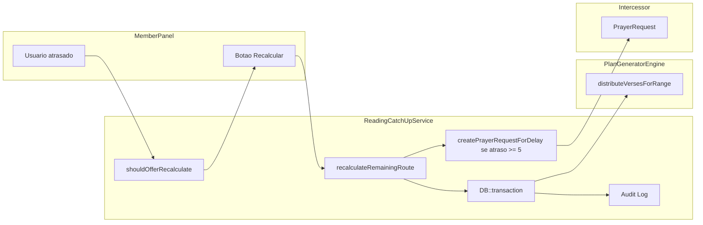

# Bible CBAV2026 Professional Hardening
Plan to harden the Bible module with giant chapter fragmentation, transaction and audit in catch-up, seeds doctrinal Batista templates, integration with Intercessor, consistent use of version_id, and zero error checklist (transaction, leap year, idempotency of check-in).


# Bible CBAV2026 – Professional Improvements and Zero Errors

## Context

- **PlanGeneratorEngine** já distribui por versículos (cursor `verse_num`), mas ao “consumir o resto do capítulo” pode atribuir um bloco grande (ex.: Salmo 119 inteiro) em um único dia se a cota do dia for maior que o capítulo.
- **ReadingCatchUpService** não envolve o fluxo em transação única e não registra auditoria.
- **BiblePlanTemplatesSeeder** tem apenas chaves; falta metadata doutrinária (temas Batistas e referências).
- **bible_metadata** já é por versão (`[2026_03_05_100000_create_bible_metadata_table.php](Modules/Bible/database/migrations/2026_03_05_100000_create_bible_metadata_table.php)`); o gerador usa `Chapter` por `book_id` (implícito por versão via `Book::where('bible_version_id')`). Falta garantir uso explícito de `bible_metadata` quando populado (i18n de versículos).
- **Intercessor**: `[PrayerRequest](Modules/Intercessor/app/Models/PrayerRequest.php)` (user_id, category_id, title, description, privacy_level, status). Categorias em `[PrayerCategory](Modules/Intercessor/app/Models/PrayerCategory.php)`. Não há “pedido privado” no enum; usar `pastoral_only` para pedido visível só ao pastor.
- **Check-in**: `[PlanReaderController::complete()](Modules/Bible/app/Http/Controllers/MemberPanel/PlanReaderController.php)` faz toggle (se existe progresso, deleta; senão, cria). Duplo clique “Lido” pode desmarcar; além disso, duas requisições paralelas podem tentar criar duas linhas (unique evita duplicata, mas o comportamento desejado é “sempre marcar”, idempotente).

---

## A. Fragmentação de capítulos gigantes (PlanGeneratorEngine)

**Objetivo:** Quando o peso do capítulo exceder 2× a média diária, limitar o que é atribuído em um único dia a no máximo 2× a média (fragmentar o capítulo em vários dias).

**Onde:** `[PlanGeneratorEngine](Modules/Bible/app/Services/PlanGeneratorEngine.php)`: `distributeVerses()` e `distributeVersesForRange()`.

**Lógica atual:** No ramo “consumir resto do capítulo” (`versesRemainingInChapter <= quota`), todo o restante do capítulo vai para um dia. Para capítulos muito longos (ex.: 176 versículos), isso pode gerar um único dia com carga excessiva.

**Alteração:**

1. Calcular `$versesPerDay` (já existe) e definir `$maxVersesFromChapterPerDay = (int) ceil(2 * $versesPerDay)`.
2. No bloco que consome o “resto do capítulo”:

- Se `totalVersesInChapter > maxVersesFromChapterPerDay` **e** `versesRemainingInChapter > maxVersesFromChapterPerDay`:
  - Não consumir o capítulo inteiro; atribuir apenas `min(versesRemainingInChapter, maxVersesFromChapterPerDay)` versículos neste dia.
  - Atualizar cursor (`verse_num`) e **não** avançar `chapter_idx` (o mesmo capítulo continua no próximo dia).
- Caso contrário, manter o comportamento atual (consumir o resto e avançar para o próximo capítulo).

Aplicar a mesma regra nos dois fluxos: `distributeVerses` e `distributeVersesForRange`, para consistência entre geração inicial e recálculo de rotas.

---

## B. ReadingCatchUpService: transação e auditoria

**1. Transação**

- Envolver **todo** o `recalculateRemainingRoute()` em `DB::transaction(function () { ... })`.
- Dentro da transação: coletar capítulos a partir dos dias existentes, apagar dias/contents a partir de `fromDayNumber`, chamar `distributeVersesForRange`. O `distributeVersesForRange` já usa transação interna; aninhar é seguro no Laravel (transação única).
- Em caso de exceção, nada é persistido; evita plano corrompido ou duplicado.

**2. Log de auditoria**

- **Opção leve (recomendada):** Nova tabela `bible_reading_audit_log` no módulo Bible:
  - Colunas: `id`, `user_id`, `subscription_id`, `action` (ex.: `recalculate_route`), `payload` (JSON: e.g. `{ "from_day": 45, "days_remaining": 320, "new_end_date": "..." }`), `created_at`.
- Em `recalculateRemainingRoute()`, após a transação (sucesso), inserir um registro com `action = 'recalculate_route'`, `user_id` do dono da subscription, `subscription_id` e dados relevantes em `payload`.
- Alternativa: usar apenas `Log::channel('stack')` com contexto (subscription_id, user_id) se não quiser nova tabela; a tabela permite consulta e relatórios no admin.

---

## C. BiblePlanTemplatesSeeder – Doutrinas Batistas

**Objetivo:** Enriquecer o template **doctrinal** com metadata que vincule temas das Convicções Batistas a referências (livro + capítulo).

**Estrutura em `options` (JSON) do template `doctrinal`:**

- Usar a coluna `options` já existente em `[bible_plan_templates](Modules/Bible/database/migrations/2026_03_05_100001_create_bible_plan_templates_table.php)`.
- Exemplo de estrutura:

```json
{
  "doctrinal_themes": [
    {
      "theme": "Batismo por imersão",
      "references": [
        { "book": "Mt", "chapter": 3 },
        { "book": "Rm", "chapter": 6 },
        { "book": "At", "chapter": 2 },
        { "book": "At", "chapter": 8 }
      ]
    },
    {
      "theme": "Ceia como memorial",
      "references": [
        { "book": "Mt", "chapter": 26 },
        { "book": "1Co", "chapter": 11 }
      ]
    },
    {
      "theme": "Sacerdócio universal dos crentes",
      "references": [
        { "book": "1Pe", "chapter": 2 },
        { "book": "Ap", "chapter": 1 },
        { "book": "Hb", "chapter": 4 }
      ]
    }
  ]
}
```

- No seeder, ao fazer `updateOrCreate` do template `doctrinal`, preencher `options` com essa estrutura (e outros temas desejados, ex.: Sola Scriptura, Autoridade das Escrituras).
- O gerador de plano doutrinário atual usa ordem de livros (Evangelhos → Atos → Epístolas → AT); essa metadata serve para UI, relatórios ou futura geração “por tema” (não obrigatório alterar o motor nesta fase).

---

## D. Versões da Bíblia (bible_metadata e ReadingPlanGeneratorService)

- **Schema:** `bible_metadata` já é por versão (`bible_version_id` + `book_id` + `chapter_number` + `verse_count`).
- **Uso no gerador:**
  - Garantir que todos os pontos de geração recebam e usem `bible_version_id` (já ocorre em `[ReadingPlanGeneratorService](Modules/Bible/app/Services/ReadingPlanGeneratorService.php)` e no controller que chama o gerador).
  - Opcional: em `PlanGeneratorEngine::generateSequential()` (e onde for construir `allChapters`), se existir tabela `bible_metadata` populada para a versão, usar `BibleMetadata::where('bible_version_id', $versionId)` para obter `verse_count` por capítulo em vez de `Chapter::total_verses`, assim respeitando numeração por versão (ARC vs NVI vs NAA). Manter fallback para `Chapter` quando `bible_metadata` não tiver linha para aquele capítulo.

---

## E. Integração automática com Intercessor (atraso ≥ 5 dias)

**Comportamento:** Quando o atraso for **≥ 5 dias**, além de oferecer “Recalcular rotas”, criar automaticamente um **pedido de oração** no Intercessor: título/descrição relacionados a “Disciplina e Deleite na Palavra”, visível apenas ao pastor (`pastoral_only`).

**Implementação:**

1. **Categoria:** Criar categoria “Vida devocional” ou “Disciplina na Palavra” no seeder do Intercessor (ou no primeiro uso), e obter/guardar o `category_id` (ex.: config ou constante no Bible).
2. **Serviço Bible:** Em `ReadingCatchUpService`, adicionar método auxiliar (ex.: `createPrayerRequestForDelay(User $user, int $delayDays)`) que:

- Verifica se o módulo Intercessor está disponível (existência da classe `Modules\Intercessor\App\Models\PrayerRequest`).
- Cria um `PrayerRequest` com: `user_id`, `category_id` da categoria acima, título/descrição fixos (“Disciplina e Deleite na Palavra”), `privacy_level = 'pastoral_only'`, `status = 'active'` (ou `pending` se o Intercessor exigir moderação para novos pedidos).

1. **Ponto de chamada:** Onde hoje se usa `shouldOfferRecalculate()` (ex.: MemberPanel ou API de status do plano), ao calcular o atraso:

- Se `$delayDays >= 5`: chamar `createPrayerRequestForDelay($user, $delayDays)` **uma vez por subscription** (evitar duplicar pedidos: verificar se já existe um pedido recente do mesmo usuário para a mesma categoria, ex. últimos 7 dias, e só criar se não houver).

Assim o Bible não fica acoplado ao Intercessor além do uso do model; se o módulo não estiver instalado, não quebra.

---

## 3. Checklist Zero Erros

### 1) Database transaction no recálculo

- Implementar como em **B.1**: todo o corpo de `recalculateRemainingRoute()` dentro de `DB::transaction()`. Garantir que nenhum commit parcial ocorra (apagar dias e falhar antes de redistribuir deixaria o plano inconsistente).

### 2) Ano bissexto (366 dias e 29/02)

- **Cálculo de datas:** Onde `projected_end_date` ou duração é calculada a partir de `start_date` + `duration_days`, usar Carbon com cuidado:
  - `Carbon::parse($startDate)->addDays($durationDays - 1)` para a data do último dia (ex.: 1º jan + 365 dias = 31 dez; 1º jan + 366 = 31 dez em ano bissexto).
  - Garantir que **nunca** se use “ano fixo não-bissexto” ao calcular o fim do plano; sempre usar a aritmética de dias a partir da data de início.
- **Teste unitário:** Novo teste em `[ReadingPlanGenerationTest.php](Modules/Bible/tests/Unit/ReadingPlanGenerationTest.php)` (ou classe dedicada):
  - Cenário 1: Plano de 366 dias começando em 1º de janeiro de um ano bissexto (ex.: 2024). Assert: `projected_end_date` = 31/12 do mesmo ano; nenhuma exceção `InvalidDateException`.
  - Cenário 2: Assinar plano com `start_date = 2024-02-29`. Assert: criação e cálculos (ex.: “dias desde o início” em um serviço de progresso) não lançam e não “pulam” o dia 29.
- Opcional: helper no Bible que calcula `projected_end_date` dado `start_date` e `duration_days`, e usar em subscription; o teste valida esse helper com 365 e 366 dias e com `start_date` em 29/02.

### 3) Idempotência do check-in (botão “Lido”)

- **Problema atual:** Em `[PlanReaderController::complete()](Modules/Bible/app/Http/Controllers/MemberPanel/PlanReaderController.php)` o fluxo é “se já existe progresso → deletar (desmarcar); senão → criar”. Duplo clique ou duas requisições paralelas: a primeira cria; a segunda pode desmarcar ou, em concorrência, tentar criar de novo (a unique evita duplicata, mas o UX é confuso).
- **Comportamento desejado:** “Lido” é idempotente: múltiplos cliques = um único registro de conclusão (e não desmarcar acidentalmente).
- **Alteração:**
  - Trocar a criação de progresso por `BibleUserProgress::firstOrCreate(['subscription_id' => ..., 'plan_day_id' => ...], ['completed_at' => now(), ...])` (e, se existir coluna `time_spent`, atualizar apenas se a segunda requisição enviar um valor maior ou manter o primeiro).
  - Decisão de produto: **remover** o toggle “desmarcar” do mesmo endpoint, ou deixar “Desmarcar” para um endpoint/action separado (ex.: `POST .../uncomplete`). Assim, o botão “Lido” só marca e é idempotente.
- **UserReadingLog:** Se o fluxo também gravar em `user_reading_logs`, usar a mesma estratégia (unique em `subscription_id` + `plan_day_id`) e `firstOrCreate` para evitar duplicata.

---

## Ordem sugerida de implementação

1. **PlanGeneratorEngine:** regra de fragmentação (2× média) em `distributeVerses` e `distributeVersesForRange`.
2. **ReadingCatchUpService:** envolver em `DB::transaction` e adicionar registro em `bible_reading_audit_log` (criar migration + model se for tabela).
3. **BiblePlanTemplatesSeeder:** preencher `options` do template `doctrinal` com `doctrinal_themes` e referências.
4. **ReadingPlanGeneratorService / Engine:** garantir `bible_version_id` em todos os caminhos e, opcionalmente, uso de `bible_metadata` para pesos.
5. **Intercessor:** seeder de categoria + `ReadingCatchUpService::createPrayerRequestForDelay()` e chamada quando atraso ≥ 5 dias (com guard contra duplicata).
6. **Teste de ano bissexto:** 366 dias e `start_date` em 29/02.
7. **PlanReaderController:** check-in idempotente com `firstOrCreate` e remoção do toggle no mesmo endpoint (ou endpoint separado para desmarcar).

---

## Diagrama de fluxo (recálculo + auditoria + Intercessor)



---

## Status Final CBAV2026 (Green Light)

Resumo das funcionalidades ativas no módulo Bible após as implementações de gamificação, painel pastoral e conclusão.

### Leitura e planos
- Assinaturas a planos, dias, progresso (`BibleUserProgress` + `UserReadingLog`).
- Check-in idempotente (complete/uncomplete) no leitor.
- Recálculo de rota (catch-up) com transação e auditoria (`BibleReadingAuditLog`).
- Fragmentação de capítulos gigantes no gerador; suporte a ano bissexto e datas projetadas.

### Gamificação
- **user_reading_logs**: cada `complete()` grava em `UserReadingLog`; cada `uncomplete()` remove o registro.
- **BadgeService**: avaliado após cada `complete()` bem-sucedido.
  - **Bereano da Semana**: 7 dias consecutivos (por day_number) sem atraso (completed_at ≤ data esperada); cooldown 7 dias.
  - **Fiel ao Pacto**: 30 dias de leitura no plano atual; uma vez por inscrição.
  - **Leitor do Corpo**: 15 dias em plano com `is_church_plan`; uma vez por inscrição.
- Selos armazenados em `bible_user_badges` (user_id, badge_key, subscription_id, awarded_at).

### Integração Intercessor
- Atraso ≥ 5 dias: criação de pedido de oração “Disciplina na Palavra” (pastoral_only).
- `prayer_request_id` gravado na inscrição para link direto no relatório pastoral.

### Painel administrativo pastoral
- **Relatório Plano da Igreja** (`admin.bible.reports.church-plan`):
  - Visão geral dos membros inscritos no(s) plano(s) oficial(is) (is_church_plan).
  - Tabela de engajamento: Em dia (0), Em atraso (1–4 dias), Crítico (≥ 5 dias) com link para o pedido de oração no Intercessor quando existir.
  - Métrica de conclusão: porcentagem total de dias lidos em relação ao total esperado (igreja).
- Link no sidebar Admin: “Relatório Plano da Igreja” no bloco Bíblia Digital.
