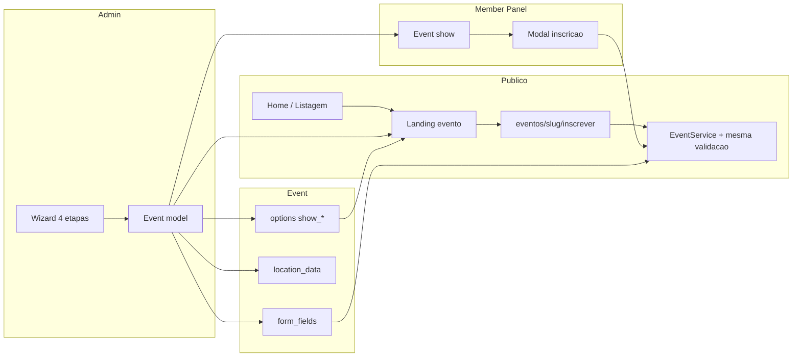

# Etapa 1 – Informações Básicas do Evento (E-Inscrição)

Preencha os dados iniciais essenciais do seu evento.

---

## 1. Endereço da Página do Evento (URL pública)
Exemplo:
`https://www.e-inscricao.com/asbafba/`

## 2. Nome do Evento
Exemplo:
`CONGRESSO KIDS ASBAF`

## 3. Tipo do Evento
Selecione uma das opções abaixo:
- **Presencial:** Para eventos que acontecerão fisicamente.
    > Use o E-Inscrição para fazer a gestão completa do seu evento presencial.
- **Transmissão integrada no E-Inscrição:**
    > Permite organizar o evento no E-Inscrição e disponibilizar a transmissão pelo próprio site, mantendo o participante focado no conteúdo.
- **Transmissão via outra plataforma:**
    > Organize o evento pelo E-Inscrição e compartilhe um link externo de transmissão com os participantes de forma prática.

## 4. O evento é cristão?
Indique se o evento é cristão para sugerirmos temas mais relevantes e aumentar sua visibilidade ao público-alvo.

## 5. Tema(s) do Evento
Escolha pelo menos um tema principal para alcançar melhor o público.
- Caso não encontre um tema adequado, sugerir um novo (separar palavras por espaço).

## 6. Categoria do Evento
Exemplo:
`Congressos`

## 7. Limite Máximo de Inscritos
Exemplo:
`100`

## 8. Datas do Evento
- **Data de início:** `21/03/2026`
- **Data do fim:** `22/03/2026`

## 9. Contato do Organizador
- **E-mail do organizador:** `pr.alexreis@gmail.com`
  (Disponibilizado para dúvidas dos usuários)
- **Whatsapp para contato:** `+55 (75) 99231-9454`
  (Exibido na seção "Fale com o Organizador" na página do evento)

## 10. Tipo de Inscrição/Venda
- **Você deseja vender inscrições ou ingressos?**
    - Se sim, escolha a nomenclatura mais apropriada.
- **Permitir inscrições?**
    - Marque se o evento for gratuito.
- **Inscrições por pedido:**
    - Quantidade mínima: `1`
    - Quantidade máxima: `10`
- **Facilitar preenchimento de formulários:**
    - Informações de todos os participantes podem ser preenchidas automaticamente via dados do comprador.
- **Participantes podem se inscrever mais de uma vez:**
    - Útil para campanhas ou contribuições repetidas.
- **Participantes podem se inscrever sem realizar login:**
    - Deixa o fluxo mais rápido, mas não salva dados para futuras inscrições.

## 11. Privacidade do Evento
- Marque caso deseje ocultar o evento da página pública da organização
  (O evento ficará acessível apenas por link direto)

## 12. Grupo ou Comunidade para Participantes
- Exemplo de link: `https://chat.whatsapp.com/ABC123xyz456`
  (O link será exibido ao participante ao final do processo de inscrição)

## 13. Mensagem Personalizada para o Inscrito
- Mensagem que será enviada junto ao comprovante de pagamento

---

### Etapa 2: Inscrição e vagas (formulário e regras de preço)

No painel do evento, uma **única seção "Inscrição e vagas"** define o que será solicitado aos participantes e como as vagas são organizadas. As **regras de preço** definem apenas quanto cobrar, com base nos dados já configurados nessa seção.

#### Modo de inscrição

- **Formulário único:** Um único conjunto de campos para todos os participantes; a quantidade de vagas é escolhida pelo usuário na inscrição (até a capacidade do evento). Você configura solicitar telefone e quais documentos (CPF, RG, Título), além de **campos adicionais** (igreja, código promocional, tipo de almoço, etc.). Esses dados são usados automaticamente pelas regras de preço.
- **Por faixa ou categoria:** Use quando o evento tiver vagas por faixa etária (ex.: crianças 0–4, 5–7) ou por categoria. Cada faixa define quantidade de vagas, documentos e campos extras. O formulário público exibe blocos por faixa.

Não há dois formulários ao mesmo tempo: ou se usa o formulário único ou as faixas.

#### Regras de preço

As regras definem **quanto** cada participante ou inscrição paga. Os valores são calculados com base nos dados já configurados na seção «Inscrição e vagas» (idade, código promocional, data da inscrição, etc.). Para descontos por código, adicione um campo «Código promocional» na seção Inscrição e vagas.

#### Referência de campos (modo formulário único)

Campos e documentos são configurados na seção **Inscrição e vagas**. Sempre são coletados: nome, e-mail, data de nascimento. Opcionalmente: telefone; documentos (CPF, RG, Título). Os **campos adicionais** permitem igreja, código promocional, tipo de almoço e outros; use o nome sugerido na descrição do tipo de regra (ex.: `discount_code` ou `codigo_promocional` para regras de código).

**Dica:** Revise os campos antes do evento para garantir experiência de cadastro rápida e objetiva.

## Página do Evento

Na configuração da página do evento, você pode **ativar ou desativar** as seções conforme a necessidade do seu evento. As principais seções disponíveis para personalização são:

- **Capa**
  Defina uma imagem de capa para destacar seu evento.
  *Recomendação de tamanho: 1600x848 px.*

- **Título do evento**
  Informe o nome do evento (ex: Congresso Kids Família: Somos Um).

- **Sobre**
  Adicione uma breve descrição do evento, incluindo objetivos, informações relevantes, público-alvo e diferenciais.

- **Palestrantes/Bandas**
  Apresente quem irá ministrar, palestrar ou se apresentar (opcional).

- **Programação**
  Informe a ordem das atividades, horários, palestras e atrações (opcional).

- **Fotos**
  Exiba imagens relacionadas ao evento, de edições anteriores ou divulgação (opcional).

- **Local**
  Detalhe o endereço completo do evento:
  - Nome do local
  - Endereço (Rua, Número, Bairro, Cidade, UF, CEP, Complemento)
  - Latitude/Longitude (opcional para mapas)
  - Facilite para o participante encontrar o local.

- **Comentários e redes sociais**
  Ative espaços de interação, comentários ou exiba links das redes sociais do evento (opcional).

- **Vídeo**
  Insira um link de vídeo (YouTube ou Vimeo) de apresentação ou convite (opcional).

### Como ativar ou desativar seções

Para cada seção, utilize a interface para **habilitar ou desabilitar** a exibição na página. Isso permite personalizar a apresentação de acordo com a proposta do evento.

> **Dica:** Ative apenas as seções relevantes para o seu público. Mantenha as informações objetivas e atualizadas.

---

**Ações rápidas na página:**
- Salvar alterações
- Pré-visualizar página
- Publicar/despublicar evento
- Copiar link de divulgação

Assim, a experiência do participante será clara, objetiva e focada nos destaques do seu evento!

## O Que voce fez no evento:

Summary of what was implemented:
1. Event model
Added logo_path to fillable; migration added.
Extended defaultOptions() with show_about, show_location, show_map, show_capacity, show_cover.
Added helpers: showAboutEnabled(), showLocationEnabled(), showMapEnabled(), showCapacityEnabled(), showCoverEnabled().
2. Requests
StoreEventRequest / UpdateEventRequest: validation for location_data.address, location_data.lat, location_data.lng, logo (image), and options.show_* (and other options).
UpdateEventRequest prepareForValidation() updated to normalize the new boolean options.
3. Admin EventController
buildLocationData(Request) to build location_data (address, lat, lng, maps_url).
Store: builds location_data, merges options, handles logo upload to events/logos.
Update: applies location_data when present, handles logo upload and old logo delete.
4. Layout and landing
New layout events::layouts.landing: event-only navbar (no homepage nav/footer), logo or title, anchor links for enabled sections (Sobre, Local, Mapa, Programação, Palestrantes, Vagas), CTA “Inscreva-se” to eventos/{slug}/inscrever.
landing.blade.php now extends this layout; section IDs and scroll-mt-24 for anchors; all blocks wrapped in show*Enabled(); map embed when address or lat/lng; meta/cover respect show_cover.
5. Public show
Link “Ver página de divulgação” to the landing.
Hero and blocks respect showCoverEnabled(), showAboutEnabled(), showLocationEnabled(), showCapacityEnabled().
Map block with iframe when show_map and address or lat/lng; “Como chegar” and labels via i18n.
6. Admin create/edit
Logo upload (after banner) in basic info.
Location: “Endereço completo”, “Latitude”, “Longitude” (location_data).
New section “Página do evento (landing)” with checkboxes for show_cover, show_about, show_schedule, show_speakers, show_location, show_map, show_capacity (with hidden 0 so unchecked is sent).
Edit: same logo/location/options; options wired to existing Alpine eventResources (show_cover, show_about, show_location, show_map, show_capacity).
7. EventService
getRegistrationConfig(Event) already present; used by public inscrever and member panel (no change).
8. Member panel – modal
Main content wrapped in x-data="{ registrationModalOpen: false }".
Hero CTA “Inscrever-se” opens the modal.
Registration form (same form and eventRegistration Alpine component) moved into a modal: overlay, title “Inscrição — {event}”, close button and Escape, scrollable body.
9. i18n
New keys: register, map, view_landing_page, registration, schedule_heading, speakers_heading, event_logo, event_logo_helper, full_address, full_address_helper, latitude, longitude, landing_page_options, landing_page_options_desc, show_cover, show_about, show_schedule, show_speakers, show_location, show_map, show_capacity.
Not done
Admin create/edit 4-step wizard UI (stepper with “Próxima etapa” / “Etapa anterior” and sections in steps): only the new fields and “Página do evento” were added; the form was not split into four steps with a visible stepper. Everything is still in one long form. I can add the 4-step stepper in the admin forms next if you want.

---
name: Events map landing steps modal
overview: Upgrade completo do módulo Events com padrão único de inscrição em todo o projeto; landing como página de divulgação do evento com navbar do evento (sem navbar da home) e âncoras; suporte a logo e capa do evento; admin e inscrição por etapas; mapa; eliminação de redundâncias.
todos: []
isProject: false
---

# Plano: Upgrade completo Events – padrão único, landing evento, etapas, mapa e modal

## Objetivo

Reformular o fluxo de eventos para ser **coerente, completo e sem redundância** em todo o projeto: admin (criar/editar por etapas), painel do membro (inscrição em modal por etapas), público (home, listagem, página do evento, landing) e **landing como página de divulgação do evento** com identidade própria (navbar do evento, âncoras, logo e capa do evento). Um único padrão de inscrição e regras em todos os pontos de entrada.

---

## Princípios

- **Uma fonte de verdade**: Regras de inscrição e formulário vêm de [EventService::getRegistrationConfig](../../../../../Users/Administrator/.cursor/plans/Modules/Events/app/Services/EventService.php) e do modelo Event (form_fields, segments, options). Public inscrever, member panel e landing usam o mesmo fluxo (escolher quantidade → preencher participantes → pagar se necessário).
- **Landing = página de divulgação do evento**: Não usa navbar/footer da home. Usa layout próprio com **navbar do evento** (logo do evento se houver, nome do evento, âncoras só para seções habilitadas) e conteúdo em seções com ids (sobre, local, mapa, programação, palestrantes, vagas) para navegação por âncora. Qualquer pessoa acessa pelo link e se inscreve pela mesma rota de inscrição.
- **Por etapas**: Admin cria/edita em 4 etapas (wizard). Usuário que se inscreve vê passos claros: (1) quantidade por faixa ou lote, (2) dados dos participantes, (3) pagamento se aplicável.
- **Evento com identidade**: Evento pode ter **logo própria** (navbar da landing) e **capa própria** (banner_path já existe). Tudo configurável no admin para montar uma página de divulgação completa e profissional.

### Fluxo geral

---

## 1. Layout e navbar da landing (página do evento)

### 1.1 Layout dedicado para a landing

- Criar um layout **somente para a landing** do evento, por exemplo [Modules/Events/resources/views/layouts/landing.blade.php](../../../../../Users/Administrator/.cursor/plans/Modules/Events/resources/views/layouts/landing.blade.php) (ou dentro de `components`).
- Este layout **não** inclui a navbar nem o footer da home ([homepage::components.navbar](../../../../../Users/Administrator/.cursor/plans/Modules/HomePage/resources/views/components/navbar.blade.php) e footer). Inclui apenas:
  - `<head>`: title, meta, CSRF, Vite (app.css, app.js), Font Awesome local, `<x-loading-overlay />`.
  - **Barra superior do evento** (navbar do evento): fundo sólido ou semi-transparente, com:
    - Logo do evento (se `$event->logo_path` existir) ou apenas texto com o nome do evento.
    - Links de âncora para cada seção **habilitada** nas options: ex. Sobre (#sobre), Local (#local), Mapa (#mapa), Programação (#programacao), Palestrantes (#palestrantes), Vagas (#vagas). Só exibir links para seções com `show_*` true.
    - CTA "Inscreva-se" ou "Garantir vaga" (link para `route('events.public.inscrever', $event->slug)` para visitantes; para logados pode apontar para o painel do membro ou manter inscrever).
  - `@yield('content')` ou `@stack('content')` para o corpo da página.
- A view [landing.blade.php](../../../../../Users/Administrator/.cursor/plans/Modules/Events/resources/views/public/landing.blade.php) passa a `@extends` esse layout (ex.: `events::layouts.landing`) em vez de `homepage::components.layouts.master`.

### 1.2 Logo do evento

- Adicionar ao modelo Event: atributo **logo_path** (string, nullable). Migration: `$table->string('logo_path')->nullable()->after('banner_path');` (ou em migration dedicada).
- Incluir `logo_path` em fillable; no admin, na etapa "Informações básicas" ou "Página do evento", campo de upload **Logo do evento** (opcional). Controller store/update: salvar em `events/logos` no disco public e persistir em `logo_path`.
- Na navbar da landing: se `$event->logo_path` existir, exibir `logo_path) }}" alt="{{ $event->title }}">`; senão, exibir apenas o título do evento como texto.

### 1.3 IDs e âncoras no conteúdo da landing

- Cada bloco de conteúdo na landing deve ter um **id** único para âncora: `id="sobre"`, `id="local"`, `id="mapa"`, `id="programacao"`, `id="palestrantes"`, `id="vagas"`, `id="inscrever"` (ou CTA fixo). Os links da navbar do evento usam `#sobre`, `#local`, etc. Só renderizar blocos cujo `show_*` estiver habilitado; os links da navbar são gerados dinamicamente com base nas mesmas options.

---

## 2. Mapa do Google (local + embed)

### 2.1 Dados no backend

- O modelo [Event](../../../../../Users/Administrator/.cursor/plans/Modules/Events/app/Models/Event.php) já tem `location` (string) e `location_data` (JSON). A view usa `location_data['address']`, `location_data['maps_url']`, `location_data['link']` para o link "Como chegar".
- **Convenção** para `location_data`: `address` (endereço completo para busca e embed), opcionalmente `lat`, `lng`, `maps_url` (link para abrir no Google Maps). Se não houver `maps_url`, construir com `https://www.google.com/maps/search/?api=1&query=` + `rawurlencode($event->location_data['address'] ?? $event->location)`.

### 2.2 Admin: campos de localização

- Em [admin/events/edit.blade.php](../../../../../Users/Administrator/.cursor/plans/Modules/Events/resources/views/admin/events/edit.blade.php) e [create.blade.php](../../../../../Users/Administrator/.cursor/plans/Modules/Events/resources/views/admin/events/create.blade.php), na seção "Data e Localização":
  - Manter o campo **Local** (nome do local / texto curto) como hoje.
  - Adicionar **Endereço completo** (textarea ou input), opcional: usado para mapa e link "Como chegar". Salvar em `location_data.address`.
  - Opcional: campos **Latitude** e **Longitude** (inputs numéricos), salvos em `location_data.lat` e `location_data.lng` para embed mais preciso.
- No controller de update/store: montar `location_data` a partir dos inputs (address, lat, lng) e, se houver address, gerar `maps_url`; persistir em `location_data` junto com o restante dos dados do evento.

### 2.3 Request e validação

- Em [UpdateEventRequest](../../../../../Users/Administrator/.cursor/plans/Modules/Events/app/Http/Requests/UpdateEventRequest.php) e [StoreEventRequest](../../../../../Users/Administrator/.cursor/plans/Modules/Events/app/Http/Requests/StoreEventRequest.php): aceitar `location_data.address`, `location_data.lat`, `location_data.lng` (ou um único `location_data` como array) e validar tipos (string, numeric).

### 2.4 Views públicas: link + embed

- Em [landing.blade.php](../../../../../Users/Administrator/.cursor/plans/Modules/Events/resources/views/public/landing.blade.php) e [show.blade.php](../../../../../Users/Administrator/.cursor/plans/Modules/Events/resources/views/public/show.blade.php), no bloco "Local":
  - Manter o texto do local e o link "Como chegar" (já existente; usar `location_data.address` ou `location` para construir a URL do Google Maps se necessário).
  - **Abaixo** do link, adicionar um **mapa embed**: se houver `location_data.address` ou (`location_data.lat` e `location_data.lng`), exibir um `<iframe>` do Google Maps. URL do iframe: com lat/lng usar `https://www.google.com/maps?q=lat,lng&output=embed`; só com address usar `https://www.google.com/maps?q=rawurlencode(address)&output=embed`. Container com altura fixa (ex.: 300px), responsivo. Sem API key (embed básico por query).

---

## 3. Personalização da landing no admin

### 3.1 Opções no modelo

- O [Event](../../../../../Users/Administrator/.cursor/plans/Modules/Events/app/Models/Event.php) já tem `options` (JSON) com `show_schedule`, `show_speakers`, etc. Estender com chaves para a landing/página do evento, por exemplo: `show_about`, `show_location`, `show_map`, `show_capacity`, `show_cover` (exibir capa/banner). Valores boolean; default true para não quebrar eventos existentes (em `defaultOptions()` e no getter de options).

### 3.2 Admin: seção "Página do evento / Landing"

- Em edit e create (ou na etapa correspondente do wizard), adicionar uma seção **"Página do evento"** ou **"O que exibir na landing"** com checkboxes:
  - Exibir capa (banner)
  - Exibir sobre (descrição)
  - Exibir programação
  - Exibir palestrantes
  - Exibir local
  - Exibir mapa (embed)
  - Exibir vagas
- Cada checkbox mapeia para `options.show_*`. Salvar via request existente (`options` já é validado em UpdateEventRequest/StoreEventRequest).

### 3.3 Views públicas: respeitar opções

- Na [landing](../../../../../Users/Administrator/.cursor/plans/Modules/Events/resources/views/public/landing.blade.php) e na [show](../../../../../Users/Administrator/.cursor/plans/Modules/Events/resources/views/public/show.blade.php): envolver cada bloco (capa, sobre, programação, palestrantes, local, mapa, vagas) em `@if($event->showXEnabled())` (ou equivalente usando o array `options`). Criar helpers no modelo se necessário (ex.: `showAboutEnabled()`, `showMapEnabled()`).

---

## 3. Padrão único de inscrição (regras e fluxo)

### 3.1 Fonte única de regras

- **EventService**: Centralizar em [EventService](../../../../../Users/Administrator/.cursor/plans/Modules/Events/app/Services/EventService.php) (ou método dedicado) a lógica de "configuração de inscrição": lotes ativos, segmentos/faixas, regras de preço, form_fields, quantidade máxima por faixa, se é pago ou gratuito. Expor algo como `getRegistrationConfig(Event $event)` retornando um array/objeto usado por:
  - Página pública [inscrever.blade.php](../../../../../Users/Administrator/.cursor/plans/Modules/Events/resources/views/public/inscrever.blade.php).
  - Modal de inscrição no [memberpanel/show.blade.php](../../../../../Users/Administrator/.cursor/plans/Modules/Events/resources/views/memberpanel/show.blade.php).
  - Qualquer CTA "Inscrever-se" na landing (que leva à rota de inscrever ou abre fluxo equivalente).
- **Validação**: As mesmas regras de validação (request ou FormRequest) para o POST de registro devem ser usadas tanto na rota pública de inscrição quanto na rota do member panel (evitar duplicar regras em dois FormRequests diferentes; preferir um único RegistrationRequest ou validação compartilhada no EventService/controller).

### 3.2 Fluxo do usuário (por etapa)

- **Passo 1 – Quantidade**: Escolher quantidade por faixa (se houver segmentos) ou quantidade geral (se gratuito sem faixas) ou seleção de lote/ingresso (se pago). Interface igual na inscrever pública e no modal do member panel (reutilizar componente Alpine ou mesmo partial Blade).
- **Passo 2 – Participantes**: Formulário de participantes (um bloco por participante) com os campos definidos em `form_fields`. Campos iguais em público e member; dados enviados com os mesmos names para o backend.
- **Passo 3 – Pagamento** (se evento pago): Redirecionamento para checkout/pagamento já existente; após confirmação, inscrição confirmada.
- Garantir que a landing e a show tenham CTA claro ("Inscreva-se" / "Garantir vaga") apontando para `eventos/{slug}/inscrever` (público) ou para o painel do membro com modal (se quiser manter inscrição no member em modal). Decisão: **landing sempre leva a `eventos/{slug}/inscrever`** para manter um único fluxo de formulário; usuário logado pode ser identificado na mesma página e pré-preenchido se aplicável.

### 3.3 Redundância a eliminar

- Não duplicar lógica de "quantidade por faixa" ou "sync participants" em dois lugares. Preferir um partial Blade (ex.: `events::public.partials.registration-form`) ou um componente Alpine reutilizável que receba `eventSlug`, `actionUrl`, `isMemberPanel` (para ajustar action e token). Public inscrever e member modal incluem esse mesmo partial/component.
- Revisar controllers: uma única rota de processamento de inscrição (ou duas rotas que chamam o mesmo service/validação) para evitar regras diferentes entre público e membro.

---

## 4. Admin: criar/editar evento por etapas (wizard)

### 4.1 Estrutura das etapas (conforme EventsUpdate.md)

- **Etapa 1 – Informações básicas e local**: título, slug, tipo (presencial/transmissão), datas, local (nome), endereço completo, lat/lng (opcional), capacidade, status, visibilidade, descrição, capa (banner).
- **Etapa 2 – Inscrição e vagas**: formulário único vs faixas; campos do formulário; segmentos; regras de preço; lotes (batches) se houver.
- **Etapa 3 – Página do evento**: checkboxes do que exibir na landing (capa, sobre, programação, palestrantes, local, mapa, vagas).
- **Etapa 4 – Programação, palestrantes e extras**: programação (schedule), palestrantes, crachá, certificado, opções (has_ticket, has_checkin, etc.).

### 4.2 Implementação do wizard

- **Opção A (recomendada)**: Um único form com seções colapsáveis/abas (Alpine ou tabs). Botões "Próxima etapa" / "Etapa anterior"; cada etapa é um bloco visível (x-show="step === 1", etc.). Validação no submit final (ou validação por etapa no front com atributos HTML5).
- **Opção B**: Múltiplas rotas (create step 1, create step 2, …) com dados em session; mais complexo e mais mudanças no controller.
- Recomendação: **Opção A** em [edit.blade.php](../../../../../Users/Administrator/.cursor/plans/Modules/Events/resources/views/admin/events/edit.blade.php) e [create.blade.php](../../../../../Users/Administrator/.cursor/plans/Modules/Events/resources/views/admin/events/create.blade.php): mesmo formulário, agrupar os blocos atuais em 4 etapas e controlar visibilidade com Alpine (variável `currentStep`). Indicador visual de etapas (stepper) no topo. Não alterar rotas nem método store/update; apenas reorganizar a view.

### 4.3 Arquivos a tocar

- [Modules/Events/resources/views/admin/events/create.blade.php](../../../../../Users/Administrator/.cursor/plans/Modules/Events/resources/views/admin/events/create.blade.php): adicionar estrutura de steps (Alpine), mover blocos existentes para step 1–4, adicionar seção "Página do evento" na etapa 3 e campos de local (endereço, lat/lng) na etapa 1.
- [Modules/Events/resources/views/admin/events/edit.blade.php](../../../../../Users/Administrator/.cursor/plans/Modules/Events/resources/views/admin/events/edit.blade.php): mesma estrutura de etapas e mesmos campos.
- Controller e request: apenas garantir que `location_data` e `options` são preenchidos e validados (já parcialmente suportado).

---

## 6. Painel do membro: inscrição em modal com escolha de quantidade

### 6.1 Comportamento desejado

- Na [memberpanel event show](../../../../../Users/Administrator/.cursor/plans/Modules/Events/resources/views/memberpanel/show.blade.php): em vez do formulário de inscrição sempre visível na página, exibir um botão **"Inscrever-se"** (ou "Garantir vaga") que abre um **modal**.
- **Dentro do modal**: (1) Primeiro passo: escolher quantidade por faixa (se houver segmentos) ou quantidade de vagas (se gratuito sem faixas) ou seleção de ingresso (se pago com regras); (2) Segundo passo: formulário de participantes (um bloco por participante), igual ao atual. Botão "Confirmar inscrição" no final submete o form (POST para a rota de registro do evento).

### 6.2 Implementação

- Adicionar um modal (div com x-show, overlay) controlado por Alpine (ex.: `registrationModalOpen = false`; botão "Inscrever-se" define `registrationModalOpen = true`).
- O conteúdo do modal usa o **mesmo partial/componente** de inscrição que a página pública (ver sec. 4), para não duplicar lógica: escolha de quantidade + formulário de participantes. Form action aponta para a rota de registro do member panel; mesmos names para o backend.
- Garantir que, com segmentos, o usuário primeiro escolhe a quantidade por faixa (como na página pública inscrever) e só então os blocos de participantes aparecem. Reutilizar o mesmo Alpine component ou partial Blade da inscrever.

### 6.3 Arquivos

- [Modules/Events/resources/views/memberpanel/show.blade.php](../../../../../Users/Administrator/.cursor/plans/Modules/Events/resources/views/memberpanel/show.blade.php): introduzir o modal; colocar dentro dele o bloco de "escolha de quantidade" (por faixa ou freeTickets) e o bloco de formulário de participantes; botão principal da página "Inscrever-se" abre o modal em vez de scroll para o form. Opcional: esconder o formulário antigo da página quando o modal estiver em uso (ou removê-lo e ter só no modal).

---

## 7. Show, landing, home e admin (fluxo completo)

- **Landing** (`eventos/{slug}/landing`): Página de divulgação do evento com layout próprio (navbar do evento, âncoras, logo/capa do evento). É a URL ideal para compartilhar. CTA "Inscreva-se" leva a `eventos/{slug}/inscrever`.
- **Show** (`eventos/{slug}`): Pode continuar como página com layout da home (navbar do site) para quem chega pela listagem interna, ou exibir um aviso/link "Ver página completa do evento" para a landing. Decisão de produto: manter show com layout da home e conteúdo similar à landing (respeitando options), com link destacado para "Ver página de divulgação" (landing).
- **Home / listagem**: Cards de eventos devem linkar para a **landing** (ou para show, conforme definição acima) para que o usuário veja a página completa do evento e possa inscrever-se.
- **Admin**: Na show do evento no admin, manter links "Ver página pública" (show) e "Ver landing" (landing) para preview. Na etapa 1 do wizard, incluir upload de **logo do evento** (opcional) além da capa (banner).

---

## 8. Resumo de arquivos e ordem sugerida

- **Event model**: `defaultOptions()` e helpers `showAboutEnabled()`, `showMapEnabled()`, etc.; `logo_path` em fillable; migration para `logo_path`.
- **Requests**: Validar `location_data.address`, `location_data.lat`, `location_data.lng` e `options.show`; aceitar `logo` no store/update.
- **Admin EventController**: Montar `location_data`; persistir `options` e `logo_path`; upload de logo em `events/logos`.
- **Layout landing**: Criar [Modules/Events/resources/views/layouts/landing.blade.php](../../../../../Users/Administrator/.cursor/plans/Modules/Events/resources/views/layouts/landing.blade.php) (navbar do evento, sem navbar home).
- **landing.blade.php**: Passar a usar layout `events::layouts.landing`; adicionar ids nas seções; navbar com âncoras dinâmicas; bloco mapa e opções show.
- **show.blade.php**: Mesmos blocos condicionais (show), link "Como chegar", mapa embed; link para landing se desejado.
- **admin/events/create e edit**: Campos local (endereço, lat/lng), logo do evento, seção "Página do evento" (checkboxes); wizard em 4 etapas com Alpine (stepper).
- **EventService**: Método `getRegistrationConfig(Event $event)` para uso em inscrever e member modal.
- **Partial de inscrição**: Criar partial Blade (ou componente) com quantidade + participantes; usar em [inscrever.blade.php](../../../../../Users/Administrator/.cursor/plans/Modules/Events/resources/views/public/inscrever.blade.php) e no modal do [memberpanel/show.blade.php](../../../../../Users/Administrator/.cursor/plans/Modules/Events/resources/views/memberpanel/show.blade.php).
- **memberpanel/show.blade.php**: Modal de inscrição com o mesmo partial; botão "Inscrever-se" abre o modal.
- **i18n**: Chaves em `events::messages` para novos labels (logo do evento, endereço, latitude, longitude, exibir capa, exibir mapa, âncoras, etc.).

---

## 9. Observações

- **Google Maps embed**: iframe com `https://www.google.com/maps?q=...&output=embed`; sem API key. Trocar URL se no futuro usar Maps Embed com key.
- **Admin wizard**: Um único POST (store/update); wizard é organização visual em 4 etapas no mesmo form.
- **Inscrição**: Uma única fonte de regras (EventService + form_fields); mesmo fluxo (quantidade → participantes → pagamento) na página pública e no modal do membro; preferir um partial/componente reutilizado.
- **Landing**: Nunca exibir navbar da home; sempre navbar do evento com âncoras para seções habilitadas; evento com logo e capa próprios para identidade visual completa.
