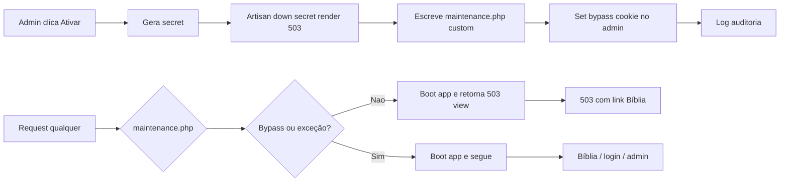

Para transformar a **HomePage** em uma ferramenta de resiliência e manter a edificação mesmo durante atualizações, vamos implementar um sistema de **Modo de Manutenção Inteligente**. No Laravel 12, utilizaremos a flexibilidade dos middlewares para garantir que a Bíblia permaneça acessível enquanto o restante do site está "em construção".
Para transformar a **HomePage** em uma ferramenta de resiliência e manter a edificação mesmo durante atualizações, vamos implementar um sistema de **Modo de Manutenção Inteligente**. No Laravel 12, utilizaremos a flexibilidade dos middlewares para garantir que a Bíblia permaneça acessível enquanto o restante do site está "em construção".

Aqui está o plano para deixar o módulo **HomePage** profissional e com o acesso administrativo garantido:

---

## 🛠️ Modo de Manutenção "Santuário em Obra"

O objetivo é que, ao ativar a manutenção, o usuário não veja um erro frio de servidor (503), mas sim uma página de extrema beleza que o convide à leitura da Palavra.

### 1. Design da Página de Manutenção (The Sacred Book)

A página será construída para ser um "Santuário Digital". Enquanto os técnicos trabalham no código, o membro da igreja tem acesso ao que é imutável: a Bíblia.

* **Estética:** Fundo com degradê suave (Dark/Light), tipografia serifada elegante e um ícone de "Construção Sagrada".
* **A Bíblia Online:** Um componente Livewire injetado na página de manutenção que permite ao usuário navegar por livros e capítulos sem sair da tela de erro.
* **Mensagem Clara:** "Estamos organizando a casa para melhor serví-lo, mas a Palavra de Deus não para. Desfrute da Bíblia Online abaixo."

---

### 2. Acesso Administrativo de Emergência (Anti-Lock)

Para evitar que o Admin perca o acesso ao painel (erro comum no Laravel onde o `artisan down` bloqueia tudo), vamos implementar uma **Rota de Bypass**.

* **A Rota Secreta:** Criaremos uma rota exclusiva (ex: `/admin/portal-acesso`) que não passa pelo filtro de manutenção.
* **O Cookie de Acesso:** Ao entrar nesta rota e logar, o sistema gera um "Secret Token" (nativo do Laravel) que permite que aquele navegador específico veja o site normalmente, enquanto o resto do mundo vê a página de manutenção.

---

### 3. Painel de Controle de Status (Admin)

Dentro do seu painel administrativo, haverá um botão "Mestre" para gerenciar o estado do site:

| Recurso | Função no Backend | Benefício |
| --- | --- | --- |
| **Ativar Manutenção** | `Artisan::call('down --secret=chave-mestra')` | Bloqueia o site com segurança. |
| **Exceções de Rota** | Configuração no `bootstrap/app.php` | Permite que o módulo `Bible` continue funcionando. |
| **Desativar via Painel** | `Artisan::call('up')` | Libera o site sem precisar de FTP ou Terminal. |

---

### 🚀 Prompt para o Cursor (Modo Plan: Maintenance & Bible Resilience)

```markdown
# PROJETO: Upgrade HomePage - Modo Manutenção Inteligente e Bíblia Resiliente
# OBJETIVO: Garantir que o site seja mantido profissionalmente sem bloquear a Bíblia ou o acesso Admin.

Atue como Engenheiro de Software Sênior. Quero um upgrade no sistema de manutenção da `HomePage` seguindo os padrões do Laravel 12.

## 1. Página de Manutenção Profissional
- Crie uma view `resources/views/errors/503.blade.php` com design premium.
- Integre o componente de leitura da Bíblia do `Modules\Bible` diretamente nesta página, permitindo navegação pública mesmo em manutenção.
- Adicione uma mensagem de status clara e inspiradora.

## 2. Configuração de Exceções (Laravel 12 Middleware)
- No arquivo `bootstrap/app.php` (ou no middleware correspondente), configure o `PreventRequestsDuringMaintenance` para permitir as seguintes rotas mesmo em modo 'down':
    - Rotas do módulo `Bible` (Leitura pública).
    - Rota exclusiva de login admin (ex: `/admin/acesso-mestre`).
    - Recursos necessarios (CSS/JS/Imagens).

## 3. Painel de Gestão do Status (Admin)
- No `Modules\Admin`, crie um componente de "Status do Site".
- Implemente botões para 'Ativar Manutenção' e 'Desativar Manutenção'.
- Ao ativar, utilize o comando `php artisan down --secret="SUA_CHAVE_AQUI" --render="errors.503"`.
- O sistema deve salvar a chave secreta de bypass na sessão do administrador logado para que ele continue visualizando o site normalmente.

## 4. Segurança e Anti-Falhas
- Garanta que a função de "Desativar" utilize `Artisan::call('up')` de forma segura.
- Adicione um log de auditoria: "Manutenção ativada/desativada por [Nome do Admin]".

Instrução Técnica: Foque na estética da página 503 e na garantia de que o Admin nunca seja trancado para fora do sistema.

```

---

### Por que isso é vital para o seu projeto?

1. **Edificação Ininterrupta:** Uma igreja batista preza pela Palavra. Se o site cai para manutenção, a Bíblia continua lá. É um testemunho de prioridade.
2. **Independência Técnica:** Você não precisará abrir o terminal ou o banco de dados para "subir" o site. Tudo é feito pelo seu painel administrativo de forma visual.
3. **Profissionalismo:** O visitante sentirá que o site é bem cuidado e não que ele "quebrou".

**Deseja que eu prepare uma "Mensagem de Manutenção" personalizada baseada em um versículo bíblico sobre construção e edificação para usarmos no template?**


----------------- Plano de Implementação -----------------

# HomePage Admin and Maintenance Upgrade
Plano em três eixos: (1) melhorar e unificar as views admin do HomePage (settings, carousel, contacts, newsletter) e integrar controle central em Admin Settings; (2) implementar modo de manutenção inteligente com página 503 premium, Bíblia acessível e bypass para admin; (3) garantir exceções de rotas e auditoria no Laravel.

# HomePage Admin + Modo Manutenção Inteligente

## Contexto atual

- **HomePage admin**: Duas views de configuração ( `[admin/settings.blade.php](Modules/HomePage/resources/views/admin/settings.blade.php)` e `[admin/homepage/settings.blade.php](Modules/HomePage/resources/views/admin/homepage/settings.blade.php)` ). O controller `[HomePageSettingsController](Modules/Admin/app/Http/Controllers/HomePageSettingsController.php)` usa `homepage::admin.homepage.settings`. Carousel, contacts e newsletter têm listagens funcionais mas pouco dinâmicas.
- **Admin Settings**: `[Modules/Admin/resources/views/settings/index.blade.php](Modules/Admin/resources/views/settings/index.blade.php)` já tem abas (Geral, Aparência, Segurança, Pagamentos, E-mail, Notificações, Sistema) e um checkbox "Modo de Manutenção" que apenas persiste em `Settings` (não usa `artisan down`). Não há componente "Status do Site" com ativar/desativar manutenção real nem auditoria.
- **503**: Existe `[resources/views/errors/503.blade.php](resources/views/errors/503.blade.php)` com layout "Obra em andamento" e `errors::layout`; não há Bíblia integrada.
- **Bíblia pública**: Rotas em `[routes/web.php](routes/web.php)` prefixo `biblia-online` (nome `bible.public.`), controller `PublicBibleController`; views em `Modules/Bible/resources/views/public/` (index, read, book, chapter, search).
- **Manutenção Laravel**: `public/index.php` faz `require maintenance.php` antes de bootar a aplicação. Ou seja, exceções (Bíblia, login admin, assets) precisam ser tratadas dentro do fluxo que usa esse arquivo (customizando o que é escrito por `php artisan down` ou usando um stub que bootstrapa a app e decide entre 503 ou passar adiante).

---

## 1. Unificar e melhorar as views admin do HomePage

**Objetivo:** Uma única experiência de configuração da HomePage, mais dinâmica e com mais opções, alinhada ao padrão do Admin.

- **Consolidar settings:** Manter uma única view de configuração (a que o controller já usa: `homepage::admin.homepage.settings`). Remover ou redirecionar a outra (`admin/settings.blade.php`) para evitar duplicidade. Garantir que a sidebar e as abas sigam o mesmo padrão visual do `[admin/settings/index.blade.php](Modules/Admin/resources/views/settings/index.blade.php)` (descrições curtas, ícones, dicas).
- **Melhorar conteúdo das abas:**
  - **Geral/Hero:** Manter campos atuais; adicionar dicas (tooltip ou texto auxiliar) por campo; opção de "Versículo de destaque" ou mensagem customizável para manutenção (reutilizável na 503).
  - **SEO / Seções / Carousel / Contato / Estatísticas / Navegação:** Revisar labels e adicionar uma linha de ajuda por seção; garantir toggles acessíveis e estados claros (ativo/inativo).
- **Carousel (admin):** Em `[admin/carousel/index.blade.php](Modules/HomePage/resources/views/admin/carousel/index.blade.php)` (e equivalente em `admin/homepage/carousel` se existir): adicionar filtro por status/ativo, contador de slides, botão "Preview" e ordenação persistida (drag-and-drop já existe; garantir que o backend salve a ordem). Opção de duplicar slide.
- **Contacts:** Em `[admin/contacts/index.blade.php](Modules/HomePage/resources/views/admin/contacts/index.blade.php)`: filtros (não lida / lida, data), busca por nome/e-mail, paginação clara e ações em lote (marcar como lida, arquivar). Manter link para "Configurações do Sistema" para endereço/e-mail/telefone.
- **Newsletter:** Em `[admin/newsletter/index.blade.php](Modules/HomePage/resources/views/admin/newsletter/index.blade.php)`: filtro por status (ativo/inativo), exportar lista (CSV), contador de assinantes e mensagem quando vazio. Compor e-mail (compose) com preview de texto e opção de template.

Arquivos principais: `[Modules/HomePage/resources/views/admin/homepage/settings.blade.php](Modules/HomePage/resources/views/admin/homepage/settings.blade.php)`, views em `admin/carousel`, `admin/contacts`, `admin/homepage/contacts`, `admin/newsletter`, `admin/homepage/newsletter`; controllers correspondentes no Admin e no HomePage conforme rotas em `[routes/admin.php](routes/admin.php)`.

---

## 2. Completar Admin Settings e componente "Status do Site"

**Objetivo:** Centralizar controle do projeto em Configurações do Sistema, com foco em facilidade de uso e entendimento de cada função.

- **Nova aba ou bloco "Status do Site" (Modo Manutenção):**
  - **Estado atual:** Indicador visual "Site em manutenção" / "Site no ar" (baseado em existência de `storage/framework/maintenance.php` ou flag em Settings, conforme abordagem escolhida).
  - **Botão "Ativar Manutenção":** Ao clicar, o backend gera um secret único, chama `Artisan::call('down', ['--secret' => $secret, '--render' => 'errors.503'])`, grava o secret na sessão do admin e define o cookie de bypass na resposta (para que o administrador continue vendo o site normalmente). Exibir mensagem de sucesso com link de bypass para uso em outra aba/dispositivo: `?secret=...`.
  - **Botão "Desativar Manutenção":** Chama `Artisan::call('up')` de forma segura (try/catch, verificar se o arquivo de manutenção existe). Apenas para usuários com permissão (ex.: mesmo middleware técnico de Settings).
  - **Auditoria:** Registrar em log de auditoria (tabela existente do Admin ou `activity_log` se houver): "Manutenção ativada por [Nome do Admin]" / "Manutenção desativada por [Nome do Admin]" com timestamp e user_id.
- **Ajustes gerais em Settings:** Manter ícones Font Awesome Pro Duotone (`<x-icon name="..." />`), descrições curtas em cada seção e, onde fizer sentido, link "Saiba mais" ou tooltip. O checkbox atual "Modo de Manutenção" em Geral pode ser mantido como "Modo soft" (middleware que exibe 503 para não-admins) ou removido em favor do único fluxo "Status do Site" com `artisan down/up`; recomenda-se um único fluxo para não confundir.

Arquivos: `[Modules/Admin/resources/views/settings/index.blade.php](Modules/Admin/resources/views/settings/index.blade.php)` (nova aba ou bloco em Geral), `[Modules/Admin/app/Http/Controllers/SettingsController.php](Modules/Admin/app/Http/Controllers/SettingsController.php)` (novas ações `activateMaintenance` / `deactivateMaintenance` ou lógica no `update`; preferível rotas POST dedicadas para ativar/desativar). Rotas em `routes/admin.php`.

---

## 3. Página de Manutenção 503 premium + Bíblia resiliente

**Objetivo:** Página 503 com design "Santuário em Obra" e Bíblia acessível durante a manutenção; exceções para Bíblia, login admin e assets.

### 3.1 View 503

- **Arquivo:** `[resources/views/errors/503.blade.php](resources/views/errors/503.blade.php)`.
- **Conteúdo:** Layout premium (degradê, tipografia serifada, ícone "construção sagrada"), mensagem inspiradora (ex.: "Estamos organizando a casa para melhor serví-lo; a Palavra de Deus não para. Desfrute da Bíblia Online abaixo."). Incluir **bloco de leitura da Bíblia**: reutilizar o mesmo conteúdo/componente que o módulo Bible usa na leitura pública (livros/capítulos). Opções de implementação:
  - **A)** 503 é uma view Blade que inclui um partial que chama o mesmo controller/rotas do Bible (ex.: conteúdo via componente Livewire ou Blade com dados injetados). Para isso, a 503 só é servida quando a app já está bootada (middleware ou custom maintenance handler que renderiza a view).
  - **B)** 503 contém um iframe ou link destacado para `url('/biblia-online')`; durante a manutenção, a rota `biblia-online` deve estar nas exceções para que o iframe ou o link funcione.

Recomendação: **B)** — 503 com link e/ou iframe para `/biblia-online`; garantir que essa rota seja exceção no modo down (ver abaixo). Se quiser leitura "embutida" na mesma página, será necessário que a 503 seja renderizada pela aplicação já bootada e que um partial da Bíblia seja incluído (dados via controller ou componente).

### 3.2 Exceções no modo manutenção (Laravel)

O modo "down" do Laravel é acionado por `storage/framework/maintenance.php` incluído em `public/index.php` **antes** do bootstrap. Para permitir Bíblia, login admin e assets:

- **Abordagem recomendada:** Customizar o fluxo de manutenção para que, em vez de retornar 503 direto nesse arquivo, ele:
  1. Bootstrap a aplicação (require `vendor/autoload.php` e `bootstrap/app.php`, capturar `$app` e fazer handle do request).
  2. No primeiro request após bootstrap, um middleware ou o próprio kernel verifica: se a URL for uma exceção **ou** se o cookie de bypass (secret) for válido, deixa a request seguir; senão, retorna resposta 503 com a view `errors.503`.

Ou seja: **não** usar o comportamento padrão de "manutenção.php retorna 503 e termina". Usar um **stub customizado** de `maintenance.php` que:

- Carrega o autoload e o app.
- Dispara uma única request para a aplicação; a aplicação usa um middleware "PreventRequestsDuringMaintenance" (ou equivalente) que:
  - Permite: `biblia-online/`_, `/login`, `/admin/acesso-mestre` (ou a rota de login admin que for definida), e paths de assets (`/build/`_, `/storage/_`, `/vendor/_`, etc.).
  - Permite: se existir cookie com o secret gerado por `artisan down --secret=xxx`.
  - Caso contrário: responde com 503 e a view `errors.503`.

Para isso é necessário que o comando `down` escreva esse stub customizado em `storage/framework/maintenance.php`. Laravel permite customizar o template via método no comando `DownCommand` (publicar o comando e sobrescrever, ou usar evento/callback se existir). Alternativa: não usar `artisan down` para criar o arquivo; criar um comando ou ação no Admin que escreve manualmente o `maintenance.php` com a lógica acima (bootstrap + delegate to app). Assim as exceções ficam centralizadas nesse stub.

- **Rotas a permitir:** `biblia-online`, `biblia-online/`_; `/login`, `login` (GET/POST); rota de bypass admin (ex.: `/admin/acesso-mestre` ou a mesma `/login` com redirect para admin após login); `/build/`_, `/storage/\`, `favicon.ico`, etc.

### 3.3 Rota de acesso admin (anti-lock)

- Criar rota nomeada (ex.: `admin.acesso-mestre`) que exibe apenas um formulário de login para administradores. URL ex.: `/admin/acesso-mestre`. Essa rota deve estar na lista de exceções do maintenance para que, mesmo em "down", o admin possa autenticar e depois acessar o painel (e desativar a manutenção). Após login, redirecionar para `route('admin.dashboard')` e, na primeira resposta, definir o cookie de bypass se usar o mesmo secret.

Implementação: rota em `routes/web.php` ou em arquivo carregado antes do grupo `admin` (para não exigir auth), apontando para um controller que mostra a view de login e, no POST, valida credenciais e roles admin; em seguida redirect ao dashboard. Garantir que essa rota esteja nas exceções do stub de manutenção.

---

## 4. Segurança e anti-falhas

- **Desativar manutenção:** Sempre usar `Artisan::call('up')` dentro de try/catch; verificar se o site está realmente em manutenção (arquivo existe) antes de exibir "Desativar". Em caso de falha (ex.: permissão de arquivo), exibir mensagem clara e registrar em log.
- **Secret:** Gerar secret forte (Str::random(32)) ao ativar; não expor em logs; mostrar na UI apenas uma vez (ou na sessão) o link de bypass.
- **Auditoria:** Toda ativação e desativação registrada com user_id, nome do admin e timestamp (e opcionalmente IP). Usar o sistema de auditoria já existente no módulo Admin, se houver.

---

## 5. Fluxo resumido (manutenção)



---

## Ordem sugerida de implementação

1. **503 view** — Redesenhar `errors/503.blade.php` (premium + mensagem + link/iframe para Bíblia).
2. **Stub maintenance + exceções** — Implementar escrita customizada de `maintenance.php` (bootstrap app + middleware ou lógica de exceções e bypass cookie) e rota `/admin/acesso-mestre`.
3. **Status do Site no Admin** — Aba/bloco em Settings com Ativar/Desativar, chamadas Artisan, cookie de bypass e auditoria.
4. **Unificar e melhorar views HomePage** — Consolidar settings, melhorar carousel/contacts/newsletter (filtros, dicas, ações).
5. **Completar Admin Settings** — Revisar textos, ícones e organização; garantir que "Status do Site" seja a referência única para manutenção real (e eventualmente remover ou renomear o checkbox antigo "Modo de Manutenção" para evitar confusão).

---

## Pontos de atenção

- **Duplicação de views HomePage:** Há `admin/settings.blade.php` e `admin/homepage/settings.blade.php`; o controller usa `homepage::admin.homepage.settings`. Definir uma como fonte e a outra como redirect ou remover.
- **Ícones:** Manter apenas `<x-icon name="..." />` (Font Awesome Pro Duotone) em todas as telas alteradas.
- **Loading overlay:** Formulários que disparam ativar/desativar manutenção devem disparar `<x-loading-overlay />` ou o evento `loading-overlay:show` conforme AGENTS.md.
- **Bible na 503:** Se a 503 for servida pela app (após bootstrap no stub), é possível incluir um partial Blade que chama o `PublicBibleController` ou um componente que lista livros/capítulos; caso contrário, link/iframe para `/biblia-online` com essa rota em exceção é a solução mais simples e resiliente.
