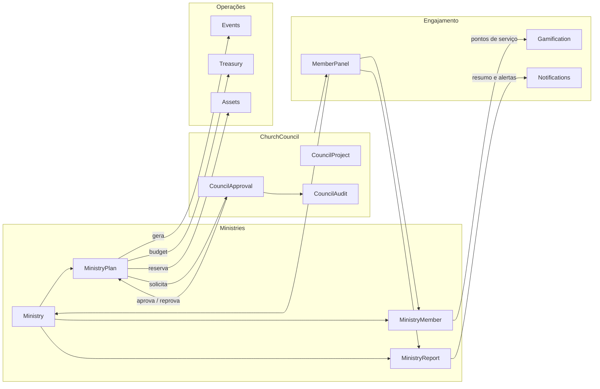

# PROJETO: Upgrade Completo Módulo Ministries (Ministérios) - VertexCBAV
# OBJETIVO: Implementar gestão de ministérios profissional, integrada e doutrinariamente Batista.

Atue como Engenheiro de Software Sênior. Quero um upgrade "ponta a ponta" no módulo `Modules\Ministries`. O foco é transformar o módulo em uma ferramenta de gestão de liderança servidora, planejamento estratégico e prestação de contas, integrando-o com todo o ecossistema da igreja.

## 1. Estrutura de Domínio (Backend & Modelagem)
Implemente ou refine os modelos para suportar:
- **Gestão de Liderança:** Vinculação de um "Líder" e "Vice-Líder" (integrado ao `MemberPanel`).
- **Planejamento Anual/Trimestral:** Objetivos, metas e cronograma de atividades para cada ministério.
- **Workflow de Status:** Planos de Ação que iniciam como `Rascunho`, passam por `Revisão do Conselho` (integrado ao `ChurchCouncil`) e chegam a `Em Execução`.
- **Equipes de Voluntários:** Gestão de membros servindo em cada ministério, com histórico de entrada e saída.

## 2. Integrações "Ponta a Ponta" (O Coração do Sistema)
O módulo Ministries deve interagir com os outros módulos da seguinte forma:
- **Treasury:** Solicitação de verba (Budget Request) vinculada ao plano de ação do ministério. Prestação de contas simplificada.
- **Assets:** Reserva de equipamentos (som, projetores, cadeiras) para atividades específicas do ministério.
- **Events:** Criação automática de eventos no calendário da igreja após aprovação do plano de ação do ministério.
- **Gamification:** Atribuição de "Pontos de Serviço" para voluntários ativos (integrar com o motor de gamificação).
- **Notifications:** Alertas para o líder sobre prazos de relatórios e notificações para a equipe sobre reuniões.
- **EBD / Worship / SocialAction / Intercessor:** Estes módulos especializados devem ser "sub-tipos" ou estar vinculados funcionalmente ao módulo base de Ministérios para relatórios unificados.

## 3. Frontend Profissional (UI/UX)
- **Dashboard do Líder:** Visão clara de: Orçamento disponível, equipe atual, próximos eventos e pendências de relatórios.
- **Dashboard do Conselho/Pastor:** Visão macro de todos os ministérios, status de saúde de cada área e semáforo de metas.
- **Interface de Relatório Mensal:** Um formulário simples e rápido para o líder enviar o "Relatório de Atividades" (Quantitativo e Qualitativo) para o Conselho.

## 4. Requisitos Técnicos e Segurança
- **Segurança (RBAC):** Líderes editam apenas seus ministérios. O Conselho visualiza tudo. Membros veem apenas onde servem.
- **Código:** Seguir padrão de Service Layers para isolar integrações financeiras (Treasury) e de patrimônio (Assets).
- **Logs:** Auditoria completa de quem alterou lideranças ou orçamentos ministeriais.

## 5. Instruções de Implementação
1. Comece criando as migrações para `ministry_plans`, `ministry_members` e `ministry_reports`.
2. Implemente a lógica de integração que solicita aprovação no `ChurchCouncil` quando um novo plano de ação é criado.
3. Desenvolva as Views usando os componentes padrão do sistema, garantindo um design limpo e funcional.
4. Garanta que o líder de ministério consiga ver os dados dos membros de sua equipe (apenas o necessário para o serviço).

Por favor, analise as dependências entre os 19 módulos e apresente o plano de execução passo a passo.

# ministries-upgrade
 Upgrade completo do módulo Ministries para gestão estratégica de ministérios, com planejamento, relatórios, integrações com ChurchCouncil/Treasury/Events/Assets/Gamification e dashboards para líderes e conselho.

todos:
  - id: domain-migrations
    content: Criar `ministry_plans` e `ministry_reports` (e ajustes mínimos em `ministry_members`) com modelos e relacionamentos básicos.
    status: completed
  - id: council-workflow
    content: Estender `CouncilApproval` e `CouncilAuditService` para suportar `TYPE_MINISTRY_PLAN` e amarrar submissão/aprovação de planos de ministério.
    status: in_progress
  - id: treasury-integration
    content: Integrar planos e relatórios de ministério com `TreasuryApiService` para orçamento planejado vs. realizado por ministério.
    status: pending
  - id: assets-reservations
    content: Modelar e implementar reservas de equipamentos (Assets) vinculadas a ministérios e, opcionalmente, a eventos.
    status: pending
  - id: events-generation
    content: Implementar geração e exibição de eventos de igreja a partir de planos de ministério aprovados, incluindo status de aprovação do conselho.
    status: pending
  - id: gamification-service-points
    content: Criar fluxo de pontos de serviço de voluntariado baseado em `MinistryReport` e integrá-lo ao motor de Gamification.
    status: pending
  - id: notifications-reminders
    content: Configurar notificações para líderes e conselho (prazos de relatório, submissão e aprovação de planos, reuniões de ministério).
    status: pending
  - id: dashboards-ui
    content: Refinar dashboards do líder (MemberPanel) e do conselho (ChurchCouncil) para visão macro de ministérios, planos, metas e saúde geral.
    status: pending
isProject: false
---

# Upgrade módulo Ministries – Plano de Execução

## Visão geral da arquitetura

## 1. Modelagem de domínio e migrações

- **Revisar modelos existentes de Ministries**
  - Confirmar e manter a modelagem atual de `Ministry` e `MinistryMember`:
    - `Ministry` já possui `leader_id`, `co_leader_id`, `requires_approval`, `settings` em `[Modules/Ministries/app/Models/Ministry.php](Modules/Ministries/app/Models/Ministry.php)`.
    - `MinistryMember` já registra `role`, `status`, `joined_at`, `approved_at`, `approved_by` em `[Modules/Ministries/app/Models/MinistryMember.php](Modules/Ministries/app/Models/MinistryMember.php)`; isso será a base do histórico de entrada/saída.
  - Ajustar apenas se necessário (ex.: adicionar `left_at` no pivot via migration incremental, se quisermos registrar data de saída explicitamente).
- **Nova tabela `ministry_plans` (planejamento anual/trimestral)**
  - Criar migration em `Modules/Ministries/database/migrations/*_create_ministry_plans_table.php` com, por exemplo:
    - `id`, `ministry_id` (FK), `title`, `period_year`, `period_type` (`annual|semiannual|quarterly|monthly`), `period_start`, `period_end`.
    - Campos de planejamento: `objectives` (texto longo), `goals` (JSON com metas quantitativas), `activities` (JSON com atividades e cronograma), `budget_requested` (decimal), `budget_notes` (texto).
    - Workflow: `status` (`draft|under_council_review|approved|in_execution|archived`), `council_approval_id` (FK opcional para `CouncilApproval`), `approved_at`, `approved_by`.
    - Auditoria básica: `created_by`, `updated_by` (FK para `users`), timestamps e soft deletes.
  - Criar modelo `MinistryPlan` em `[Modules/Ministries/app/Models/MinistryPlan.php](Modules/Ministries/app/Models/MinistryPlan.php)` com relacionamentos `ministry()`, `councilApproval()`, `creator()`, `approver()`.
- **Nova tabela `ministry_reports` (relatórios mensais)**
  - Criar migration `*_create_ministry_reports_table.php` com:
    - `id`, `ministry_id` (FK), `plan_id` (FK opcional para `ministry_plans`).
    - Período: `report_year`, `report_month`, `period_start`, `period_end`.
    - Conteúdo: `quantitative_data` (JSON – ex.: presença, nº de reuniões, atendimentos), `qualitative_summary` (texto), `prayer_requests` (texto), `highlights` (texto), `challenges` (texto).
    - Workflow: `status` (`draft|submitted|under_council_review|archived`), `submitted_at`, `submitted_by`, `reviewed_at`, `reviewed_by`.
    - Campos de integração: `treasury_summary` (JSON opcional com agregados financeiros do período para aquele ministério), `attachments` (JSON se futuramente aceitarmos anexos).
  - Criar modelo `MinistryReport` em `[Modules/Ministries/app/Models/MinistryReport.php](Modules/Ministries/app/Models/MinistryReport.php)` com relações para `Ministry`, `MinistryPlan` e usuários.
- **Reforçar vínculo ministeriocêntrico nos outros módulos**
  - Garantir (via migrações pontuais) que os principais domínios tenham `ministry_id` onde fizer sentido, apontando para `ministries.id`:
    - `events` (já possui `ministry_id` em `[Modules/Events/app/Models/Event.php](Modules/Events/app/Models/Event.php)`, apenas alinhar validações e formulários para tratar como obrigatório quando o evento for de um ministério).
    - `financial_entries` (já possui `ministry_id` usado em `[Modules/Treasury/app/Services/TreasuryApiService.php](Modules/Treasury/app/Services/TreasuryApiService.php)`; apenas reforçar uso nos relatórios por ministério).
    - SocialAction, EBD e Worship: adicionar `ministry_id` nas entidades agregadoras principais (ex.: campanhas sociais, turmas EBD, setlists ou rosters de louvor) em migrações próprias, permitindo relatórios consolidados por ministério.

## 2. Workflow de aprovação com ChurchCouncil

- **Tipos e regras em `CouncilApproval`**
  - Estender o modelo `CouncilApproval` (em `Modules/ChurchCouncil/app/Models/CouncilApproval.php`) com um novo tipo, por ex.: `TYPE_MINISTRY_PLAN`.
  - Atualizar `executeApproval()` (já ajustado para Events/Treasury no plano Baptist) para tratar `TYPE_MINISTRY_PLAN`:
    - Se aprovado: atualizar `MinistryPlan` de `under_council_review` para `approved` e `in_execution` (ou `approved` + mudança manual posterior para `in_execution`).
    - Se rejeitado/solicitada revisão: voltar o plano para `draft` ou `under_revision` e registrar comentários.
- **Criação automática de solicitações ao criar/enviar plano**
  - Em um novo controller de planos de ministério, por ex. `Admin\MinistryPlanController` em `[Modules/Ministries/app/Http/Controllers/Admin/MinistryPlanController.php](Modules/Ministries/app/Http/Controllers/Admin/MinistryPlanController.php)` (ou separado para MemberPanel líder):
    - Ao líder submeter um plano (`status` muda de `draft` para `under_council_review`), criar `CouncilApproval` com:
      - `approvable_type = MinistryPlan::class`, `approvable_id = $plan->id`, `approval_type = TYPE_MINISTRY_PLAN`, `status = pending`, `requested_by` = líder.
    - Preencher `request_details` com resumo amigável do plano (período, orçamento, principais objetivos).
  - Integrar com painel de aprovações existente:
    - Reutilizar a tela de `aprovacoes` em `[Modules/ChurchCouncil/resources/views/admin/approvals/index.blade.php](Modules/ChurchCouncil/resources/views/admin/approvals/index.blade.php)` (ou equivalente) filtrando por `TYPE_MINISTRY_PLAN`.
- **Auditoria centralizada via `CouncilAuditService`**
  - Em pontos-chave relacionados a ministérios, usar `CouncilAuditService` (em `Modules/ChurchCouncil/app/Services/CouncilAuditService.php`):
    - Criação e aprovação/rejeição de `MinistryPlan`.
    - Mudança de liderança de um ministério (alterações em `leader_id`/`co_leader_id` de `Ministry`).
    - Ajustes significativos de orçamento ministerial vinculado a planos.

## 3. Integrações com Treasury (budget e prestação de contas)

- **Solicitação de verba vinculada ao plano**
  - No formulário de criação/edição de `MinistryPlan`, incluir seção "Orçamento planejado" para o período, com:
    - `budget_requested` (valor total previsto) e possivelmente categorias de gasto em JSON.
  - Definir estratégia de espelho na Tesouraria:
    - Opção simples inicial: usar apenas `budget_requested` em `MinistryPlan` e consultar `FinancialEntry` com `ministry_id` + período do plano para comparar orçamento vs. realizado.
    - Fase seguinte (se desejado): criar automaticamente uma `FinancialGoal` ou `Campaign` da Tesouraria ao aprovar o plano, com `ministry_id` preenchido e alvo igual ao orçamento do plano.
- **Prestação de contas simplificada no relatório do ministério**
  - Em `MinistryReport`, ao abrir o formulário do relatório mensal:
    - Consultar `TreasuryApiService::getReportAggregates()` com `filters['ministry_id'] = $ministry->id` e intervalo do mês.
    - Preencher um painel de resumo financeiro (receitas, despesas, saldo, principais categorias) apenas para leitura dentro do relatório.
  - No dashboard do líder (MemberPanel), exibir um cartão "Caixa do Ministério" reutilizando a mesma agregação, em vez de valores fixos (`R$ 0,00` hoje em `[Modules/Ministries/resources/views/memberpanel/show.blade.php](Modules/Ministries/resources/views/memberpanel/show.blade.php)`).
- **RBAC fiscal**
  - Respeitar `TreasuryPermission` ao consumir API da Tesouraria:
    - Líderes podem ver resumo do próprio ministério (via uma fachada específica em `TreasuryApiService`, por ex. `getMinistrySummary($ministryId, $user)` que aplica regras de permissão).
    - Conselho e Tesouraria continuam com visão completa por padrão.

## 4. Integração com Assets (reserva de equipamentos)

- **Modelagem de reserva de recursos**
  - No módulo Assets, adicionar uma entidade de reserva (ex.: `AssetReservation`) em `Modules/Assets/app/Models/AssetReservation.php` com:
    - `asset_id`, `ministry_id` (obrigatório), `event_id` (opcional), `requested_by`, `start_at`, `end_at`, `status` (`requested|approved|denied|completed`), `notes`.
  - Migration correspondente em `Modules/Assets/database/migrations/*_create_asset_reservations_table.php`.
- **Fluxo de uso para ministérios**
  - No dashboard do líder (aba "Recursos" em `[Modules/Ministries/resources/views/memberpanel/show.blade.php](Modules/Ministries/resources/views/memberpanel/show.blade.php)`), adicionar:
    - Botão "Solicitar Equipamentos" que abre um formulário simplificado (escolher data, horários, tipo de recurso, se está vinculado a um evento ou apenas à atividade do plano).
    - Essa ação cria `AssetReservation` com `ministry_id` preenchido.
  - No admin de Assets, adicionar uma view de lista/agenda para `AssetReservation` filtrável por `ministry` e `status`, permitindo aprovação.

## 5. Integração com Events (eventos a partir dos planos)

- **Geração de eventos a partir de um plano aprovado**
  - Em `MinistryPlan` (modelo), expor um método helper `plannedEvents()` que leia o JSON `activities` para extrair atividades com data/tipo.
  - Em um controller de planos (admin ou líder), oferecer ações:
    - "Gerar evento único" a partir de uma atividade específica.
    - "Gerar eventos em lote" para várias atividades do plano.
  - Na implementação, criar registros `Event` em `[Modules/Events/app/Models/Event.php](Modules/Events/app/Models/Event.php)` com:
    - `ministry_id` do plano, `requires_council_approval` herdado de configuração do ministério ou da própria atividade.
    - Definir status inicial:
      - Se o plano já está `approved` e a atividade não exige avaliação extra, criar como `STATUS_PUBLISHED`.
      - Se a atividade marcar "requer aprovação adicional", criar como `STATUS_WAITING_APPROVAL` e um `CouncilApproval::TYPE_EVENT_CREATION` (reutilizando o fluxo já descrito em `final-bridge-council-integrations.md`).
- **Consumo no dashboard dos líderes e conselho**
  - No dashboard do líder de ministério (MemberPanel), aba "Atividades":
    - Listar eventos futuros vinculados ao `ministry_id`, destacando status (Publicado / Aguardando Conselho / Encerrado).
  - No painel de planejamento do conselho (`planningApprovals` já registrado em `[routes/admin.php](routes/admin.php)`), mostrar também contexto do plano de ministério, se presente (ex.: coluna com o nome do plano ou período).

## 6. Integração com Gamification (pontos de serviço)

- **Definir regra de pontuação de serviço**
  - Adotar regra simples na primeira fase, por exemplo:
    - X pontos por mês com `MinistryReport` enviado no prazo para cada voluntário ativo.
    - Pontos extras por participação em eventos do ministério (futuro, se quisermos rastrear presença por voluntário).
- **Implementação técnica**
  - Centralizar a lógica num pequeno serviço (ex.: `MinistryGamificationService` em `[Modules/Ministries/app/Services/MinistryGamificationService.php](Modules/Ministries/app/Services/MinistryGamificationService.php)`), que:
    - Ao salvar um `MinistryReport` com status `submitted`, calcula quantos voluntários ativos existem e registra créditos de serviço (p.ex. em uma tabela `ministry_service_points` ou atualizando um campo acumulado na relação User–Ministry).
    - Integra essa pontuação com o motor global de pontos usado por `User::getGamificationPoints()` (ajustando a implementação desse método para somar os pontos de serviço de ministérios).
  - Reusar `Modules/Gamification/app/Services/GamificationService.php` apenas para níveis e badges; os pontos de serviço alimentam a mesma base de pontos.

## 7. Integração com Notifications (alertas e lembretes)

- **Alertas para líderes**
  - Ao criar um `MinistryPlan` com período definido, agendar lembretes de relatório mensal (ex.: 3 dias antes do fim do mês) usando uma tarefa scheduled (`php artisan schedule:run`), que:
    - Para cada ministério ativo, verifica se há `MinistryReport` do mês em `submitted`.
    - Se não houver, usa `InAppNotificationService::sendToUser()` para notificar o líder/co-líder com link direto para a tela de relatório.
- **Notificações de reuniões e aprovações**
  - Quando um plano for submetido ao conselho, enviar notificação para membros do conselho responsáveis (via `sendToRole('council_member', ...)` ou equivalente configurado).
  - Quando um plano for aprovado/rejeitado (em `CouncilApproval::executeApproval`), notificar o líder/co-líder do ministério (e-mail + in-app) com resumo da decisão.

## 8. Dashboards e UI/UX

- **Dashboard do Líder (MemberPanel)**
  - Expandir a view `[Modules/Ministries/resources/views/memberpanel/show.blade.php](Modules/Ministries/resources/views/memberpanel/show.blade.php)`:
    - Manter as abas atuais (Geral, Equipe, Recursos, Atividades) e adicionar:
      - Seção "Planejamento" com o plano atual (ou planos) mostrando período, status, orçamento e próximos marcos.
      - Card "Relatório do mês" com CTA para criar/editar o `MinistryReport` do mês corrente e indicador de status (Rascunho / Enviado / Pendente).
      - Card financeiro com resumo vindo da Tesouraria (saldo, entradas/saídas do período corrente para o ministério).
      - Lista de próximos eventos do ministério (via relação `Event::ministry`).
- **Dashboard do Conselho/Pastor**
  - Criar uma nova tela em ChurchCouncil, por ex. `CouncilMinistriesDashboardController@index` em `[Modules/ChurchCouncil/app/Http/Controllers/Admin/CouncilMinistriesDashboardController.php](Modules/ChurchCouncil/app/Http/Controllers/Admin/CouncilMinistriesDashboardController.php)` com rota `admin.churchcouncil.ministries.dashboard`:
    - Quadro geral de todos os ministérios: cards com nome, líder, status de plano (aprovado / em revisão / ausente), semáforo de metas (baseado em dados de `MinistryReport` + agregados de Tesouraria).
    - Filtros por tipo de ministério (educação, louvor, ação social, intercessão etc. – vindo de `Ministry.settings['type']` ou categoria própria).
    - Links rápidos para aprovarem planos pendentes (`TYPE_MINISTRY_PLAN`).
- **Interface de Relatório Mensal**
  - Criar formulários de relatório em novas views, por exemplo:
    - Admin: `[Modules/Ministries/resources/views/admin/reports/form.blade.php](Modules/Ministries/resources/views/admin/reports/form.blade.php)` para uso secretarial.
    - MemberPanel (recomendado): `[Modules/Ministries/resources/views/memberpanel/reports/form.blade.php](Modules/Ministries/resources/views/memberpanel/reports/form.blade.php)` acessível apenas a líder/co-líder.
  - Padrões UX:
    - Layout "didático" com poucos campos obrigatórios, tooltips e placeholders claros.
    - Uso de `<x-loading-overlay />` nas submissões.

## 9. Segurança, RBAC e auditoria

- **Policies de acesso a ministérios**
  - Criar `MinistryPolicy` em `[Modules/Ministries/app/Policies/MinistryPolicy.php](Modules/Ministries/app/Policies/MinistryPolicy.php)` com regras:
    - `view`: membro do ministério, líder, co-líder, admin, conselho.
    - `update`: admin, líder/co-líder daquele ministério.
    - `manageMembers`: admin ou líder/co-líder.
    - `submitPlan` / `submitReport`: apenas líder/co-líder.
  - Registrar a policy no `AuthServiceProvider` do módulo ou global (`app/Providers/AuthServiceProvider.php`).
- **Isolamento de dados no MemberPanel**
  - Em `Member\MinistryController` ([Modules/Ministries/app/Http/Controllers/Member/MinistryController.php](../../../../../Users/Administrator/.cursor/plans/Modules/Ministries/app/Http/Controllers/Member/MinistryController.php)), reforçar checagens:
    - Não permitir ações de `join/leave` em ministérios inativos.
    - Garantir que apenas líderes/co-líderes enxergam abas de planejamento/relatórios/financeiro detalhado.
- **Auditoria de mudanças críticas**
  - Usar `CouncilAuditService` para registrar:
    - Mudanças em `leader_id` e `co_leader_id` (capturadas no service `MinistryApiService` em `[Modules/Ministries/app/Services/MinistryApiService.php](Modules/Ministries/app/Services/MinistryApiService.php)`).
    - Criação/alteração/remoção de `MinistryPlan` e `MinistryReport`.
    - Atribuições de orçamentos ou vínculos com campanhas/metas da Tesouraria.

## 10. Ordem de implementação sugerida

- **Fase 1 – Fundamentos de domínio e segurança**
  - Criar migrações e modelos `MinistryPlan` e `MinistryReport`.
  - Ajustar `MinistryMember` apenas se necessário (ex.: `left_at`).
  - Criar `MinistryPolicy` e registrar policies; revisar `Member\MinistryController` para reforçar RBAC básico.
- **Fase 2 – Workflow com ChurchCouncil**
  - Estender `CouncilApproval` com `TYPE_MINISTRY_PLAN` e ajustar `executeApproval`.
  - Implementar criação automática de aprovações ao submeter planos.
  - Conectar auditoria via `CouncilAuditService`.
- **Fase 3 – Integrações fiscais e de recursos**
  - Integrar `MinistryReport` e dashboards com `TreasuryApiService` para resumos por ministério.
  - Implementar `AssetReservation` e UI de solicitação/aprovação de equipamentos.
- **Fase 4 – Integração com Events e Gamification**
  - Implementar geração de eventos a partir de planos aprovados e surfacing destes em dashboards de líder/conselho.
  - Criar `MinistryGamificationService` e integrar pontos de serviço ao cálculo global de gamificação.
- **Fase 5 – Dashboards, relatórios e refinamentos**
  - Refinar UI do dashboard do líder e do painel macro do conselho.
  - Implementar interface de relatório mensal, lembretes via Notifications e ajustes finos de UX (semáforo de metas, tooltips, i18n).

## 11. Dependências entre os 19 módulos (resumo focado em Ministries)

- **Admin**: controla ativação de módulos e gestão de usuários; `Ministries` depende de roles/permissions administrados aqui.
- **Bible**: usado apenas indiretamente (conteúdo espiritual nos dashboards/gamificação), sem vínculo direto estrutural com `Ministries`.
- **ChurchCouncil**: hub de governança; fornece `CouncilApproval` e `CouncilAuditService` para aprovação de planos, mudanças de liderança e supervisão de relatórios ministeriais.
- **Treasury**: fonte de verdade financeira; `financial_entries.ministry_id` e possivelmente `campaigns`/`goals` associadas a planos de ministério para orçamento e prestação de contas.
- **Events**: calendário oficial; eventos ligados a ministérios via `event.ministry_id` e status `waiting_approval` para fluxos que exigem conselho.
- **Assets**: inventário físico; reservas de equipamentos para atividades de ministérios via `AssetReservation.ministry_id`.
- **Worship / EBD / SocialAction / Intercessor**: cada um mapeado para um ministério canônico via `ministry_id` em suas entidades principais, permitindo relatórios unificados de engajamento e atividades por ministério.
- **MemberPanel**: superfície principal para líderes e voluntários; consome APIs/Controllers de `Ministries` para dashboards, planos, relatórios e integração com doações ligadas a ministérios.
- **Gamification**: consome o fato de participação em ministérios (contagem de ministérios ativos, relatórios enviados, etc.) para cálculo de pontos, níveis e badges.
- **Notifications**: canal para lembretes de relatórios, avisos de aprovação de planos, chamadas para reuniões e comunicações internas com as equipes.

Os demais módulos (HomePage, Projection, Sermons, PaymentGateway, SocialAction extra, etc.) permanecem integrados principalmente via Events/Treasury/Worship, herdando benefícios do vínculo ministeriocêntrico por meio de `ministry_id` e relatórios consolidados, sem acoplamento direto adicional nesta fase.

# ministries-finalization
 Finalize o módulo Ministries com links ministeriocêntricos em todos os módulos, relatórios consolidados em PDF, validação de reserva de ativos mais inteligente, e indicadores de saúde em semáforos para dashboards de conselho
 
todos:
  - id: link-opcao-a
    content: Adicionar ministry_id e relações belongsTo(Ministry) em EBD (EBDClass), Worship (WorshipSetlist), SocialAction (SocialCampaign) e Intercessor (PrayerRequest).
    status: pending
  - id: consolidated-pdf
    content: Implementar rota/controller/view para Relatório Consolidado de Gestão do ministério em PDF usando dados de liderança, plano atual, últimos 3 relatórios mensais e resumo financeiro da Tesouraria.
    status: pending
  - id: reservation-collision
    content: Adicionar validação de colisão de reservas em AssetReservation (Admin e MemberPanel) bloqueando intervalos sobrepostos para o mesmo asset com status requested/approved.
    status: pending
  - id: council-traffic-light
    content: Ajustar CouncilMinistriesDashboard para calcular e exibir semáforo (verde/amarelo/vermelho) baseado na entrega de relatórios mensais.
    status: pending
  - id: integration-test-flow
    content: "Executar (manual ou automatizado) um fluxo ponta a ponta: plano -> aprovação no conselho -> geração de evento -> envio de relatório -> reserva de asset -> exportação de PDF consolidado."
    status: pending
isProject: false
---

# Finalização módulo Ministries – Plano de Execução

## Visão geral

- **Objetivo**: fechar o ciclo do módulo `Ministries` com vínculos ministeriocêntricos (Opção A), relatórios consolidados em PDF, inteligência em reservas de patrimônio e um dashboard de conselho com semáforo de metas.
- **Abordagem**: seguir o padrão já estabelecido no plano anterior (`ministries-upgrade_78cbbe9d`), reutilizando serviços existentes (`TreasuryApiService`, `InAppNotificationService`) e o estilo visual das Atas do Conselho.

## 1. Vínculo ministeriocêntrico (Opção A)

- **1.1. EBD – turmas/cursos**
  - Criar migration em `Modules/EBD/database/migrations/*_add_ministry_id_to_ebd_classes_table.php`:
    - Adicionar coluna `ministry_id` (nullable) com FK para `ministries.id` e índice.
  - Atualizar `Modules/EBD/app/Models/EBDClass.php`:
    - Adicionar `protected $fillable[] = 'ministry_id';` se necessário.
    - Criar relação `ministry()` com `belongsTo(\Modules\Ministries\App\Models\Ministry::class, 'ministry_id')`.
  - (Opcional / futuro) Expor o campo em formulários admin de EBD (não faz parte estrita deste escopo, mas deixar model pronto).
- **1.2. Worship – setlists**
  - Criar migration em `Modules/Worship/database/migrations/*_add_ministry_id_to_worship_setlists_table.php`:
    - Adicionar `ministry_id` (nullable FK) em `worship_setlists`.
  - Atualizar `Modules/Worship/app/Models/WorshipSetlist.php`:
    - Garantir `ministry_id` em `$fillable`.
    - Adicionar `ministry()` com `belongsTo(Ministry::class, 'ministry_id')`.
  - (Opcional) Expor seleção de ministério no CRUD de setlists para permitir relatórios cruzados depois.
- **1.3. SocialAction – campanhas**
  - Criar migration em `Modules/SocialAction/database/migrations/*_add_ministry_id_to_social_campaigns_table.php`:
    - Adicionar `ministry_id` (nullable FK) em `social_campaigns`.
  - Atualizar `Modules/SocialAction/app/Models/SocialCampaign.php`:
    - Incluir `ministry_id` em `$fillable`.
    - Criar `ministry()` `belongsTo(Ministry::class, 'ministry_id')`.
- **1.4. Intercessor – pedidos de oração**
  - Criar migration em `Modules/Intercessor/database/migrations/*_add_ministry_id_to_prayer_requests_table.php`:
    - Adicionar `ministry_id` (nullable FK) em `prayer_requests`.
  - Atualizar `Modules/Intercessor/app/Models/PrayerRequest.php`:
    - Adicionar `ministry_id` em `$fillable`.
    - Criar `ministry()` `belongsTo(Ministry::class, 'ministry_id')`.
- **1.5. Lado Ministries**
  - Em `Modules/Ministries/app/Models/Ministry.php`, adicionar relações agregadas de leitura (sem obrigatoriedade de uso imediato):
    - `ebdClasses()`, `worshipSetlists()`, `socialCampaigns()`, `prayerRequests()` com `hasMany` apropriados.
  - Não alterar lógica atual de RBAC: uso principal será para relatórios e dashboards futuros.

## 2. Relatório consolidado em PDF (Admin Ministries)

- **2.1. Rota e controller**
  - Em `routes/admin.php`, dentro do grupo admin padrão, registrar rota:
    - `Route::get('/ministries/{ministry}/relatorio-consolidado', [MinistryReportController::class, 'exportConsolidated'])->name('admin.ministries.reports.consolidated');`
  - Criar `Modules/Ministries/app/Http/Controllers/Admin/MinistryReportController.php` (ou usar `MinistryController` se preferir concentrar):
    - Método `exportConsolidated(Ministry $ministry)` que:
      - Carrega `leader`, `coLeader`, plano atual (aprovado/em execução) via relação `plans()`/escopo.
      - Busca últimos 3 `MinistryReport` submetidos (`status = submitted`), ordenados por período desc.
      - Usa `TreasuryApiService::getMinistrySummary($ministry->id, $start, $end, $user)` para compor um resumo financeiro no período desejado (por exemplo, somando range dos últimos 3 relatórios ou do plano atual).
      - Monta um DTO/array consolidado e envia para a view Blade do PDF.
- **2.2. View PDF e estilo**
  - Criar `Modules/Ministries/resources/views/admin/reports/consolidated.blade.php`:
    - Basear-se na estética das atas do conselho em `Modules/ChurchCouncil/resources/views/admin/meetings/show.blade.php` e PDFs existentes (se houver view específica de ata em PDF; caso não exista, seguir a tipografia e componentes usados nas telas de ata/assembleia).
    - Seções recomendadas:
      - Cabeçalho (igreja, ministério, período, data de emissão).
      - Bloco "Liderança" (líder/co-líder, contatos básicos).
      - Bloco "Plano Atual" (título, período, status, orçamento planejado, principais objetivos).
      - Bloco "Últimos 3 Relatórios Mensais" com agregados quantitativos e resumos qualitativos.
      - Bloco "Resumo Financeiro" (saldo, receitas, despesas, principais categorias) usando dados do `TreasuryApiService`.
- **2.3. Geração do PDF**
  - Reutilizar a infraestrutura de PDFs já usada em outros módulos (ex.: Tesouraria ou Event tickets), tipicamente via `Barryvdh\DomPDF`:
    - Injetar o facade/service correspondente (por ex.: `use Barryvdh\DomPDF\Facade\Pdf;`).
    - No controller: `return Pdf::loadView('ministries::admin.reports.consolidated', $data)->download('relatorio-ministerio-'.$ministry->id.'.pdf');`.
  - Garantir que o método só é acessível por admins/conselheiros (usar gates existentes ou `MinistryPolicy`).
- **2.4. Entrada na UI**
  - Em `Modules/Ministries/resources/views/admin/show.blade.php`, adicionar botão "Relatório Consolidado (PDF)" visível para admins/conselho:
    - Linkando para `route('admin.ministries.reports.consolidated', $ministry)`.

## 3. Inteligência em reservas (Assets)

- **3.1. Regras de colisão de reservas**
  - Definir critério de conflito: duas reservas conflitam se:
    - Mesmos `asset_id` **e**
    - Intervalos de tempo se sobrepõem **e**
    - Status da reserva existente é `requested` ou `approved`.
  - Intervalo sobreposto: `existing.start_at < new_end_at && existing.end_at > new_start_at`.
- **3.2. Implementação no backend**
  - Em `Modules/Assets/app/Models/AssetReservation.php`:
    - (Opcional) Criar método estático helper `hasCollision($assetId, $startAt, $endAt): bool` encapsulando a query.
  - Em `Modules/Assets/app/Http/Controllers/Admin/AssetReservationController.php`:
    - Adicionar método `store(Request $request)` (caso não exista) para permitir criação de reservas via Admin, usando validação padrão e chamando o helper de colisão.
  - Em `Modules/Ministries/app/Http/Controllers/Member/MinistryController::storeReservation()`:
    - Antes do `AssetReservation::create`, chamar o mesmo helper (ou replicar a query via serviço compartilhado) para validar colisão.
    - Se houver conflito, retornar `back()->with('error', 'Este equipamento já está reservado neste horário. Escolha outro horário ou recurso.')` mantendo os dados do form com `old()`.
- **3.3. Mensagens de erro e UX**
  - Garantir que a view `ministries::memberpanel.reservations.create` exiba mensagem de erro (já há bloco de `session('error')`), então apenas reutilizar.
  - (Opcional) No Admin, exibir alerta quando tentativa de criar reserva conflituosa ocorrer.

## 4. Dashboard "Semáforo" no Conselho

- **4.1. Regra de semáforo**
  - Definir cor por ministério e mês de referência (mês atual):
    - **Verde**: existe `MinistryReport` para `{year, month}` com `status = submitted` (independente do dia de envio).
    - **Amarelo**: estamos até 5 dias após o fim do mês, ainda **sem** relatório submetido (período de tolerância / atraso curto).
    - **Vermelho**: mais de 5 dias após o fim do mês **e** ainda não há relatório submetido para `{year, month}`.
  - A lógica usa `now()`, `endOfMonth()` e diferença em dias.
- **4.2. Controller**
  - Em `Modules/ChurchCouncil/app/Http/Controllers/Admin/CouncilMinistriesDashboardController.php` (já criado no upgrade anterior):
    - Após obter `$reportSubmitted`, calcular `$trafficLights[ministry_id] = 'green'|'yellow'|'red'` para cada ministério com base na regra acima.
    - Passar `$trafficLights` para a view.
- **4.3. View**
  - Em `Modules/ChurchCouncil/resources/views/admin/ministries-dashboard/index.blade.php`:
    - Substituir o ponto colorido atual por classes baseadas em `$trafficLights[$ministry->id] ?? 'red'`:
      - `green` → `bg-green-500` + tooltip "Relatório do mês entregue".
      - `yellow` → `bg-amber-400` + tooltip "Relatório pendente (tolerância)".
      - `red` → `bg-rose-500` ou `bg-red-500` + tooltip "Sem relatório enviado no mês".
    - Opcional: adicionar legenda simples no topo da página com três bolinhas e labels.

## 5. Teste de integração ponta a ponta

- **5.1. Cenário manual recomendado**
  - **Passo 1 – Plano**: no Admin, criar ministério (se ainda não existir), depois criar `MinistryPlan` (rascunho), enviar ao conselho.
  - **Passo 2 – Aprovação**: no módulo ChurchCouncil, acessar `Homologação de Planejamento` e aprovar o plano (`TYPE_MINISTRY_PLAN`), verificando a notificação ao líder.
  - **Passo 3 – Evento**: voltar ao Admin Ministries, na tela do plano usar ação "Gerar eventos" para criar evento(s) a partir das atividades; conferir que eventos aparecem vinculados ao ministério (Admin e MemberPanel).
  - **Passo 4 – Relatório + Gamification**: como líder no MemberPanel, preencher e enviar relatório mensal; conferir pontos de serviço (gamificação) e semáforo verde no dashboard do conselho.
  - **Passo 5 – Reservas**: tentar reservar um equipamento em horário já reservado para verificar bloqueio de colisão; depois em horário livre para confirmar sucesso.
  - **Passo 6 – PDF**: no Admin Ministries, gerar o "Relatório Consolidado de Gestão" em PDF e validar conteúdo (liderança, plano atual, últimos 3 relatórios, resumo financeiro).
- **5.2. Teste automatizado (opcional)**
  - Criar um teste de feature em `Modules/Ministries/tests/Feature/MinistryEndToEndTest.php` que:
    - Usa factories para criar usuário admin, conselho, líder e ministério.
    - Simula criação de plano, submissão, aprovação (mockando `CouncilApproval`), geração de evento, criação de relatório e chamada ao endpoint de exportação de PDF (assert status 200 e cabeçalho `application/pdf`).

## 6. Impacto em módulos e dependências

- **Admin**: sem mudanças de contrato; apenas nova rota/view para relatório consolidado e uso de policies existentes.
- **Ministries**: ganha vínculos `ministry_id` em outros módulos, relatório PDF e participação no semáforo via relatórios.
- **EBD/Worship/SocialAction/Intercessor**: passam a ter `ministry_id` em entidades-chave, sem quebra de compatibilidade (nullable, preenchimento opcional).
- **Treasury**: reutilizado apenas via `TreasuryApiService` no relatório; nenhuma alteração de schema.
- **Assets**: `AssetReservation` passa a ter validação de colisão compartilhada entre Admin e MemberPanel.
- **ChurchCouncil**: dashboard de ministérios exibe semáforo de metas usando `MinistryReport`.
- **Gamification/Notifications**: já integrados; nenhuma mudança estrutural adicional neste passo.
