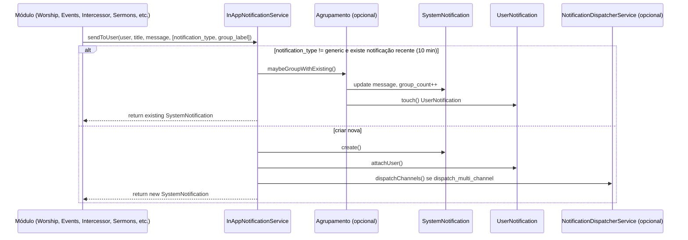
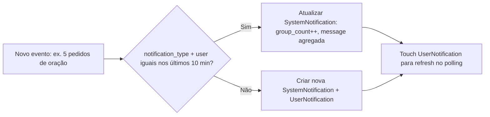
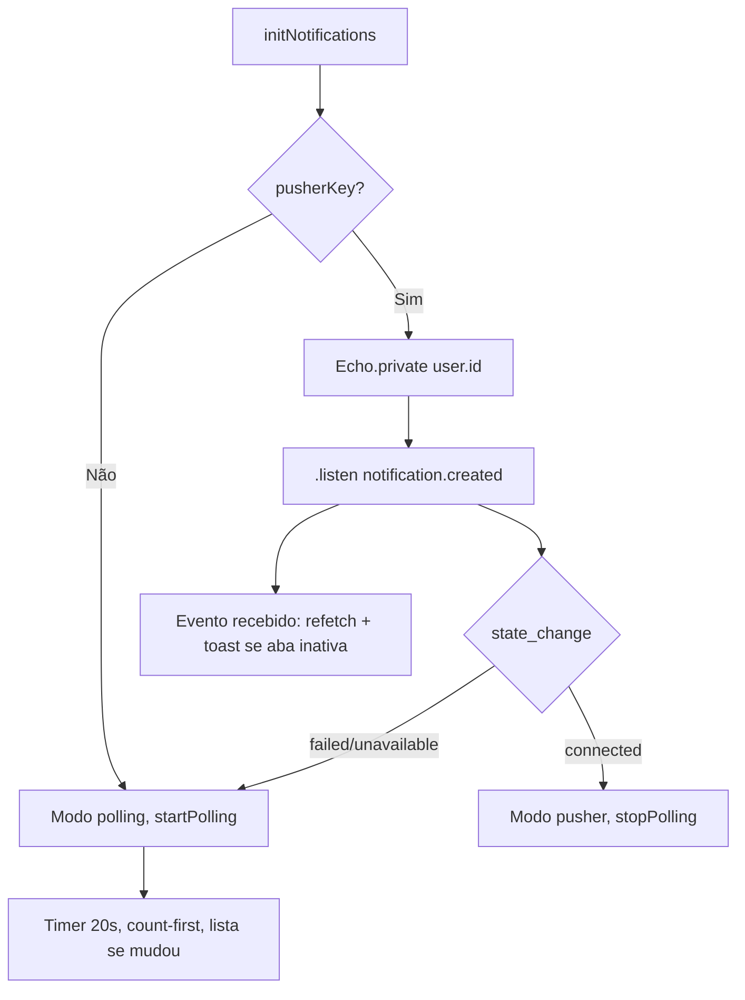
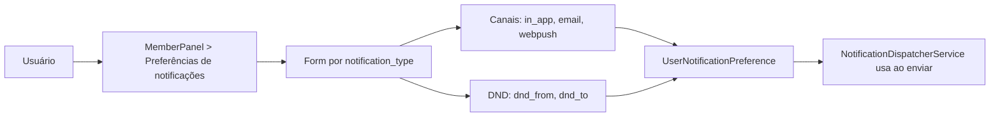
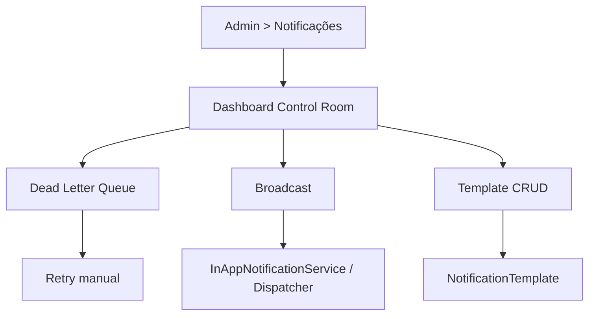

# Módulo Notifications – Visão Geral e Fluxos

 O módulo **Notifications** é o **hub central de comunicação** da aplicação VEPL. Ele entrega alertas in-app, e-mail, web push e (opcionalmente) SMS, com preferências por usuário, agrupamento inteligente e painel de controle para administradores. Funciona em modo **híbrido**: **Pusher** como canal principal (tempo real) e **Smart Polling** como contingência quando a conexão falha ou atinge limite. Inclui UI premium no dropdown, toasts clicáveis, camada educativa e comando de limpeza.

Este documento descreve como o módulo funciona, os fluxos principais e como usá-lo a partir de outros módulos.

---

## 1. Domínio e Principais Entidades

- **SystemNotification**
  - Notificação “global” criada pelo sistema (título, mensagem, tipo, prioridade, destinos).
  - Campos principais: `title`, `message`, `type` (info|success|warning|error), `priority` (low|normal|high|urgent), `target_users`, `target_roles`, `target_ministries`, `action_url`, `action_text`, `notification_type` (para agrupamento), `group_count`, `uuid`, `created_by`, `scheduled_at`, `expires_at`.
  - Relações: `creator()`, `users()` (via pivot `user_notifications`).

- **UserNotification**
  - Pivot “caixa de entrada” do usuário: liga `user_id` a `notification_id`, com `is_read`, `read_at`, `uuid`.
  - O sino e a listagem consomem apenas `UserNotification` do usuário autenticado.

- **NotificationTemplate**
  - Templates reutilizáveis por `key` (ex: `worship_roster`, `academy_lesson`, `event_registration`). Corpo com placeholders `{{ title }}`, `{{ message }}`, `{{ action_url }}`, `{{ action_text }}`. Usado pelo dispatcher multi-canal e pelo Admin para edição sem código.

- **UserNotificationPreference**
  - Preferências por usuário e `notification_type`: canais habilitados (`in_app`, `email`, `webpush`), e DND (`dnd_from`, `dnd_to`). Central de preferências no MemberPanel.

- **NotificationFailedDelivery** (DLQ)
  - Registros de entregas que falharam após retentativas (canal, payload, erro). Admin pode reenviar manualmente.

- **NotificationChannelStatus**
  - Estado do circuit breaker por canal/provedor (falhas, `open_until`).

- **NotificationAuditLog**
  - Rastreio de envios (data, usuário, canal, status, payload, erro).

---

## 2. Fluxos Principais (Mermaid)

### 2.1 Envio de notificação in-app (qualquer módulo)

Qualquer módulo envia notificação in-app injetando `InAppNotificationService` e chamando `sendToUser`, `sendToAdmins`, `sendToUsers` ou `sendToRole`. Opcionalmente passa `notification_type` e `group_label` para agrupamento.

### 2.2 Agrupamento (throttling) no mesmo usuário

Se o sistema disparar várias notificações do **mesmo tipo** para o **mesmo usuário** em **menos de 10 minutos**, o serviço **atualiza a notificação existente** em vez de criar várias (ex.: “Você tem 5 novos pedidos de oração”).

- Opções em `sendToUser`: `notification_type` (ex: `prayer_request`, `academy_lesson`) e `group_label` (ex: `pedidos de oração`) para texto “Você tem N novos {group_label}”.

### 2.3 Híbrido Pusher + Smart Polling (sino no navbar)

O script `resources/js/notifications.js` implementa **inteligência de conexão**:

1. **Tenta Pusher primeiro:** se `window.Laravel.pusherKey` existir, inicializa Laravel Echo e inscreve no canal privado `user.{id}`, ouvindo `.notification.created`.
2. **Payload mínimo no broadcast:** o evento `NotificationCreated` envia apenas `{ refresh: true, ts }` (sem dados sensíveis); o cliente refaz a leitura via API v1.
3. **Respeito à preferência:** o broadcast só é disparado se o usuário tiver canal `in_app` habilitado para aquele `notification_type` (`InAppNotificationService::shouldBroadcastToUser`).
4. **Se Pusher conectar:** `connection.state === 'connected'` → modo `pusher`, polling desativado; badge e lista atualizam ao receber o evento.
5. **Se falhar ou "Limit Exceeded":** modo `polling`, Smart Polling ativo (20s, count-first, só com aba visível, falha silenciosa).
6. **Admin:** quando em modo polling, o Control Room exibe o alerta discreto: *"Sistema operando em modo de Polling Otimizado (Contingência ativa)"*.

- **Marcar todas como lidas:** botão no dropdown chama `POST /api/v1/notifications/read-all` (batch update no backend); em seguida o JS atualiza o badge para 0 e recarrega a lista.

### 2.4 Central de preferências (MemberPanel)

O usuário define, por tipo de notificação, por quais canais deseja receber e o horário DND.

- Rotas: `memberpanel.preferences.notifications.index`, `memberpanel.preferences.notifications.update`.
- **Onde o usuário configura:** o link "O que receber / Silenciar" (ou "Configurar o que receber") aparece no dropdown do sino e no menu do usuário (Admin e MemberPanel); no MemberPanel também no sidebar em "Recursos" → "O que receber / Silenciar". Notificações marcadas pelo admin como **importantes** (prioridade alta/urgente) **sempre são entregues**, ignorando preferência e DND.

### 2.5 Painel de controle Admin (Control Room)

- **Dashboard:** estatísticas de entrega, DLQ e atalhos para broadcast e templates.
- **DLQ:** lista de `NotificationFailedDelivery`; botão “Tentar reenviar” por item.
- **Broadcast:** envio em massa (todos ou por grupo/role).
- **Templates:** CRUD de `NotificationTemplate` (placeholders apenas; sem Blade dinâmico no corpo).

- Rotas: `admin.notifications.control.dashboard`, `admin.notifications.dlq.*`, `admin.notifications.broadcast.*`, `admin.notifications.templates.*`.

---

## 3. API v1 (única API de notificações)

Todas as rotas sob `GET/POST/DELETE /api/v1/notifications/*` (middleware `web` + `auth`). Respostas no padrão `{ data }`.

| Método | Endpoint | Descrição |
|--------|----------|-----------|
| GET | `/api/v1/notifications` | Lista notificações do usuário (paginado; `per_page` opcional). |
| GET | `/api/v1/notifications/unread-count` | Contagem de não lidas + `last_updated_at` (para smart polling). |
| POST | `/api/v1/notifications/read-all` | Marca todas como lidas (batch update). |
| POST | `/api/v1/notifications/{id}/read` | Marca uma como lida. |
| DELETE | `/api/v1/notifications/clear-all` | Exclui todas do usuário. |
| DELETE | `/api/v1/notifications/{id}` | Exclui uma notificação do usuário. |

- **Serviço:** `NotificationApiService` (contagem, listagem, marcar lida, marcar todas, excluir).
- **Controller:** `Modules\Notifications\App\Http\Controllers\Api\V1\NotificationController`.

---

## 4. UI/UX – Sino, dropdown premium e toasts

- **Badge:** `#notification-badge` e `#notification-count-label` (“X nova(s)”) atualizados pelo JS (smart polling) e pelo botão “Marcar todas como lidas”.
- **Dropdown (Admin e MemberPanel):**
  - **Borda por prioridade:** barra lateral esquerda (azul info, amarelo aviso, vermelho urgente/alto).
  - **Actionable:** se houver `action_url` e `action_text`, exibe botão de destaque (“Resolver Agora” / “Ver Detalhes”) além do link do card.
- **Marcar todas como lidas:** um único batch update no backend; o JS atualiza badge e lista em seguida (sem erro de console em falha de rede).

---

## 5. Como outros módulos enviam notificações

- **In-App apenas:**  
  `app(InAppNotificationService::class)->sendToUser($user, 'Título', 'Mensagem', ['type' => 'success', 'action_url' => route('...'), 'action_text' => 'Ver']);`
- **Para agrupamento:** passe `notification_type` e opcionalmente `group_label`:  
  `sendToUser($user, 'Novo pedido de oração', '...', ['notification_type' => 'prayer_request', 'group_label' => 'pedidos de oração']);`
- **Para admins:**  
  `sendToAdmins('Alerta', 'Mensagem', ['priority' => 'high']);`
- **Multi-canal (e-mail, web push):** use as mesmas opções e ative `dispatch_multi_channel`; o `NotificationDispatcherService` respeita preferências e DND.

---

## 6. Camada educativa e produção

- **Economia de queries:** o polling chama primeiro só `unread-count`; a lista é carregada apenas quando o count ou `last_updated_at` mudam.
- **Agrupamento:** reduz criação de linhas e ruído na caixa de entrada quando muitos eventos do mesmo tipo ocorrem em pouco tempo.
- **Falhas:** erros de polling são tratados de forma silenciosa; “Marcar todas como lidas” usa um único batch update.
- **Migrações:** UUIDs em `system_notifications` e `user_notifications`; tabelas de audit, preferências, DLQ, templates e channel status conforme planejado no UPDATE.md.
- **Ícones:** uso de Font Awesome 7.1 Pro Duotone (incl. itens renderizados pelo JS no dropdown).
- **Camada educativa:** infobox nas preferências (MemberPanel); botão "Como funcionam as notificações?" (Elias); tooltips no Control Room; alerta "modo Polling (Contingência ativa)" no Admin.
- **Limpeza:** `php artisan notifications:purge [--days=90]` remove notificações lidas antigas.

---

## 8. Estrutura resumida de arquivos

- **Serviços:** `App\Services\InAppNotificationService`, `NotificationApiService`, `NotificationDispatcherService`
- **Models:** `SystemNotification`, `UserNotification`, `NotificationTemplate`, `UserNotificationPreference`, `NotificationFailedDelivery`, etc.
- **API:** `App\Http\Controllers\Api\V1\NotificationController`, `App\Http\Resources\UserNotificationResource`
- **Admin:** Control Room (dashboard, DLQ, broadcast, templates), listagem e criação de notificações
- **MemberPanel:** listagem de notificações, central de preferências
- **Front-end:** `resources/js/notifications.js` (smart polling), dropdown nas navbars (Admin e MemberPanel)
- **Rotas:** API em `routes/api.php` (grupo v1); web em `Modules/Notifications/routes/` e registros em `routes/admin.php` e rotas do MemberPanel

Com isso, o módulo Notifications fica documentado, com fluxos claros em Mermaid e pronto para uso e evolução em produção.
