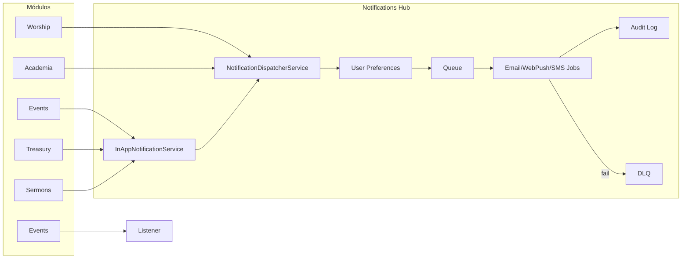

# PROJETO: Upgrade "Notifications Engine v2" - VEPL
# OBJETIVO: Criar um sistema de notificações centralizado, anti-falhas, multicanal e com gestão profissional.

Atue como Engenheiro de Software Especialista em Sistemas Distribuídos e Laravel 12. O módulo `Modules\Notifications` deve ser o HUB central de comunicação de todos os outros 18 módulos, garantindo entrega garantida e controle total.

## 1. Arquitetura Anti-Falhas (Backend & Resiliência)
- **Multi-Channel Stack:** Suporte nativo para In-App (Database), Email (Mailgun/SES), WebPush (Firebase/WebPush) e SMS/WhatsApp (opcional via Driver).
- **Smart Queuing:** Todas as notificações devem ser processadas via Queues (Redis/Horizon) com:
    - **Exponential Backoff:** Tentativas automáticas em caso de erro (3x, 10min, 1h).
    - **Circuit Breaker:** Se um provedor (ex: Mailgun) cair, o sistema deve registrar a falha e silenciar tentativas inúteis por X minutos, enviando um alerta ao Admin.
- **Notification Logging:** Tabela `notification_audit_logs` para rastrear: [Data, Usuário, Canal, Status (Sent/Failed/Opened), Payload, ErrorMessage].

## 2. Central de Preferências (MemberPanel)
- **User Choice:** O membro deve ter uma tela no `MemberPanel` para escolher O QUE e POR ONDE deseja ser notificado (ex: "Quero receber avisos de Escala por Email, mas avisos da Academia VEPL apenas In-App").
- **Do Not Disturb (DND):** Configuração de horário de silêncio (ex: não enviar Push após as 22h).

## 3. Painel de Controle Admin (The Control Room)
Crie um dashboard em `Admin\Notifications` com:
- **Stats:** Gráficos de entrega (Sucesso vs Falha), taxa de abertura e canais mais usados.
- **Dead Letter Queue (DLQ):** Lista de notificações que falharam definitivamente. Botão para "Tentar Reenviar" manualmente após corrigir o problema.
- **Global Broadcast:** Ferramenta para enviar notificações em massa para todos os membros ou grupos específicos (ex: apenas Líderes, apenas Diáconos).
- **Templates Dinâmicos:** Editor de templates (Blade/Markdown) para que o admin altere os textos das notificações sem mexer no código.

## 4. Integrações Estratégicas (Ponta a Ponta)
O sistema deve ouvir eventos de todos os módulos:
- **Events:** Notificar participantes e líderes sobre inscrições confirmadas.
- **Treasury:** Notificar tesoureiros sobre despesas acima do limite que aguardam aprovação.
- **Worship:** Avisar sobre novas escalas, ensaios e aulas da Academia VEPL.
- **Sermons:** Notificar co-autores sobre novos convites de colaboração.

## 5. UI/UX "Awesome" (Frontend 2026)
- **Live Bell:** O sininho no cabeçalho deve ser Livewire/Websocket para atualização em tempo real sem refresh.
- **Actionable Notifications:** Cada notificação deve ter um link direto para a ação (ex: "Você foi escalado" -> link para a escala).
- **Toasts de Feedback:** Use notificações flutuantes (Toasts) suaves quando o usuário estiver logado.

## Instruções Técnicas:
1. Use o novo sistema de `Job Batching` do Laravel 12 para notificações em massa.
2. Implemente o `NotificationServiceProvider` para registrar os canais customizados.
3. Garanta que todas as migrations usem UUIDs para segurança e rastreabilidade.
4. Utilize o componente `<x-loading-overlay />` no painel de reenvio manual.

Por favor, analise as dependências de todos os módulos e crie o plano de migração e implementação dos Services.

--------------------------  PLANO DE IMPLEMENTAÇÃO --------------------------
# Notifications Engine v2
Plano de migração e implementação do Notifications Engine v2: hub central multi-canal (In-App, Email, WebPush, SMS/WhatsApp), filas resilientes com backoff e circuit breaker, auditoria, central de preferências no MemberPanel, painel Admin (stats, DLQ, broadcast, templates) e integrações ponta a ponta com Events, Treasury, Worship e Sermons.

# Notifications Engine v2 - Plano de Implementação

## Estado atual (resumo)

- **Backend:** [InAppNotificationService](../../../../../Users/Administrator/.cursor/plans/Modules/Notifications/app/Services/InAppNotificationService.php) (sendToUser, sendToAdmins, sendToUsers, sendToRole) cria `SystemNotification` + `UserNotification` e dispara `NotificationCreated` (ShouldBroadcast). [NotificationApiService](../../../../../Users/Administrator/.cursor/plans/Modules/Notifications/app/Services/NotificationApiService.php) alimenta a API v1 (`/api/v1/notifications/`). Listeners: RegistrationConfirmed, payment.completed, RosterCreated.
- **Tabelas:** `system_notifications` (id bigint, sem UUID), `user_notifications`; sem audit log e sem preferências.
- **Admin:** [Admin\NotificationController](../../../../../Users/Administrator/.cursor/plans/Modules/Admin/app/Http/Controllers/NotificationController.php) — index, create, store, show; rotas em [routes/admin.php](../../../../../Users/Administrator/.cursor/plans/routes/admin.php). Views em `notifications::admin.notifications.`.
- **MemberPanel:** Bell no navbar (dados server-side + [notifications.js](../../../../../Users/Administrator/.cursor/plans/resources/js/notifications.js) com polling quando Echo não está configurado); página de notificações e ações via API v1.
- **Integracoes existentes:** Treasury (envios para tesoureiros/admin), Events, PaymentGateway, Worship (escalas), Sermons (convite co-autor), Intercessor (NotificationService + Jobs).

---

## 1. Arquitetura anti-falhas (backend e resiliência)

### 1.1 Multi-channel stack

- **Canais:** In-App (DB, já existe), Email (Mailgun/SES via Laravel Mail), WebPush (driver: Firebase ou WebPush), SMS/WhatsApp (driver opcional, ex: Twilio/Evolution API).
- **Abordagem:** Um único ponto de entrada que decide canais por preferência do usuário e tipo de notificação. Introduzir um **NotificationDispatcherService** (ou estender o atual) que:
  - Recebe: user(s), título, mensagem, tipo/categoria (ex: `worship_roster`, `academy_lesson`, `event_registration`), opções (action_url, etc.).
  - Consulta preferências do usuário (nova tabela) e DND.
  - Para cada canal habilitado, enfileira um Job (não envia síncrono), exceto In-App que pode continuar síncrono para feedback imediato na UI.
- **Canais Laravel:** Usar o sistema nativo `Illuminate\Notifications` com canais customizados registrados em um **NotificationChannelManager** ou em um `NotificationServiceProvider` do módulo (registrar canais: `mail`, `database`, `webpush`, `sms`). Cada notificação “lógica” (ex: RosterPublished) pode ser uma classe que implementa `toArray` (database), `toMail`, `toWebPush`, etc., ou um DTO único convertido por adaptadores por canal.
- **Recomendação:** Manter **InAppNotificationService** como API estável para os módulos; internamente ele pode chamar o novo dispatcher que enfileira também Email/WebPush/SMS conforme preferências. Assim não quebra Treasury, Sermons, etc.

### 1.2 Smart queuing

- **Fila:** Todas as entregas por canal (exceto In-App persistência) devem ir para queue (ex: `notifications`). Config em [config/queue.php](../../../../../Users/Administrator/.cursor/plans/config/queue.php); Redis recomendado para produção, mas manter `database` como fallback (já é o default).
- **Jobs:** Um job por canal por destinatário (ou um job “multi-delivery” que trata um lote). Exemplo: `SendNotificationEmailJob`, `SendNotificationWebPushJob`, `SendNotificationSmsJob`. Cada job:
  - Implementa **exponential backoff:** `$tries = 3`, `$backoff = [60, 600, 3600]` (1 min, 10 min, 1 h) ou usar `backoff()` no Laravel 12.
  - Em falha definitiva, grava na **Dead Letter Queue** (tabela `notification_failed_deliveries` ou similar) e opcionalmente notifica Admin.
- **Circuit breaker:** Tabela `notification_channel_status` (ou config cache): `channel` (mail, webpush, sms), `provider` (mailgun, ses, etc.), `last_failure_at`, `failure_count`, `open_until` (timestamp). No job, antes de enviar: se `open_until > now()` para aquele provider, pular envio e registrar para DLQ + alertar Admin (uma vez). Ao falhar: incrementar contador, setar `open_until = now()->addMinutes(X)`. Ao sucesso: resetar. Serviço: `CircuitBreakerService` ou lógica dentro do job.
- **Laravel 12 Job Batching:** Para “Global Broadcast” (envio em massa), usar `Bus::batch([...])->dispatch()` para agrupar jobs de notificação e permitir progresso e tratamento de falhas no lote.

### 1.3 Notification audit log

- **Migration:** Nova tabela `notification_audit_logs` com: `uuid` (primary ou key), `user_id` (nullable), `channel` (in_app, email, webpush, sms), `status` (sent, failed, opened), `notification_id` (FK system_notifications, nullable), `payload` (JSON, conteúdo resumido), `error_message` (nullable), `created_at`. Índices por user_id, channel, status, created_at.
- **Uso:** Em cada entrega (no job ou no listener), após tentativa, gravar registro. “Opened” pode ser atualizado por webhook (email) ou por evento no front (in_app/push) se desejar.

---

## 2. Central de preferências (MemberPanel)

- **Tabela `user_notification_preferences`:** `user_id`, `notification_type` (ex: `worship_roster`, `academy_lesson`, `event_registration`, `sermon_collaboration`, `treasury_approval`, etc. — enum ou string), `channels` (JSON array: `["in_app","email","webpush"]`), `dnd_from`, `dnd_to` (time ou null). PK (user_id, notification_type) ou id + unique.
- **Tela MemberPanel:** Nova rota e view (ex: `memberpanel.preferences.notifications`). Formulário: para cada tipo de notificação (lista fixa ou vinda de config), checkboxes por canal (In-App, Email, WebPush, SMS) e opcionalmente horário DND (ex: não enviar push/email entre 22h e 7h). Salvar via controller que atualiza `user_notification_preferences`.
- **Aplicação:** No NotificationDispatcherService, antes de enfileirar Email/WebPush/SMS, ler preferências do usuário; respeitar DND para canais “intrusivos” (push, sms, talvez email).

---

## 3. Painel de controle Admin (The Control Room)

- **Rotas e controller:** Novo namespace em Admin dedicado ao “Control Room” ou estender o atual. Rotas em [routes/admin.php](../../../../../Users/Administrator/.cursor/plans/routes/admin.php) sob prefixo existente (ex: `admin/notifications/...`). Controller(s): `NotificationDashboardController`, `NotificationDlqController`, `NotificationBroadcastController`, `NotificationTemplatesController`.
- **Dashboard (stats):** Página com gráficos: entrega (sucesso vs falha) por período, taxa de abertura (se tiver dado), canais mais usados. Dados agregados a partir de `notification_audit_logs` (e opcionalmente `system_notifications`). Usar ApexCharts ou similar (já há vendor no projeto); dados via controller que retorna JSON ou Blade com dados injetados.
- **DLQ (Dead Letter Queue):** Lista de registros de `notification_failed_deliveries` (ou audit_logs com status failed e sem retry pendente). Colunas: data, usuário, canal, título/resumo, erro. Botão “Tentar reenviar” que dispara job novamente (e usa `<x-loading-overlay />` conforme instruções).
- **Global Broadcast:** Formulário: título, mensagem, destino (todos os membros; ou por role(s); ou por ministério(s)). Ao enviar, usar Job Batching para criar um job por usuário (ou por lote) e disparar. Canais respeitam preferências e DND.
- **Templates dinâmicos:** Tabela `notification_templates`: `key` (ex: `worship_roster_published`), `name`, `subject` (para email), `body` (Blade/Markdown), `channels` (json). Editor no Admin (CRUD). No momento de montar a notificação, o dispatcher resolve o template por key e substitui variáveis (ex: `{{ title }}`, `{{ action_url }}`). Fallback: se não houver template, usar título/mensagem passados no código.

---

## 4. Integrações estratégicas (ponta a ponta)

- **Events — inscrições confirmadas:** Disparar notificações quando uma inscrição é confirmada (listener `RegistrationConfirmed`), incluindo link para a área do evento. Essa abordagem mantém integração ponta a ponta sem dependência de módulos legados.
- **Treasury — despesas acima do limite:** Já existe criação de `CouncilApproval` em [TreasuryApiService](../../../../../Users/Administrator/.cursor/plans/Modules/Treasury/app/Services/TreasuryApiService.php) (linha ~246). Adicionar notificação para tesoureiros ou admins quando uma despesa acima do limite é criada e fica aguardando aprovação (ex: evento ou chamada direta ao InAppNotificationService/Dispatcher com tipo `treasury_approval` e action_url para a aprovação).
- **Worship — escalas, ensaios e Academia:** Definir eventos: ex: `RosterCreated` (escalas) e eventos para aulas da Academia VEPL (quando aplicável). Worship registra listeners e o Notifications envia (via dispatcher) para os usuários afetados, respeitando preferências.
- **Sermons — convite co-autor:** Já implementado em [SermonController](../../../../../Users/Administrator/.cursor/plans/Modules/Sermons/app/Http/Controllers/Admin/SermonController.php) (linha ~421) via InAppNotificationService. Manter; opcionalmente passar um “tipo” para que o dispatcher possa enviar também email/push conforme preferência do usuário.

Fluxo geral: cada módulo continua chamando `InAppNotificationService` ou disparando um evento; o Notifications module concentra a lógica de multi-canal, fila e auditoria.

---

## 5. UI/UX (frontend 2026)

- **Live Bell:** Conforme AGENTS.md (low-cost), preferir **Livewire polling** em vez de WebSockets: um componente Livewire no navbar que a cada X segundos (ex: 30–60) chama a API v1 `unread-count` e atualiza o badge e a lista. Alternativa: manter o polling em [notifications.js](../../../../../Users/Administrator/.cursor/plans/resources/js/notifications.js) (já existe) e apenas garantir que o badge e a lista no dropdown sejam atualizados via JS quando os dados mudam. Evitar depender de Reverb/Pusher a menos que explicitamente configurado.
- **Actionable notifications:** Já existem `action_url` e `action_text` em SystemNotification. Garantir que todas as integrações (Treasury, Events, Worship, Sermons, Intercessor) passem `action_url` e `action_text` adequados nas chamadas ao serviço. No front (Admin e MemberPanel), o dropdown e a página de listagem devem renderizar link clicável para `action_url`.
- **Toasts:** [notifications.js](../../../../../Users/Administrator/.cursor/plans/resources/js/notifications.js) já possui lógica de toast para `notification-received`. Manter e garantir que o evento seja disparado quando uma nova notificação chega (polling ou broadcast). Estilo alinhado ao design system (Tailwind, premium).

---

## 6. Migrações e alterações de schema

- **UUIDs:** Nova migration em Notifications: adicionar `uuid` (uuid, unique) a `system_notifications` e `user_notifications`; preencher para registros existentes; opcionalmente usar uuid como identificador público em APIs. Manter `id` para FKs internas.
- **Novas tabelas:** `notification_audit_logs`, `user_notification_preferences`, `notification_failed_deliveries` (ou equivalente para DLQ), `notification_templates`, `notification_channel_status` (circuit breaker). Todas com `uuid` onde fizer sentido para rastreabilidade.
- **Migrations:** Usar `Schema::uuid()` ou `$table->uuid('uuid')->unique()` conforme padrão Laravel 12.

---

## 7. Ordem sugerida de implementação

1. **Fase 1 — Base:** Migrations (audit log, preferences, DLQ, templates, channel status, UUIDs). Models e repos/services mínimos para ler/escrever essas tabelas.
2. **Fase 2 — Canais e fila:** NotificationDispatcherService (ou refactor do InAppNotificationService) que enfileira jobs por canal; Jobs com backoff; gravação em audit log; circuit breaker no job.
3. **Fase 3 — Preferências e DND:** Tela MemberPanel de preferências; aplicação de preferências e DND no dispatcher.
4. **Fase 4 — Admin Control Room:** Dashboard (stats), DLQ (lista + reenviar com loading-overlay), Global Broadcast (batch jobs), CRUD de templates.
5. **Fase 5 — Integrações:** Listeners/eventos para Events (inscrições confirmadas), Treasury (despesa aguardando aprovação), Worship (escalas/aulas), Sermons (convites) e Intercessor (compromissos).
6. **Fase 6 — UI:** Livewire polling (ou refinamento do JS) no bell; garantir toasts e links acionáveis em todas as views de notificação.

---

## Diagrama de fluxo (resumo)

---

## Dependências entre módulos (consumidores atuais)

| Módulo              | Uso atual                                               |
| ------------------- | ------------------------------------------------------- |
| Worship             | Listener NotifyWorshipRosterCreated                  |
| Treasury            | InAppNotificationService::sendToAdmins (balancete)      |
| Events              | Listener SendEventRegistrationNotification + Mail       |
| PaymentGateway      | Listener SendPaymentCompletedNotification               |
| Academy (Worship)   | Notificações por aula/nível (types VEPL)            |
| Sermons             | InAppNotificationService::sendToUser (convite co-autor) |
| Intercessor         | NotificationService + Jobs (email)                      |
| Admin / MemberPanel | UserNotification no navbar e páginas                    |

Nenhum módulo precisa ser alterado na assinatura do InAppNotificationService; a extensão é interna ao Notifications (dispatcher + canais + preferências).
