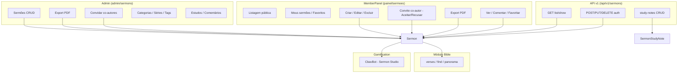
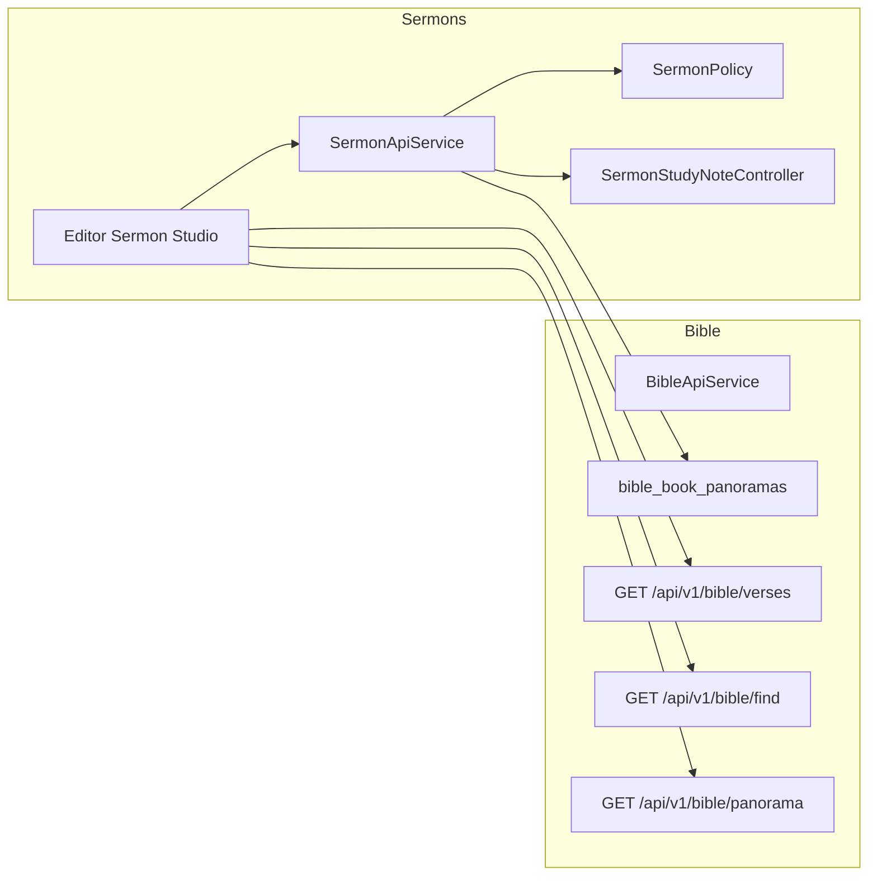
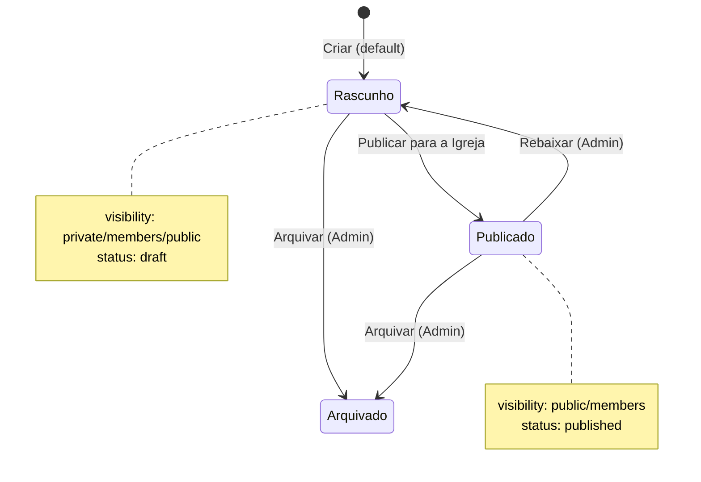
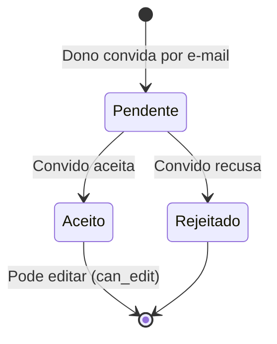

# Módulo Sermons – Visão Geral e Fluxos (Sermon Studio)

O módulo **Sermons** é o **laboratório de homilética e exegese** da igreja: ferramenta de estudo e preparação teológica para elaboração de sermões, com privacidade, co-autoria, integração à Bíblia local e assistente Elias sob demanda. Após o upgrade **Sermon Studio**, o módulo cobre desde o rascunho privado até a publicação e exportação para o púlpito.

Este documento descreve **como o módulo funciona**, o que foi implementado no upgrade e como usar os recursos na prática.

---

## 1. Domínio e Principais Entidades

### 1.1. Sermon (Sermão)

- **Representa** um sermão ou esboço (rascunho ou publicado).
- **Campos principais:**
  - Identificação: `title`, `slug`, `subtitle`, `description`.
  - Conteúdo: `full_content` (editor rico), `introduction`, `body_outline`, `conclusion`, `practical_application`.
  - Estrutura homilética: `sermon_structure_type` (expositivo | temático | textual), `structure_meta` (JSON).
  - Classificação: `category_id`, `sermon_series_id`, tags (pivot), `sermon_date`, `worship_suggestion_id`.
  - Mídia: `cover_image`, `attachments` (JSON).
  - Controle: `status` (draft | published | archived), `visibility` (public | members | private), `is_collaborative`, `is_featured`.
  - Métricas: `views`, `likes`, `downloads`, `published_at`, `user_id`.
- **Relações importantes:**
  - `user` → autor.
  - `category` → SermonCategory.
  - `sermonSeries` → SermonSeries (série expositiva).
  - `tags` → SermonTag (many-to-many).
  - `bibleReferences` → SermonBibleReference (referências citadas).
  - `studyNotes` → SermonStudyNote (notas de exegese).
  - `collaborators` → SermonCollaborator (co-autores).
  - `comments` → SermonComment (comentários públicos).
  - `favorites` → SermonFavorite.
- **Regras de negócio:**
  - Novo sermão nasce **privado** e em **rascunho**; publicação é explícita (“Publicar para a Igreja”).
  - `canView($user)`: público publicado → todos; members publicado → autenticados; privado → dono ou co-autor aceito.
  - `canEdit($user)`: dono, admin/pastor ou co-autor aceito com `can_edit`.
  - `canDelete($user)`: apenas dono ou admin/pastor (co-autor não pode excluir).

### 1.2. SermonBibleReference

- Referência bíblica vinculada ao sermão: livro, capítulo, versículos, tipo (main/support/illustration), contexto, opcionalmente `exegesis_notes` e `study_note_id` (vínculo com nota de estudo).

### 1.3. SermonStudyNote

- Nota de exegese (termos originais, referências cruzadas) do usuário. Pode ser ligada a um sermão (`sermon_id`) ou apenas por referência (`reference_text`, `book_id`, `chapter_id`) para reutilização. Campo `is_global` para “dicionário” reutilizável.

### 1.4. SermonCollaborator

- Co-autoria: `sermon_id`, `user_id`, `role`, `can_edit`, `status` (pending | accepted | rejected), `invited_at`, `accepted_at`. Apenas dono (ou admin) convida; convidado recebe notificação e aceita/recusa no MemberPanel.

### 1.5. Outras entidades do módulo

- **SermonCategory** – categorias de sermões (CRUD Admin).
- **SermonTag** – tags temáticas (Escatologia, Mordomia, etc.); multiselect no create/edit.
- **SermonSeries** – séries expositivas (livro/tema); usado em `sermons.sermon_series_id`.
- **SermonOutline** / **SermonExegesis** – esboços homiléticos e exegese do texto (gestão Admin; listagem/visualização no MemberPanel).
- **SermonComment** / **SermonFavorite** – comentários e favoritos no painel do membro.

### 1.6. Integrações externas

- **Bible (API v1):** `GET /api/v1/bible/verses`, `find`, `panorama` – picker de citações, trigger `@` e painel “Contexto Bíblico”.
- **Gamification:** XP logic removed as the module was deleted.
- **Notifications:** `InAppNotificationService` para convite de co-autor (link para aceitar/recusar no MemberPanel).

---

## 2. Estrutura do Módulo (Mermaid)

---

## 3. Fluxos Principais (Ponta a Ponta)

### 3.1. Criar e publicar sermão (Admin ou MemberPanel)

1. **Admin:** `admin/sermons/sermons/create` ou **Member:** `painel/sermoes/criar`.
2. Formulário: título, subtítulo, resumo, categoria, série, tipo de estrutura (expositivo/temático/textual), **editor rico** (`full_content`), seções tradicionais (intro/desenvolvimento/conclusão/aplicação) em bloco opcional, tags, referências bíblicas.
3. **Configurações:** status (rascunho/publicado), visibilidade (público/membros/privado). **Padrão:** rascunho + privado; toggle “Publicar para a Igreja” altera conforme desejado.
4. Sidebar no editor: **Contexto Bíblico** (livro → panorama via `GET /api/v1/bible/panorama?book_number=`).
5. Submit dispara `<x-loading-overlay />` e redireciona para show (admin ou member).
6. **Bible picker:** modal “Citar Bíblia” usa `GET /api/v1/bible/verses` (sem mock); **@ no editor:** botão “Referência” ou trigger insere bloco com `data-bible-ref` após `GET /api/v1/bible/find?ref=`.

### 3.2. Editar sermão (Admin ou MemberPanel)

1. **Admin:** `admin/sermons/sermons/{id}/edit` | **Member:** `painel/sermoes/{sermon}/editar` (apenas se `canEdit`).
2. Mesmo layout: editor rico, estrutura, tags, referências, sidebar (Contexto Bíblico). No Admin: capa, anexos, sugestão de louvor, co-autores (listar + convidar por e-mail). No Member: co-autores somente listagem (convite pelo Admin).
3. **Co-autores (Admin):** bloco “Co-autores” com lista (status pendente/aceito/recusado) e formulário “Convidar por e-mail” → `POST admin/sermons/sermons/{sermon}/collaborators` → cria `SermonCollaborator` (pending), envia notificação in-app com link para `painel/sermoes/convite/{collaborator}`.
4. Submit com loading overlay; policy `SermonPolicy::update` (delega a `$sermon->canEdit($user)`).

### 3.3. Convite de co-autor (MemberPanel)

1. Convidado recebe notificação com link **Ver convite** → `GET painel/sermoes/convite/{collaborator}`.
2. View `collaborator-invite`: exibe título do sermão e autor; botões **Aceitar** / **Recusar**.
3. `POST painel/sermoes/convite/{collaborator}/respond` com `action=accept|reject` → `accept()` ou `reject()` no model; redireciona para a página do sermão.

### 3.4. Exportar para o púlpito (PDF)

1. **Admin:** botão “Exportar para púlpito” na show → `GET admin/sermons/sermons/{sermon}/export-pdf?format=full|topics&size=a4|a5`.
2. **Member:** se `canEdit`, mesmo botão na show → `GET painel/sermoes/{sermon}/export-pdf?format=...&size=...`.
3. Controller autoriza `view`; gera PDF (Mpdf) com esboço completo ou só tópicos; destaca no conteúdo `[TRANSIÇÃO]` e `[APELO]`.

### 3.5. Notas de estudo (exegese) – API v1

1. **Listar/criar notas (auth):** `GET/POST /api/v1/sermons/study-notes` (filtros por referência/sermão); `GET/PUT/DELETE .../study-notes/{id}`.
2. Usado pelo editor para “Fazer Exegese”: salvar notas reutilizáveis por `reference_text` ou vinculadas ao sermão; opção `is_global` para dicionário.

### 3.6. [REMOVIDO] Elias – Sermon Studio (Bot Elias removido por solicitação)

---

## 4. Diagrama de Fluxo de Dados (Mermaid)

---

## 5. Diagrama de Estados (Sermão e Co-autor)

---

## 6. Melhorias e Funcionalidades do Upgrade (Sermon Studio)

| Área                     | O que foi implementado                                                                                                                                                                                               |
| ------------------------ | -------------------------------------------------------------------------------------------------------------------------------------------------------------------------------------------------------------------- |
| **Bible – Panorama**     | Tabela `bible_book_panoramas` (book_number, author, date_written, theme_central, recipients); seeder 66 livros; `BibleApiService::getPanoramaByBookNumber()`; `GET /api/v1/bible/panorama?book_number=`.             |
| **Contexto Bíblico**     | Painel lateral no editor (create/edit): seleção de livro → chama API panorama e exibe autor, data, tema, destinatários.                                                                                              |
| **Bible Picker**         | “Buscar Texto” deixa de ser mock: `fetch('/api/v1/bible/verses?' + URLSearchParams(...))` com tratamento de loading/erro.                                                                                            |
| **Smart @ (linker)**     | Botão/referência no editor: usuário informa ref (ex.: João 3:16) → `GET /api/v1/bible/find?ref=` → insere blockquote com `data-bible-ref`.                                                                           |
| **Notas de exegese**     | Tabela `sermon_study_notes`; `SermonStudyNote`; API v1 `GET/POST /api/v1/sermons/study-notes` e `GET/PUT/DELETE .../study-notes/{id}`; colunas `exegesis_notes` e `study_note_id` em `sermon_bible_references`.      |
| **Privacidade**          | Default create: `visibility = private`, `status = draft`; toggle “Publicar para a Igreja” no formulário (admin e member).                                                                                            |
| **Estrutura homilética** | Colunas `sermon_structure_type` (expositivo/temático/textual) e `structure_meta`; dropdown no create/edit; constantes no model.                                                                                      |
| **Elias Sermon Studio**  | [REMOVIDO]                                                                                                                                                                                                           |
| **Export PDF**           | `exportPdf` Admin e MemberPanel; parâmetros `format=full                                                                                                                                                             | topics`, `size=a4 | a5`; marcadores [TRANSIÇÃO] e [APELO] destacados; Mpdf. |
| **RBAC**                 | `SermonPolicy` (view, update, delete); delete delega a `canDelete($user)` (só dono ou admin). Autorização em controllers Admin, MemberPanel e API v1.                                                                |
| **Co-autoria**           | Admin: bloco Co-autores na edit + `POST admin/sermons/sermons/{sermon}/collaborators`; notificação in-app com link para MemberPanel. MemberPanel: `showCollaboratorInvite`, `respondCollaborator` (aceitar/recusar). |
| **API v1 paridade**      | `SermonApiService`: create/update aceitam e sincronizam `bible_references` e `tags`; list/show incluem tags e bibleReferences; autorização via policy.                                                               |
| **MemberPanel edição**   | Rotas edit/update/destroy em `painel/sermoes/{sermon}`; mesma experiência de editor (rico, estrutura, sidebars); export PDF quando canEdit; loading overlay em submits.                                              |

---

## 7. UI/UX – Navegação e Telas Principais

### 7.1. Admin

- **Sidebar:** sob o grupo de Sermons/Estúdio Expositivo: Sermões, Categorias, Séries Expositivas, Esboços Homiléticos, Exegese do Texto.
- **Sermões:** index (listagem), create, edit, show. Na show: botão “Exportar para púlpito”. Na edit: bloco “Co-autores” (lista + convite por e-mail).
- **Create/Edit:** layout em duas colunas; coluna principal com formulário e editor rico; sidebar com Contexto Bíblico. Ícones: `pen-fancy`, `scroll`, `gavel`, `user-group`.

### 7.2. MemberPanel

- **Menu:** acesso a “Sermões” (listagem), “Meus sermões”, “Meus favoritos”, “Criar sermão”.
- **Listagem:** `painel/sermoes` – filtros por categoria/tag; apenas sermões que `canView` permite.
- **Show:** título, conteúdo, referências, comentários, favoritar; se `canEdit`: “Editar Sermão” (→ edit) e “Exportar para púlpito” (→ export-pdf).
- **Create:** `painel/sermoes/criar` – formulário com seções e referências bíblicas; configurações status/visibilidade.
- **Edit:** `painel/sermoes/{sermon}/editar` – mesmo editor rico, estrutura, tags, sidebar (Contexto Bíblico); lista de co-autores (sem convite); botão Excluir se `canDelete`.
- **Convite co-autor:** `painel/sermoes/convite/{collaborator}` – página para aceitar ou recusar; após responder, redireciona para show do sermão.

### 7.3. Loading e feedback

- Todos os formulários de sermão (admin e member create/edit) disparam `loading-overlay:show` no submit (e opcionalmente no delete no member edit), conforme AGENTS.md.
- Ícones: apenas Font Awesome via `<x-icon>` (pen-fancy, scroll, gavel, user-group, etc.).

---

## 8. Rotas Resumidas

| Contexto        | Rotas principais                                                                                                                                                                                                                                                                                                                                                                                                                                         |
| --------------- | -------------------------------------------------------------------------------------------------------------------------------------------------------------------------------------------------------------------------------------------------------------------------------------------------------------------------------------------------------------------------------------------------------------------------------------------------------- |
| **Admin**       | `admin.sermons.sermons.*` (index, create, store, edit, update, destroy), `admin.sermons.sermons.show`, `admin.sermons.sermons.export-pdf`, `admin.sermons.sermons.collaborators.invite` (POST).                                                                                                                                                                                                                                                          |
| **MemberPanel** | `memberpanel.sermons.index`, `memberpanel.sermons.my-sermons`, `memberpanel.sermons.my-favorites`, `memberpanel.sermons.create`, `memberpanel.sermons.store`, `memberpanel.sermons.show`, `memberpanel.sermons.edit`, `memberpanel.sermons.update`, `memberpanel.sermons.destroy`, `memberpanel.sermons.export-pdf`, `memberpanel.sermons.collaborator.invite` (GET), `memberpanel.sermons.collaborator.respond` (POST), toggle-favorite, store-comment. |
| **API v1**      | `GET/POST /api/v1/sermons`, `GET/PUT/DELETE /api/v1/sermons/{id}`; `GET/POST /api/v1/sermons/study-notes`, `GET/PUT/DELETE /api/v1/sermons/study-notes/{id}` (auth).                                                                                                                                                                                                                                                                                     |

---

## 9. Considerações para Produção

- **RBAC:** Sempre usar `SermonPolicy` (view/update/delete) nos controllers e na API; listagens no MemberPanel filtradas por `canView`; rascunhos/privados só para dono e co-autores.
- **Bible:** Todo texto de versículos e panorama vêm do módulo Bible (API v1); não duplicar lógica de versões/livros no Sermons.
- **Elias:** [REMOVIDO] Funcionalidade de assistente por bot removida do projeto.
- **Migrações:** Tabelas `sermon_study_notes`, `bible_book_panoramas`, colunas `sermon_structure_type`, `structure_meta`, `exegesis_notes`, `study_note_id` em refs; FKs e índices conforme migrations existentes.

---

## 10. Como Evoluir

- Painel “Fazer Exegese” completo no editor (modal com notas por referência e sugestão de notas reutilizáveis).
- Sincronização automática de `sermon_bible_references` a partir de blocos `data-bible-ref` no `full_content` ao salvar.
- Export PDF com mais opções (só introdução, só aplicação, tamanho de fonte).
- Histórico de versões (versionamento do conteúdo) usando `version` / `parent_id` já existentes no model.

O módulo Sermon Studio está **pronto para produção**: editor homilético, privacidade, co-autoria com notificações, integração Bible e Elias, export para púlpito e RBAC consistentes entre Admin, MemberPanel e API v1.
