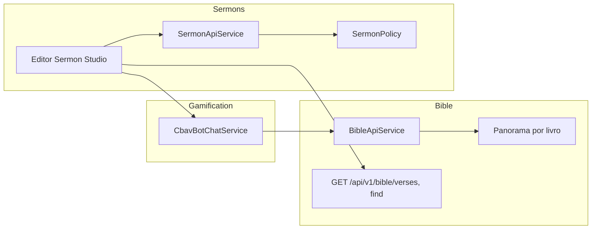

# PROJETO: Upgrade "Sermon Studio" (Laboratório de Homilética e Exegese) - VertexCBAV
# OBJETIVO: Criar uma ferramenta de estudo e preparação teológica de elite, pessoal e profissional.

Atue como Engenheiro de Software Sênior e Especialista em Teologia Bíblica. Quero transformar o módulo `Modules\Sermons` em um "Sermon Studio" completo, focado no estudo exegético e na construção do sermão, sem automações de secretaria/eventos, priorizando o uso pessoal do pregador.

## 1. Ferramentas de Estudo e Exegese (Backend & UI)
- **Panorama AT/NT Integrado:** No editor de sermões, adicione um painel lateral de "Contexto Bíblico". Quando o pastor selecionar um livro, o sistema deve exibir informações de Panorama (Autor, Data, Tema Central, Destinatários) vindo do banco de dados ou via Elias.
- **Smart Bible Linker (@):** Implemente o trigger `@`. Ao digitar `@Gênesis 1:1`, o sistema deve linkar o texto do `Modules\Bible`. Se o pastor selecionar um texto, deve haver uma opção "Fazer Exegese", que abre um campo para notas de estudo de termos originais ou referências cruzadas.
- **Dicionário e Referências:** Integração para salvar "Notas de Estudo" permanentes que o pastor pode reutilizar em futuros sermões sobre o mesmo tema ou livro.

## 2. O Editor "Sermon Studio"
- **Privacidade Total:** Por padrão, todo sermão nasce como `Privado`. Deve haver um toggle manual "Publicar para a Igreja" apenas se o pastor desejar compartilhar o esboço final no MemberPanel.
- **Estrutura Homilética Profissional:** O editor deve oferecer templates de estrutura baseados nos Princípios Batistas (Isaltino Coelho):
    - **Sermão Expositivo:** Foco no texto, contexto e aplicação.
    - **Sermão Temático:** Foco na doutrina e referências espalhadas.
    - **Sermão Textual:** Foco nas divisões do próprio versículo.
- **Gestão de Séries e Tópicos:** Agrupar sermões por livros da Bíblia ou temas doutrinários (ex: Escatologia, Mordomia).

## 3. Bot Elias: O Consultor de Bancada
- **Assistente de Homilética:** O Elias deve atuar apenas quando clicado. Ele deve oferecer:
    - "Sugerir Ilustração": Baseado no ponto principal do sermão.
    - "Verificar Coerência": Checar se a interpretação segue os princípios batistas (CBB).
    - "Pesquisa Histórica": Trazer dados sobre o contexto cultural do texto citado.
- **Sem Interferência:** O Elias é um assistente de pesquisa, não um co-autor. Ele fornece "insights" para o pastor filtrar.

## 4. Design e Exportação "Pulpit-Ready"
- **Design de Estudo:** Uma interface focada em escrita (Dark Mode opcional, tipografia limpa, sem distrações).
- **Exportação para Púlpito:** Gerador de PDF em formato A5 ou A4 com:
    - Opção de imprimir "Esboço Completo" ou "Apenas Tópicos".
    - Marcadores visuais para momentos de transição e apelo.
- **Ícones FA:** Use `fa-pen-fancy` para rascunhos, `fa-scroll` para panoramas e `fa-gavel` para exegese.

## 5. Requisitos de Integração e Segurança
- **Bible Sync:** O parsing do `@` deve ser rápido e buscar no módulo `Bible` respeitando as versões disponíveis (ARA, NVI, etc.).
- **RBAC:** Apenas o Pastor (ou quem ele autorizar via 'Co-autor') pode ler seus rascunhos. Segurança absoluta dos manuscritos.

Instrução técnica: Foque na robustez do editor de texto e no serviço de parsing bíblico. A ferramenta deve ser um deleite para quem ama estudar e preparar a Palavra.

# Sermon Studio Upgrade
Upgrade completo do módulo Sermons para \"Sermon Studio\": ferramentas de exegese (Panorama, @ linker, notas de estudo), editor homilético com privacidade e templates, Elias como consultor sob demanda, exportação PDF para púlpito, RBAC e integração Bible v1 sem redundância.

# Upgrade Sermon Studio - Plano ponta a ponta

## Estado atual (resumo)

- **Rotas:** Admin e Member em `routes/admin.php` e `routes/member.php`; API v1 em `routes/api.php` (`/api/v1/sermons`). Sem rotas dentro do módulo.
- **Modelo:** `Sermon` com status (draft/published/archived), visibility (public/members/private), `full_content`, intro/development/conclusion/application, `SermonBibleReference`, `SermonCollaborator`. Não há default `visibility = private` no create; não há `SermonPolicy`.
- **Editor:** Rich editor Quill em admin (create/edit) com bible-picker; "Buscar Texto" no picker é **mock** (não chama Bible API). Sem trigger `@` para linkar versículos.
- **Bible:** API v1 com `find`, `verses`, `books`, `search`. **Não existe** tabela de Panorama (autor, data, tema, destinatários por livro).
- **Elias:** `CbavBotChatService` em Gamification com contexto genérico (ex.: `lesson_title`); não há fluxo específico para Sermon Studio (sugerir ilustração, coerência CBB, pesquisa histórica).
- **Exportação PDF:** Não existe. Apenas upload de anexos PDF.
- **Permissões:** `canEdit`/`canView` no modelo; API sem checagem de ownership/policy.

---

## 1. Panorama AT/NT (Contexto Bíblico)

**Objetivo:** Painel lateral "Contexto Bíblico" no editor: ao selecionar um livro, exibir Autor, Data, Tema Central, Destinatários.

- **Bible module – dados:**
  - Nova migration em `Modules/Bible/database/migrations`: tabela `bible_book_panoramas` com `book_number` (1–66, canônico), `testament` (old/new), `author`, `date_written` (string), `theme_central` (text), `recipients` (text), `language` (opcional, default pt). Índice em `book_number` para evitar duplicata por versão (panorama é por livro canônico).
  - Seeder (ex.: `BibleBookPanoramaSeeder`) com dados iniciais para os 66 livros (pode ser resumido; fontes Isaltino/consenso).
- **Bible API:**
  - Em `BibleApiService`: método `getPanoramaByBookNumber(int $bookNumber, ?string $language = 'pt')`.
  - Novo endpoint: `GET /api/v1/bible/panorama?book_number=1` (ou `book_id` e resolver book_number) → resposta `{ data: { author, date_written, theme_central, recipients } }`. Registrar em `routes/api.php` no grupo v1/bible.
- **Sermons UI:**
  - No layout do editor (create/edit), painel lateral colapsável "Contexto Bíblico" (ícone `fa-scroll`). Quando o usuário escolhe um livro (dropdown ou a partir da referência principal do sermão), chamar `GET /api/v1/bible/panorama?book_number=...` e exibir os campos. Não depender do Elias para esse conteúdo; Elias pode complementar com "pesquisa histórica" quando acionado.

**Arquivos principais:** Nova migration e seeder em Bible; `BibleApiService`; `BibleController` (Api\V1); view/JS do editor Sermons (sidebar context).

---

## 2. Smart Bible Linker (@) e Notas de Exegese

**Objetivo:** Trigger `@` no editor: ao digitar `@Gênesis 1:1` (ou similar), linkar ao texto do Bible; opção "Fazer Exegese" para notas de estudo (termos originais, referências cruzadas) reutilizáveis.

- **Parsing @ no editor:**
  - No rich-editor (ou componente Sermon Studio que encapsula o editor), detectar input no padrão `@<livro> <cap>:<v>` (ex.: `@João 3:16`, `@1 Coríntios 13:4-7`). Sugestão: módulo Quill ou listener no `text-change`; ao detectar `@` + string de referência, chamar `GET /api/v1/bible/find?ref=<ref>` (Bible API já existe), obter texto e inserir no conteúdo como bloco linkado (ex.: `...` ou blockquote com atributo) com tooltip ao passar o mouse (verso + link "Abrir na Bíblia").
  - Manter o bible-picker atual como alternativa (modal livro/capítulo/versículos); substituir o **mock** em `fetchText()` por `GET /api/v1/bible/verses?chapter_id=...` ou `book_id&chapter_number&verse_range=...` (e `version_id` do default ou do formulário). Arquivo: [Modules/Sermons/resources/views/admin/sermons/partials/bible-picker.blade.php](../../../../../Users/Administrator/.cursor/plans/Modules/Sermons/resources/views/admin/sermons/partials/bible-picker.blade.php).
- **Fazer Exegese:**
  - Nova tabela `sermon_study_notes`: `id`, `user_id`, `sermon_id` (nullable), `reference_text` (ex.: "João 3:16"), `book_id`/`chapter_id` (nullable, Bible), `content` (text/JSON: termos originais, cross-refs, notas), `created_at`, `updated_at`. Uma nota pode ser só por referência (reutilizável) ou ligada a um sermão.
  - Modelo `SermonStudyNote` em Sermons; relação em `Sermon` (hasMany studyNotes). Migration em `Modules/Sermons/database/migrations`.
  - UI: ao selecionar um trecho já linkado (ou ao clicar em "Fazer Exegese" no tooltip do @), abrir painel/modal com campo de notas e lista de notas existentes para aquela referência (do usuário). Salvar via `POST /api/v1/sermons/{id}/study-notes` (ou endpoint dedicado em Sermons API).
  - Dicionário/referências: as próprias `sermon_study_notes` são o repositório reutilizável; ao abrir "Fazer Exegese" para outra referência, exibir notas salvas para a mesma `reference_text` (ou livro) para copiar/reatachar.

**Arquivos principais:** [resources/js/components/rich-editor.js](../../../../../Users/Administrator/.cursor/plans/resources/js/components/rich-editor.js) (ou novo sermon-studio-editor.js); bible-picker (fetchText → Bible API); migration + model `SermonStudyNote`; API v1 Sermons (study-notes); Blade/Alpine do editor (tooltip, modal exegese).

---

## 3. Editor "Sermon Studio" – Privacidade, Estrutura, Séries/Tópicos

**Privacidade**
- Default no create: `visibility = Sermon::VISIBILITY_PRIVATE`, `status = draft`. No formulário (admin e member): toggle explícito "Publicar para a Igreja" (só relevante ao publicar: ao marcar "Publicar", setar `visibility` para `members` ou permitir escolha public/members). Garantir que listagens no MemberPanel mostrem só o que `canView` permite e que rascunhos/privados só para dono e co-autores.

**Estrutura homilética**
- Nova coluna `sermon_structure_type` na tabela `sermons`: enum ou string (`expositivo`, `temático`, `textual`). Opcional: `structure_meta` (JSON) para rótulos customizados por seção.
- Templates baseados em Isaltino Coelho:
  - **Expositivo:** Introdução, Contexto, Desenvolvimento (pontos do texto), Aplicação, Conclusão.
  - **Temático:** Tese, Desenvolvimento (doutrina + referências), Aplicação, Conclusão.
  - **Textual:** Divisões do próprio versículo (tópicos derivados do texto).
- No editor: dropdown "Tipo de estrutura" e, conforme o tipo, exibir seções pré-definidas (podem mapear para os campos existentes `introduction`, `development`, `conclusion`, `application` + `full_content` com headings). Não obrigatório preencher todas; apenas guia visual.

**Séries e tópicos**
- Já existem `series_id` (BibleSeries) e `category_id` (SermonCategory). Usar **tags** (SermonTag) para temas doutrinários (Escatologia, Mordomia, etc.): garantir CRUD de tags no admin e no formulário do sermão (multiselect). Agrupar sermões "por livro" via série (série = livro) ou por tag. Nenhuma tabela nova; apenas uso consistente de séries + categorias + tags.

**Arquivos principais:** Migration `add_sermon_structure_type_to_sermons_table`; [Modules/Sermons/app/Models/Sermon.php](../../../../../Users/Administrator/.cursor/plans/Modules/Sermons/app/Models/Sermon.php) (constantes/fillable); views create/edit (toggle visibilidade, dropdown estrutura, tags); MemberPanel mesmo padrão onde o membro pode editar.

---

## 4. Bot Elias – Consultor de Bancada (sob demanda)

**Objetivo:** Elias só atua quando clicado; oferece "Sugerir Ilustração", "Verificar Coerência" (CBB), "Pesquisa Histórica".

- **Backend (Gamification):**
  - Estender `CbavBotChatService::respond()`: se `context['sermon_studio'] === true` e `context['action']` em `['suggest_illustration', 'check_coherence', 'historical_research']`, delegar a novo método `respondSermonStudio($user, $message, $context)`.
  - `respondSermonStudio()`:
    - **suggest_illustration:** usar ponto principal do sermão (ex.: `context['main_point']` ou excerpt) + `BibleApiService::search()` para versículos ilustrativos; opcionalmente regras locais (ex.: parábolas, narrativas) em `CbavBotRuleEngineService` ou array curto de sugestões.
    - **check_coherence:** retornar checklist curto de princípios batistas (CBB) ou texto fixo de "dicas de coerência" (interpretação literal, autoridade da Escritura, etc.) sem chamada externa.
    - **historical_research:** usar `context['reference']` ou livro selecionado; retornar conteúdo de `bible_book_panoramas` (autor, data, destinatários) + frase tipo "Para mais detalhes, consulte um comentário bíblico."
  - Rota existente: `POST .../cbav-bot/chat` já recebe `message` e pode receber `context` (JSON). Front envia `context: { sermon_studio: true, action, sermon_id?, main_point?, reference? }`.
- **Front (editor Sermons):**
  - Painel lateral ou barra "Elias" (ícone `fa-gavel` ou ícone do bot): botões "Sugerir Ilustração", "Verificar Coerência", "Pesquisa Histórica". Ao clicar, abrir painel de chat (estilo EBD) com contexto pré-preenchido; resposta do Elias exibida no painel. Sem auto-execução; apenas sob demanda.

**Arquivos principais:** [Modules/Gamification/app/Services/CbavBotChatService.php](../../../../../Users/Administrator/.cursor/plans/Modules/Gamification/app/Services/CbavBotChatService.php); view/JS do editor Sermons (painel Elias + chamada à rota de chat com context).

---

## 5. Design e Exportação "Pulpit-Ready"

**Design**
- Interface focada em escrita: layout do create/edit com área principal para o editor (Quill), sidebars colapsáveis (Contexto Bíblico, Elias, Referências). Dark mode opcional: toggle no editor com persistência em `localStorage` (ou user preference no backend). Tipografia conforme [system_default.md](../../../../../Users/Administrator/.cursor/plans/system_default.md) (Inter, Poppins), sem elementos desnecessários.
- Ícones FA (apenas `<x-icon>`): `pen-fancy` (rascunhos), `scroll` (panoramas/contexto), `gavel` (exegese/Elias). Atualizar sidebar e títulos do módulo onde fizer sentido.

**Exportação PDF**
- Nova rota: `GET admin/sermons/sermons/{sermon}/export-pdf` (e opcionalmente no MemberPanel para próprio sermão). Parâmetros: `format=full|topics`, `size=a4|a5`.
  - **full:** esboço completo (full_content renderizado + introduction, development, conclusion, application).
  - **topics:** apenas tópicos (headings/estrutura, sem corpo longo).
- Gerar PDF com DomPDF ou similar (já usado no projeto se houver); página A4 ou A5; margens adequadas para impressão. Marcadores no conteúdo: detectar `[TRANSIÇÃO]` e `[APELO]` no texto (ou tags específicas no Quill) e destacar visualmente no PDF (negrito, ícone ou caixa).
- Botão "Exportar para púlpito" na tela show/edit do sermão (admin e member quando canEdit).

**Arquivos principais:** Controller method `exportPdf` em Admin (e Member) SermonController; view Blade (ou HTML) para o layout do PDF; rota nomeada; botão na view.

---

## 6. Integração Bible e RBAC

**Bible sync**
- **Bible-picker:** Em [bible-picker.blade.php](../../../../../Users/Administrator/.cursor/plans/Modules/Sermons/resources/views/admin/sermons/partials/bible-picker.blade.php), substituir o mock em `fetchText()` por `fetch('/api/v1/bible/verses?' + new URLSearchParams({ book_id: ..., chapter_number: ..., verse_range: ..., version_id: ... }))` (ou `chapter_id` se disponível). Tratar resposta `{ data }` e preencher `this.text`. Garantir que a versão padrão seja passada pela view (ex.: `$defaultVersionId`).
- **@ linker:** Como acima, usar apenas `GET /api/v1/bible/find?ref=...`. Parsing rápido no front; sem redundância de lógica no backend além da API Bible existente.

**RBAC**
- Criar `SermonPolicy` em `Modules/Sermons/App/Policies/SermonPolicy.php`: `view` (delegar a `$sermon->canView($user)`), `update` e `delete` (delegar a `$sermon->canEdit($user)`). Registrar no `SermonsServiceProvider`: `Gate::policy(Sermon::class, SermonPolicy::class)`.
- Admin: usar `$this->authorize('view', $sermon)` (ou equivalente) em show; `authorize('update', ...)` em update; `authorize('delete', ...)` em destroy.
- MemberPanel: permitir edit/update/destroy apenas para próprios sermões (e co-autores com can_edit); usar policy em todas as ações. Rotas: adicionar `edit`, `update`, `destroy` para `painel/sermoes/{sermon}`.
- API v1: em `show`, `update`, `destroy`, autorizar com `Gate::policy` (ex.: `$this->authorize('view', $sermon)`). List: filtrar itens privados apenas para dono/co-autor (já pode ser feito no SermonApiService com `user_id` quando auth).

**Arquivos principais:** SermonPolicy; SermonsServiceProvider; Admin e MemberPanel SermonController; Api\V1\SermonController; rotas member (edit, update, destroy).

---

## 7. Co-autoria e API v1 completa

**Co-autoria**
- UI no admin (e opcionalmente no member) na tela edit do sermão: seção "Co-autores". Listar `sermon->collaborators`; botão "Convidar" (e-mail ou seleção de usuário); ao convidar, criar `SermonCollaborator` com status `pending`. Co-autor recebe notificação (InAppNotificationService) com link para aceitar/recusar. Tela de aceitação: rota `memberpanel.sermons.collaborator.respond` (accept/reject). Ao aceitar, `status = accepted` e `can_edit = true` (ou conforme escolha). Apenas dono pode remover co-autor.

**API v1**
- Estender payload de create/update para aceitar `bible_references` (array de objetos book, chapter, verses, type, context), `tags` (array de ids ou nomes para sync). Incluir na resposta de list/show: `bible_references` e `tags`. Capa: manter por URL ou adicionar endpoint separado de upload (multipart) para não inflar JSON; documentar.

**Arquivos principais:** SermonApiService (create/update com refs e tags); Api\V1\SermonController; views edit (bloco co-autores); rotas e controller para convite e respond; Notifications (invite collaborator).

---

## 8. Consistência e Produção

- **Loading overlay:** Em todos os formulários de sermão (admin e member), garantir que o submit dispare `loading-overlay:show` (e `stop-loading` ou equivalente no retorno), conforme [AGENTS.md](../../../../../Users/Administrator/.cursor/plans/AGENTS.md).
- **Skeleton/loading:** Em listagens que dependem de A

# Sermon Studio Upgrade
Upgrade completo do módulo Sermons para "Sermon Studio": ferramentas de exegese (Panorama, @ linker, notas reutilizáveis), editor homilético com privacidade e templates, Elias como consultor sob demanda, exportação PDF para púlpito, RBAC e integração Bible/MemberPanel sem redundância, pronto para produção.

# Upgrade Sermon Studio - Plano Ponta a Ponta

- **Rotas:** Admin e Member em `routes/admin.php` e `routes/member.php`; API v1 em `routes/api.php` (`/api/v1/sermons`). Sem rotas dentro do módulo.
- **Modelo:** `Sermon` com status (draft/published/archived), visibility (public/members/private), `full_content`, intro/development/conclusion/application, `SermonBibleReference`, `SermonCollaborator`. Não há default explícito de visibility no create.
- **Editor:** Rich editor (Quill) em admin create/edit com bible-picker; "Buscar Texto" no picker é **mock** (não chama Bible API). Member create usa apenas textareas, sem rich editor.
- **Bible:** `BibleApiService` e `GET /api/v1/bible/verses`, `find`, `search` existem. **Não existe** tabela de Panorama (autor, data, tema, destinatários por livro).
- **Elias:** `CbavBotChatService` em Gamification; recebe `context` (ex.: `lesson_title`). Não há fluxo específico para Sermon Studio.
- **Permissões:** `Sermon::canEdit()` / `canView()` usados; **não existe** `SermonPolicy`; API v1 não aplica autorização por sermão.
- **Exportação PDF:** Não existe no módulo.
- **Colaboradores:** Model e relações existem; não há UI para convidar/gerir co-autores.

---

## 1. Panorama AT/NT e painel "Contexto Bíblico"

- **Bible (fonte de verdade):** Criar armazenamento de panorama por livro.
  - Nova migration em **Bible**: `bible_book_panoramas` com `book_number` (1-66, independente de versão), `author`, `date`, `theme_central`, `recipients` (text), opcional `testament`. Dados seedados para os 66 livros (conteúdo básico; pode ser expandido depois).
  - **BibleApiService:** novo método `getBookPanorama(int $bookNumber): ?array`.
  - **Bible API v1:** novo endpoint `GET /api/v1/bible/books/panorama?book_number=1` (ou por `book_id` mapeando a `book_number`), resposta `{ data: { author, date, theme_central, recipients } }`.
- **Sermons – Editor:** Painel lateral "Contexto Bíblico" (ex.: coluna direita ou slide-over). Ao selecionar um livro (dropdown ou a partir da referência principal do sermão), o front chama o endpoint acima e exibe Autor, Data, Tema Central, Destinatários. Ícone sugerido: `fa-scroll` (panoramas). Manter uso 100% local (Bible); sem "Elias" para preencher panorama.

---

## 2. Smart Bible Linker (@) e exegese

- **Trigger @ no editor:** No rich editor (Quill), detectar digitação de `@` e abrir um popover/autocomplete para referência (ex.: "Gênesis 1:1", "João 3:16"). Ao escolher ou ao parsear texto do tipo `@Livro cap:versos`:
  - Chamar `GET /api/v1/bible/find?ref=...` para obter texto e metadados.
  - Inserir no conteúdo um bloco linkado (blockquote ou span com `data-ref`, link para leitura no Bible). Persistir referência em `sermon_bible_references` quando aplicável (ex.: ao salvar, extrair refs do conteúdo ou manter seção explícita de refs).
- **"Fazer Exegese":** Para uma referência já inserida ou selecionada, botão/opção que abre um painel (modal ou slide-over) com campo de **notas de exegese** (termos originais, referências cruzadas). Salvar em:
  - Opção A (recomendada): coluna `exegesis_notes` (text) em `sermon_bible_references` (uma por ref no sermão).
  - Opção B: tabela `sermon_study_notes` reutilizável (user_id, reference_text, content) e FK em `sermon_bible_references` para `study_note_id`. Para "reutilizar em futuros sermões", ver bloco 3.
- **Ícone exegese:** `fa-gavel` no painel/ botão de exegese.
- **Bible picker – produção:** Em [Modules/Sermons/resources/views/admin/sermons/partials/bible-picker.blade.php](../../../../../Users/Administrator/.cursor/plans/Modules/Sermons/resources/views/admin/sermons/partials/bible-picker.blade.php), substituir o mock em `fetchText()` por chamada real a `GET /api/v1/bible/verses` (usando `chapter_id` ou `book_id` + `chapter_number` + `verse_range`; `version_id` do formulário ou versão padrão). Tratar erros e estado de carregamento.

---

## 3. Notas de estudo reutilizáveis (dicionário / referências)

- **Modelo e tabela:** Criar `sermon_study_notes`: `id`, `user_id`, `reference_text`, `book_id` (nullable), `chapter`, `verses`, `content` (text), `timestamps`. Opcional: `is_global` (boolean) para o pastor marcar como reutilizável por tema/livro.
- **Uso:** No painel de exegese de uma referência, opção "Salvar como nota de estudo" cria/atualiza `SermonStudyNote` e opcionalmente associa à `SermonBibleReference` (ex.: `study_note_id` em `sermon_bible_references`). Em novos sermões, ao citar a mesma referência, sugerir ou carregar a nota existente (por user + reference_text ou book/chapter/verses).
- **API/UI:** Endpoints ou seção no editor para listar/criar/editar notas do usuário (ex.: `GET/POST /api/v1/sermons/study-notes` ou dentro do fluxo do sermão). Dicionário/referências = lista de notas do usuário filtrada por livro ou tema.

---

## 4. Editor "Sermon Studio": privacidade, estrutura homilética, séries/tópicos

- **Privacidade:** Todo sermão novo com `visibility = private` e `status = draft` por padrão (no model default ou no controller ao criar). No formulário (admin e member), toggle explícito **"Publicar para a Igreja"**: ao ativar, definir `visibility` (members ou public) e opcionalmente `status = published`; caso contrário, manter private/draft.
- **Estrutura homilética (Isaltino Coelho):** Adicionar ao modelo `sermon` o campo `structure_template` (enum ou string: `expositivo`, `tematico`, `textual`) e, se necessário, `structure_data` (JSON) para divisões customizadas. No editor, escolha de template que define blocos sugeridos:
  - **Expositivo:** Introdução, Contexto, Desenvolvimento (exegese), Aplicação, Conclusão.
  - **Temático:** Tese, Divisões (com referências espalhadas).
  - **Textual:** Divisões baseadas no próprio versículo.
    O conteúdo pode continuar em `full_content` (HTML) e/ou nos campos existentes (introduction, development, conclusion, application); o template apenas organiza a UI e placeholders.
- **Séries e tópicos:** Já existem `series_id` (BibleSeries) e `category_id` (SermonCategory). Usar **tags** (SermonTag) para temas doutrinários (Escatologia, Mordomia, etc.). Garantir no create/edit (admin e member) dropdowns de série e categoria e multiselect de tags; filtros na listagem por série e tag.
- **Ícones:** `fa-pen-fancy` para rascunhos/lista de sermões em elaboração; `fa-scroll` no painel de panorama; `fa-gavel` na exegese (já citados).

---

## 5. Elias: consultor de bancada (sob demanda)

- **Comportamento:** Elias só age quando o usuário clica em uma ação no editor de sermão (sem interrupção automática). Ações sugeridas:
  - **"Sugerir Ilustração"** (com base no ponto principal ou no texto do sermão).
  - **"Verificar Coerência"** (checar se a interpretação está alinhada a princípios batistas/CBB – regras locais ou texto fixo).
  - **"Pesquisa Histórica"** (contexto cultural/histórico do texto citado).
- **Implementação:** Estender o fluxo do CBAV Bot para contexto **Sermon Studio**:
  - **Gamification:** Em `CbavBotChatService` (ou novo `SermonEliasService` chamado por ele), quando `context['type'] === 'sermon_studio'` e `context['action']` é um dos acima, montar prompt/regra e responder com texto local (Bible + dados de panorama, sem APIs externas; ilustração e coerência podem ser respostas template/regras até haver IA configurada). Pesquisa histórica pode usar panorama + eventual tabela de contexto histórico (futuro) ou texto fixo por livro.
  - **Rotas:** Reutilizar `POST /painel/cbav-bot/chat` (e equivalente admin se houver) enviando `message` + `context: { type: 'sermon_studio', action, sermon_id?, title?, main_reference?, excerpt? }`.
  - **UI:** No editor de sermão (admin e member), painel lateral ou botão "Elias" que abre painel com os três botões de ação; resposta exibida como insight para o pastor filtrar (não auto-inserir no texto).

---

## 6. Design "pulpit-ready" e exportação PDF

- **Design do editor:** Interface focada em escrita: tipografia limpa (Inter/Poppins, [system_default.md](../../../../../Users/Administrator/.cursor/plans/system_default.md)), modo escuro opcional (toggle Alpine + classe no container do editor), sem distrações. Manter [system_default.md](../../../../../Users/Administrator/.cursor/plans/system_default.md) (ícones FA locais, loading overlay em submits).
- **Exportação para púlpito:** Novo recurso de geração de PDF (A5 ou A4):
  - Endpoint/action: ex.: `GET admin/sermons/sermons/{id}/export-pdf?format=a5|a4&mode=full|outline`. `mode=full` = esboço completo (intro, desenvolvimento, conclusão, aplicação, refs); `mode=outline` = apenas tópicos/divisões.
  - Marcadores visuais no PDF para **transição** e **apelo** (ex.: blocos especiais no `full_content` ou tags no structure_data; ou campos opcionais `transition_notes`, `altar_call_notes` no sermon).
  - Biblioteca: DomPDF ou similar (local, sem dependência externa). Template Blade dedicado para o layout do PDF (fonte legível, margens adequadas para púlpito).

---

## 7. Integração Bible e segurança (RBAC)

- **Bible sync:** O parsing de `@` e o bible picker usam exclusivamente `GET /api/v1/bible/find` e `GET /api/v1/bible/verses` (versões disponíveis já fornecidas pelo Bible). Garantir que o Sermons não duplique lógica de versões/livros; usar apenas a API v1 do Bible.
- **RBAC – SermonPolicy:** Criar `SermonPolicy` em `Modules\Sermons\App\Policies\SermonPolicy` com `view`, `update`, `delete`. Regras: apenas o autor, co-autor aceito com `can_edit`, ou usuário admin/pastor podem editar; apenas autor ou admin podem excluir; visualização conforme `Sermon::canView()`. Registrar no `SermonsServiceProvider`: `Gate::policy(Sermon::class, SermonPolicy::class)`.
- **Uso da policy:** Em todos os controllers (Admin e MemberPanel) e no API v1: antes de `show`/`update`/`destroy`, `$this->authorize('view'|'update'|'delete', $sermon)`. Listagens: admin vê todos; member vê apenas os que pode ver (por visibility + ownership/collaboration). API v1: listagem pública respeitando visibility/status; create = usuário autenticado; update/destroy = authorize com policy.
- **Co-autores:** Apenas o dono (ou admin) pode adicionar/remover colaboradores. Co-autor aceito com `can_edit` pode editar o sermão; não pode excluir nem alterar permissões.

---

## 8. Co-autoria (UI), API v1 e MemberPanel

- **UI de colaboradores:** Na tela de edição do sermão (admin e, se o member puder editar, member), seção "Co-autores": listar colaboradores (status pendente/aceito/recusado), convidar por e-mail (criar `SermonCollaborator` com `can_edit`), aceitar/recusar pelo convidado (rota e ação para atualizar status). Usar modelo e regras já existentes (`SermonCollaborator`, `canEdit()`).
- **API v1 – paridade:** Estender `SermonApiService` e o controller API v1 para aceitar e retornar `bible_references` (array), `tags` (array de ids ou nomes), e opcionalmente `cover` (upload ou URL). Incluir `bible_references` e `tags` na resposta de `show`/list quando fizer sentido. Aplicar autorização com `SermonPolicy` em update/destroy.
- **MemberPanel – edição:** Adicionar rotas e views para o membro editar e excluir seus próprios sermões (ou nos quais é co-autor com `can_edit`): `GET/PUT/DELETE painel/sermoes/{sermon}/editar` (ou `edit`/`update`/`destroy`). Usar o mesmo editor rico (rich editor + bible picker + @) que no admin para experiência unificada. Garantir loading overlay em todos os submits (AGENTS.md).

---

## 9. Fluxo de dados e arquivos principais

- **Arquivos a criar ou alterar (resumo):**
  - **Bible:** migration `bible_book_panoramas`, `BibleApiService::getBookPanorama`, rota e método no `BibleController` (API v1), seeder básico.
  - **Sermons:** migration para `exegesis_notes` em `sermon_bible_references` (e opcionalmente `sermon_study_notes` + FK), migration para `structure_template`/`structure_data` e defaults de visibility/status; `SermonPolicy` e registro; `SermonApiService` e API controller (bible_references, tags, authorize); Admin/Member controllers (policy, toggle publicar, colaboradores, export PDF); bible-picker (fetch real); rich-editor ou componente Sermon Studio (trigger @, painel contexto, exegese, Elias); views de edição member e export PDF; sidebar admin (ícones pen-fancy, scroll, gavel se necessário).
  - **Gamification:** extensão de `CbavBotChatService` (ou serviço auxiliar) para `context.type === sermon_studio` e ações ilustração/coerência/histórico.

---

## 10. Ordem sugerida de implementação

1. **Bible:** Panorama (migration + seeder + service + API v1).
2. **Sermons:** RBAC (`SermonPolicy`, registro, uso em controllers e API v1); defaults private/draft e toggle "Publicar para a Igreja"; bible picker com fetch real.
3. **Sermons:** Smart @ linker no editor e "Fazer Exegese" (`exegesis_notes` em refs); painel "Contexto Bíblico" consumindo panorama.
4. **Sermons:** Estrutura homilética (structure_template + UI); notas de estudo reutilizáveis (tabela + UI/API).
5. **Elias:** Fluxo Sermon Studio no CbavBot (context + ações) e UI no editor.
6. **Sermons:** Export PDF (A5/A4, full/outline, marcadores); UI de co-autores; API v1 paridade (refs, tags, cover).
7. **MemberPanel:** Edição de sermões com mesmo editor e políticas; loading overlay em todos os submits.

Com isso, o Sermon Studio fica ponta a ponta: exegese e panorama locais, editor colaborativo e privado, Elias sob demanda, export para púlpito e RBAC consistente, sem redundância e pronto para produção.
