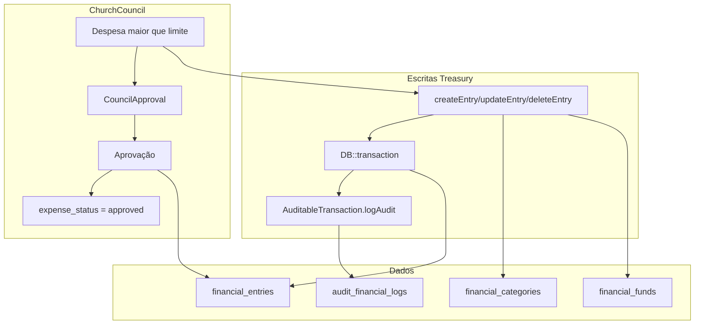

# Treasury CBAV2026 Baptist Standard
Alinhar o módulo Treasury aos padrões de tesouraria batista: plano de contas explícito, receitas/despesas categorizadas, centros de custo (fundos), fluxo de aprovação de despesas integrado ao ChurchCouncil, Plano Cooperativo, auditoria imutável, transações em DB e relatórios de prestação de contas (balancete, recibos).

# Treasury CBAV2026 – Padrão Batista Completo e Integração

## Estado atual (resumo)

- **Tabelas**: `financial_entries` (enum category, soft deletes, `council_approval_id`), `campaigns`, `financial_goals`, `treasury_permissions`. Não existem `financial_categories`, `budgets`, `audit_financial_logs` nem tabela de fundos.
- **Serviço**: [TreasuryApiService](../../../../../Users/Administrator/.cursor/plans/Modules/Treasury/app/Services/TreasuryApiService.php) concentra CRUD de entradas, campanhas, metas, relatórios e importação de pagamentos; já cria [CouncilApproval](../../../../../Users/Administrator/.cursor/plans/Modules/ChurchCouncil/app/Models/CouncilApproval.php) para despesas acima de `church_council_auto_approve_budget_limit`.
- **Integração ChurchCouncil**: Despesa acima do limite gera `CouncilApproval` (tipo `financial_request`); ao aprovar, [executeFinancialRequestApproval](../../../../../Users/Administrator/.cursor/plans/Modules/ChurchCouncil/app/Models/CouncilApproval.php) atualiza `FinancialEntry.council_approved_at`. Nenhum status explícito de despesa (Pendente/Aprovada/Paga).
- **Dinheiro**: `decimal(15,2)` em todas as colunas; modelos com `decimal:2`. Sem trait de auditoria; sem log imutável de alterações.

---

## 1. Segurança e auditoria

### 1.1 Transações e log imutável

- Envolver todas as operações de escrita financeira (criar/atualizar/estornar entrada, atualizar campanha/meta, importar pagamento) em `DB::transaction()` dentro do serviço.
- Nova tabela **audit_financial_logs**: `id`, `user_id` (nullable), `action` (created/updated/deleted/reversed), `auditable_type`, `auditable_id`, `old_values` (json nullable), `new_values` (json nullable), `ip` (string nullable), `created_at`. Sem `updated_at`: log é append-only.
- Nova **Trait AuditableTransaction** em `Modules/Treasury/App/Traits`: método estático `logAudit($action, $auditable, $oldValues, $newValues, $userId)` que insere em `audit_financial_logs`. Será chamada explicitamente pelo serviço após cada create/update/delete (não via Eloquent events, para garantir que só o serviço grava e que o log reflete o estado após a transação).

### 1.2 Proibição de exclusão física

- Manter **SoftDeletes** em `FinancialEntry`; não adicionar `forceDelete` em nenhum fluxo de tesouraria.
- Documentar que “excluir” = soft delete; preferir **estorno** (lançamento contrário) para correção. Opcional: coluna `reversal_of_id` (FK para `financial_entries.id`) em `financial_entries` para vincular entrada de estorno à original; serviço pode oferecer “Estornar” criando entrada inversa e marcando a original como estornada (ex.: `metadata->reversed_at` ou flag) em vez de soft delete, conforme política da igreja.

---

## 2. Plano de contas e categorias (Baptist standard)

### 2.1 Tabela financial_categories

- Nova migration: **financial_categories** com `id`, `type` (enum: income, expense), `slug` (string, unique), `name` (string), `description` (nullable), `is_system` (boolean, default true), `order` (int, default 0), `timestamps`.
- Seed **TreasuryCategoriesSeeder** com categorias pré-definidas:
  - **Receitas**: Dízimos (`tithe`), Ofertas Alçadas (`offering`), Ofertas de Missões – Nacional (`offering_missions_national`), Estadual (`offering_missions_state`), Mundial (`offering_missions_world`), Fundo de Construção (`construction_fund`), Doações (`donation`), Doação Ministério (`ministry_donation`), Campanha (`campaign`), Outros (`other`).
  - **Despesas**: Preletores (`preachers`), Manutenção (`maintenance`), Ação Social (`social_action`), Educação Cristã (`christian_education`), Salários e Encargos (`salary_benefits`), Contas/Utilidades (`utilities`), Equipamentos (`equipment`), Eventos (`event`), Outros (`other`).
- Migration em **financial_entries**: adicionar `category_id` (nullable FK para `financial_categories`). Manter temporariamente a coluna enum `category` para compatibilidade; preencher `category_id` a partir de um mapeamento slug ↔ enum nos seeders e no serviço; em seguida (ou em passo posterior) migrar dados e deixar de usar o enum (ou manter enum apenas como cache/legado e passar a usar só `category_id` nas novas escritas). Decisão mínima para CBAV2026: criar tabela e seeder; em `financial_entries` adicionar `category_id` nullable e, no serviço, ao criar/editar entrada, definir `category_id` a partir do slug escolhido (e continuar preenchendo `category` para relatórios atuais que filtram por enum).

### 2.2 Identificação de dízimo (member_id) e sigilo

- Nova coluna em **financial_entries**: `member_id` (nullable FK para `users`). Usar apenas para receitas (ex.: dízimos) quando a igreja quiser vincular ao membro para recibo ou relatório restrito.
- Política de acesso: apenas perfis com permissão (ex.: pastor, tesoureiro, `canViewReports` + permissão interna para “ver identificação de dízimos”) podem ver ou filtrar por `member_id`. Listagens padrão não expõem `member_id`; relatório de recibos anuais usa-o com permissão.

---

## 3. Receitas (incomes)

- **Categorias**: Usar `financial_categories` (type=income) no formulário e no serviço; mapear para slug e `category_id`.
- **Métodos de pagamento**: Já existente `payment_method` em `financial_entries`; manter e padronizar valores (Dinheiro, PIX, Transferência, Gateway/Cartão, etc.) em config ou constante; integração com Gateway já existe via `importPayment` e `payment_id`.
- **Campanhas/Fundo de Construção**: Campanhas já existem; categoria “Fundo de Construção” pode ser uma categoria de receita e, opcionalmente, vinculada a uma campanha específica ou a um fundo (ver Centro de Custos).

---

## 4. Despesas (expenses) e fluxo de aprovação

### 4.1 Status de despesa

- Nova coluna em **financial_entries**: `expense_status` (enum: pending, approved, paid), nullable. Apenas para `type = expense`; receitas ignoram.
- Regra: ao criar despesa, `expense_status = pending`. Se valor > limite e ChurchCouncil ativo, criar `CouncilApproval` (como já feito); quando o conselho aprovar, além de `council_approved_at`, atualizar `expense_status = approved`. Transição para `paid` (Pago) manual ou por integração (ex.: quando houver comprovante de pagamento). Listagens e relatórios de despesas podem filtrar por `expense_status`.

### 4.2 Integração ChurchCouncil (mantida e documentada)

- Manter lógica atual em [TreasuryApiService::createEntry](../../../../../Users/Administrator/.cursor/plans/Modules/Treasury/app/Services/TreasuryApiService.php): despesa com valor > `Settings::get('church_council_auto_approve_budget_limit', 1000)` cria `CouncilApproval` (tipo `financial_request`) e associa `council_approval_id`.
- Ao aprovar no ChurchCouncil, [executeFinancialRequestApproval](../../../../../Users/Administrator/.cursor/plans/Modules/ChurchCouncil/app/Models/CouncilApproval.php) deve, além do atual, setar `expense_status = approved` na `FinancialEntry` (ajuste no listener/executor do ChurchCouncil ou no Treasury ao ser notificado).

---

## 5. Plano Cooperativo (contribuição denominacional)

- **Configuração**: Nova chave em Settings (Admin): `treasury_plano_cooperativo_percent` (ex.: 10). Opcional: `treasury_plano_cooperativo_base` (tithes_only | tithes_offerings | total_income) para definir a base de cálculo.
- **Comportamento**: Não alterar automaticamente lançamentos existentes. Oferecer:
  - No **relatório** (dashboard ou balancete): bloco “Plano Cooperativo” mostrando o percentual configurado, a base do período (soma conforme `_base`) e o **valor a repassar** (sugerido). Opcional: botão “Gerar lançamento de contribuição” que cria uma despesa com categoria “Contribuição Denominacional” (nova categoria em `financial_categories`) e valor calculado, com `expense_status = pending` (e, se acima do limite, fluxo de CouncilApproval).
- **Categoria**: Adicionar em `financial_categories` (expense): `denominational_contribution` (Contribuição Denominacional / Plano Cooperativo).

---

## 6. Centro de custos e fundos

- Nova tabela **financial_funds**: `id`, `name`, `slug`, `description` (nullable), `is_restricted` (boolean: true = não pode ser usado para qualquer despesa sem transferência explícita), `created_at`, `updated_at`.
- Nova coluna em **financial_entries**: `fund_id` (nullable FK para `financial_funds`). Entradas sem `fund_id` = caixa geral.
- **Regra de negócio**: Ao registrar despesa, escolher `fund_id`; se o fundo for `is_restricted`, a despesa só é permitida se o saldo (soma entradas - saídas daquele fundo até a data) for suficiente e/ou a política for “apenas transferências” (implementação mínima: validar no serviço que despesa em fundo restrito está permitida pela política; opcional: tipo de movimento “transferência” entre fundos = duas entradas vinculadas).
- Seed: criar fundos padrão (ex.: Caixa Geral, Fundo de Missões, Fundo de Construção) para igrejas que desejarem separar verbas.

---

## 7. Precisão monetária

- Manter **decimal(15,2)** no banco e cast `decimal:2` nos modelos. Em cálculos no serviço, usar `bcmath` ou conversão para string antes de operações para evitar drift de float; validação de entrada com `numeric` e precisão de 2 decimais.

---

## 8. Relatórios e transparência

### 8.1 Balancete mensal (PDF para assembleia)

- O [ReportController](../../../../../Users/Administrator/.cursor/plans/Modules/Treasury/app/Http/Controllers/Admin/ReportController.php) já gera PDF por período. Garantir que a view [treasury::admin.reports.pdf](../../../../../Users/Administrator/.cursor/plans/Modules/Treasury/resources/views/admin/reports/pdf.blade.php) (ou uma variante) sirva como **balancete mensal** para assembleia: título “Balancete Mensal”, período, totais de receitas/despesas por categoria (usando `financial_categories` quando disponível), saldo, e lista resumida de lançamentos. Rota e permissão já existentes; apenas ajuste de texto/layout se necessário.

### 8.2 Dashboard e comparativo

- Dashboard já existe (API e views). Manter e garantir que use `financial_categories` para agrupamento quando `category_id` estiver preenchido (fallback para enum `category`).

### 8.3 Comprovante de contribuição (recibo anual para membros)

- Novo endpoint ou ação: “Recibo anual de contribuição” por membro e ano. Filtrar entradas com `member_id = X`, `type = income`, `entry_date` no ano, agrupando por categoria (dízimos, ofertas, etc.). Gerar PDF (uma view dedicada) com nome do membro, ano, totais por categoria e total geral. Protegido por permissão (pastor/tesoureiro ou o próprio membro apenas para seu recibo). Pode ser uma rota em Admin/MemberPanel e opcionalmente exposta na API v1.

---

## 9. Requisitos técnicos (migrations e serviços)

### 9.1 Migrations (ordem sugerida)

1. `create_financial_categories_table` + seeder de categorias padrão.
2. `add_category_id_and_member_id_to_financial_entries` (category_id nullable, member_id nullable).
3. `add_expense_status_to_financial_entries` (enum pending, approved, paid, nullable).
4. `create_financial_funds_table` + `add_fund_id_to_financial_entries`.
5. `create_audit_financial_logs_table`.
6. (Opcional) `add_reversal_of_id_to_financial_entries` para estornos rastreáveis.

### 9.2 Serviço e trait

- **AuditableTransaction**: trait em `Modules/Treasury/App/Traits/AuditableTransaction.php`; método `logAudit(...)` gravando em `audit_financial_logs`; chamado por `TreasuryApiService` após cada create/update/delete dentro da mesma transação.
- **TreasuryApiService**: todas as escritas (createEntry, updateEntry, deleteEntry, importPayment, atualização de campaign/goal) dentro de `DB::transaction` e, ao final da transação, chamada a `AuditableTransaction::logAudit`. Ao criar/editar entrada, preencher `category_id` a partir do slug da categoria; validar `expense_status` e `fund_id` conforme regras acima. Para despesas acima do limite, manter criação de `CouncilApproval`; quando o ChurchCouncil aprovar, garantir que `expense_status` seja atualizado para `approved` (pode ser no `executeFinancialRequestApproval` do ChurchCouncil chamando método do Treasury ou no Treasury ao verificar aprovação).

### 9.3 ChurchCouncil

- Em [CouncilApproval::executeFinancialRequestApproval](../../../../../Users/Administrator/.cursor/plans/Modules/ChurchCouncil/app/Models/CouncilApproval.php) (ou no observer/listener que dispara após aprovação), além de setar `council_approved_at` na `FinancialEntry`, setar `expense_status = approved`. Isso mantém a integração “Treasury ↔ ChurchCouncil” única e consistente.

---

## 10. Integração com o resto do sistema

- **PaymentGateway**: Manter [HandlePaymentReceived](../../../../../Users/Administrator/.cursor/plans/Modules/Treasury/app/Listeners/HandlePaymentReceived.php) e importação via `TreasuryApiService::importPayment`; ao criar entrada a partir de pagamento, definir `category_id` (e opcionalmente `member_id` se o pagamento tiver vínculo com usuário/membro).
- **Events**: Manter [RegistrationConfirmedListener](../../../../../Users/Administrator/.cursor/plans/Modules/Treasury/app/Listeners/RegistrationConfirmedListener.php) criando entrada com referência ao evento; categoria compatível com `financial_categories` (ex.: event).
- **Ministries**: `ministry_id` em `financial_entries` já existe; manter.
- **HomePage**: Campanhas ativas já usadas; manter.
- **Admin**: Configurações do Treasury (incl. `treasury_plano_cooperativo_percent`, `treasury_plano_cooperativo_base`) podem ficar em Settings gerais ou em uma tela “Configurações da Tesouraria” no Admin (prefix `treasury`).

---

## Diagrama de fluxo (alta nível)

---

## Ordem sugerida de implementação

1. Migrations: `financial_categories` + seeder; `audit_financial_logs`; `category_id`, `member_id`, `expense_status`, `fund_id` em `financial_entries`; `financial_funds` + seeder opcional.
2. Trait `AuditableTransaction` e uso em `TreasuryApiService` (transações + log).
3. Ajustes em `TreasuryApiService`: preenchimento de `category_id`, validação de `expense_status` e `fund_id`; preferência por estorno quando aplicável.
4. ChurchCouncil: em `executeFinancialRequestApproval` (ou listener), setar `expense_status = approved` na entrada.
5. Settings e lógica do Plano Cooperativo (cálculo no relatório + categoria + opcional “gerar lançamento”).
6. Views/forms: dropdowns de categorias a partir de `financial_categories`; fundo; expense_status em despesas.
7. Balancete: ajuste de título/estrutura do PDF existente.
8. Recibo anual de contribuição (endpoint + view PDF + permissão).
9. Documentação no módulo (README ou Treasury-CBAV2026.md) com resumo das funcionalidades e integração ChurchCouncil/Treasury.
