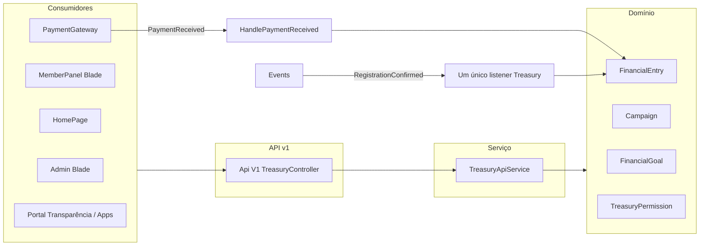

# Upgrade completo do módulo Treasury

## Contexto e riscos

- **Treasury** é o módulo de controle fiscal, gastos, receitas, prestação de contas e suporte à formalização legal/auditoria (declaração de renda, governo). Qualquer erro pode afetar dados financeiros e integrações.
- **Integrações atuais**: PaymentGateway (PaymentReceived → FinancialEntry), Events (RegistrationConfirmed → FinancialEntry), HomePage (Campaign::active()), Ministries (FinancialEntry.ministry_id). Nenhuma rota legada estilo worship/api; o único “API” é o **apiResource** em [routes/api.php](../../../../../Users/Administrator/.cursor/plans/routes/api.php) que aponta para um **controller stub** que retorna views inexistentes (treasury::admin.index, etc.) e métodos vazios.
- **Duplicação crítica**: Dois listeners criam entrada financeira para o mesmo evento **RegistrationConfirmed**:
  - [Modules/Events/app/Listeners/CreateFinancialEntry.php](../../../../../Users/Administrator/.cursor/plans/Modules/Events/app/Listeners/CreateFinancialEntry.php) (referência `EVENT-REG-{id}`)
  - [Modules/Treasury/app/Listeners/RegistrationConfirmedListener.php](../../../../../Users/Administrator/.cursor/plans/Modules/Treasury/app/Listeners/RegistrationConfirmedListener.php) (referência `REG-{id}`)
    Resultado: **duas entradas por inscrição confirmada**. Deve haver um único ponto de criação (Treasury) e convenção única de reference_number.

---

## Arquitetura alvo (padrão Worship/Notifications/PaymentGateway)

- **TreasuryApiService**: lógica de leitura/agregados (dashboard, reports, listagens filtradas), criação de entradas a partir de eventos e exposição para API. Controllers web (Admin/Member) passam a usar o serviço onde fizer sentido para evitar duplicação e permitir reuso na API.
- **Api\V1\TreasuryController**: endpoints JSON `{ data }` para dashboard, entries (list/filters), campaigns, goals, reports (agregados e export), permissions (list); todos consumindo TreasuryApiService.
- **Rotas**: sem legado. Admin continua em [Modules/Treasury/routes/web.php](../../../../../Users/Administrator/.cursor/plans/Modules/Treasury/routes/web.php) (prefix `treasury`). Member em [routes/member.php](../../../../../Users/Administrator/.cursor/plans/routes/member.php) (prefix `tesouraria`). Nova API em [routes/api.php](../../../../../Users/Administrator/.cursor/plans/routes/api.php) no grupo `v1` com prefixo `treasury` (ex.: `GET/POST /api/v1/treasury/...`), **substituindo** o apiResource atual do stub.

---

## Fase 1 – Análise e correção de duplicação (sem remover nada ainda)

1. **Unificar listener RegistrationConfirmed**

- Manter **apenas** o listener do Treasury como responsável por criar `FinancialEntry` para evento Events.
- Em [Modules/Treasury/app/Listeners/RegistrationConfirmedListener.php](../../../../../Users/Administrator/.cursor/plans/Modules/Treasury/app/Listeners/RegistrationConfirmedListener.php): usar **reference_number** único e estável (ex.: `REG-{registration->id}`) e **verificar** `FinancialEntry::where('reference_number', $ref)->exists()` antes de criar, para idempotência.
- Em [Modules/Events/app/Providers/EventServiceProvider.php](../../../../../Users/Administrator/.cursor/plans/Modules/Events/app/Providers/EventServiceProvider.php): **não** registrar `CreateFinancialEntry` para `RegistrationConfirmed` (já não está no array; garantir que com `$shouldDiscoverEvents = true` o Events não registre CreateFinancialEntry – se descobrir, desregistrar ou mover lógica para Treasury e marcar CreateFinancialEntry como deprecated/empty).
- **Decisão**: Remover a criação de FinancialEntry de [Modules/Events/app/Listeners/CreateFinancialEntry.php](../../../../../Users/Administrator/.cursor/plans/Modules/Events/app/Listeners/CreateFinancialEntry.php) (deixar método vazio ou chamar um serviço do Treasury) **ou** remover esse listener do discovery e documentar que só o Treasury cria entrada. Preferível: Treasury como único dono; Events’ CreateFinancialEntry pode ser convertido em um dispatch opcional para Treasury ou removido após testes.
- Incluir no Treasury listener: preenchimento de `payment_id` quando a inscrição tiver pagamento vinculado (se o modelo Registration tiver relação com Payment), para rastreabilidade fiscal.

2. **Auditar HandlePaymentReceived**

- Revisar [Modules/Treasury/app/Listeners/HandlePaymentReceived.php](../../../../../Users/Administrator/.cursor/plans/Modules/Treasury/app/Listeners/HandlePaymentReceived.php): garantir idempotência (já existe checagem por financialEntry), categorias alinhadas ao uso (Dízimo, Oferta, Campanha, Ministério, Evento, Doação) e que não haja conflito com RegistrationConfirmed (ex.: pagamento de evento já criar entrada via PaymentReceived e depois RegistrationConfirmed não duplicar).

---

## Fase 2 – Serviço e API v1 (sem alterar comportamento das views)

1. **Criar TreasuryApiService**

- Ficheiro: [Modules/Treasury/App/Services/TreasuryApiService.php](../../../../../Users/Administrator/.cursor/plans/Modules/Treasury/App/Services/TreasuryApiService.php).
- Métodos (espelho da lógica atual dos controllers, extraindo de DashboardController e ReportController):
  - **Dashboard**: `getDashboardStats(User|int)` → totais mensais/anuais, por categoria (receita/despesa), últimas entradas, campanhas ativas, metas ativas, dados para gráfico (ex.: últimos 6 meses).
  - **Entries**: `listEntries(array $filters, int $perPage)` (type, category, start_date, end_date, campaign_id, ministry_id); `getEntry(int $id)`; `createEntry(array $data)`; `updateEntry(FinancialEntry $entry, array $data)`; `deleteEntry(FinancialEntry $entry)`; `importPayment(Payment $payment)` (lógica atual do FinancialEntryController).
  - **Campaigns**: `listCampaigns()`, `getCampaign(int $id)`, `createCampaign(array $data)`, `updateCampaign`, `deleteCampaign`.
  - **Goals**: `listGoals()`, `getGoal(int $id)`, `createGoal`, `updateGoal`, `deleteGoal`, e uso de `updateCurrentAmount()` onde já existir.
  - **Reports**: `getReportAggregates(string $startDate, string $endDate)` (totais, por categoria, por dia, por método de pagamento, por mês, maiores entradas/saídas, etc.) – espelho do que ReportController hoje calcula.
  - **Permissions**: `listPermissions()`, `getPermission`, `createPermission`, `updatePermission`, `deletePermission`.
- Regras de permissão: receber `TreasuryPermission` ou user e validar `canViewReports`, `canCreateEntries`, etc., dentro do serviço ou em middleware; a API deve retornar 403 quando o usuário não tiver permissão.
- Não remover lógica dos controllers nesta fase; apenas extrair para o serviço e fazer os controllers chamarem o serviço (refactor incremental), para que a API v1 use o mesmo serviço.

2. **Criar Api\V1\TreasuryController**

- Ficheiro: [Modules/Treasury/App/Http/Controllers/Api/V1/TreasuryController.php](../../../../../Users/Administrator/.cursor/plans/Modules/Treasury/App/Http/Controllers/Api/V1/TreasuryController.php).
- Respostas sempre `{ data }` (e quando aplicável `message`). Autenticação: `auth:sanctum` ou `web`+`auth` conforme padrão do projeto; middleware de permissão Treasury (ex.: checar TreasuryPermission para cada área).
- Endpoints sugeridos (todos via TreasuryApiService):
  - `GET /api/v1/treasury/dashboard` → dashboard stats.
  - `GET /api/v1/treasury/entries` (query: type, category, start_date, end_date, campaign_id, ministry_id, page, per_page).
  - `GET /api/v1/treasury/entries/{id}`.
  - `POST /api/v1/treasury/entries` (create).
  - `PUT /api/v1/treasury/entries/{id}` (update).
  - `DELETE /api/v1/treasury/entries/{id}`.
  - `POST /api/v1/treasury/entries/import-payment/{paymentId}` (importar pagamento).
  - `GET /api/v1/treasury/campaigns`, `GET /api/v1/treasury/campaigns/{id}`, `POST/PUT/DELETE` para campaigns.
  - `GET /api/v1/treasury/goals`, `GET /api/v1/treasury/goals/{id}`, `POST/PUT/DELETE` para goals.
  - `GET /api/v1/treasury/reports` (query: start_date, end_date) → agregados do relatório.
  - Exportações (Excel/PDF) podem permanecer como download via web (ou API que devolve stream); se expostas na API, manter formato atual.
  - `GET /api/v1/treasury/permissions`, CRUD permissions (apenas admin Treasury).
- Documentar no AGENTS.md que consumidores (HomePage, futuro portal de transparência, apps) devem usar apenas `/api/v1/treasury/`\*.

3. **Rotas API**

- Em [routes/api.php](../../../../../Users/Administrator/.cursor/plans/routes/api.php): **remover** `Route::apiResource('treasuries', ... TreasuryController::class)` (stub).
- Registrar grupo `v1/treasury` com prefixo e nome `treasury.api.`\*, apontando para `Modules\Treasury\App\Http\Controllers\Api\V1\TreasuryController`, com middleware de auth e throttle; agrupar rotas por recurso (dashboard, entries, campaigns, goals, reports, permissions).
- Deixar [Modules/Treasury/routes/api.php](../../../../../Users/Administrator/.cursor/plans/Modules/Treasury/routes/api.php) vazio ou com comentário de que a API é centralizada em `routes/api.php` (como em Worship); **não** carregar esse ficheiro no RouteServiceProvider do Treasury (já está assim).

4. **Stub e views inexistentes**

- O [Modules/Treasury/app/Http/Controllers/Admin/TreasuryController.php](../../../../../Users/Administrator/.cursor/plans/Modules/Treasury/app/Http/Controllers/Admin/TreasuryController.php) atual é usado **apenas** pelo apiResource; não é usado pelas rotas web do módulo (que usam DashboardController, FinancialEntryController, etc.). Após registrar a nova API v1 em `routes/api.php` e remover o apiResource, esse controller Admin\TreasuryController pode ser **removido** (ou renomeado/arquivado) para evitar confusão. **Antes de remover**: confirmar que nenhuma rota nem referência em código (incl. Admin layout) chama esse controller. Sidebar e dashboard usam `treasury.dashboard`, `treasury.entries.index`, etc., que apontam para outros controllers – então a remoção é segura após troca das rotas API.

---

## Fase 3 – Controllers web e views (melhorias sem quebrar)

1. **Refatorar controllers Admin para usar TreasuryApiService**

- DashboardController, ReportController, FinancialEntryController, CampaignController, FinancialGoalController, TreasuryPermissionController: passar a delegar leitura e escritas ao TreasuryApiService onde for possível (dashboard stats, report aggregates, create/update entry, import payment, etc.), mantendo a mesma resposta HTTP e redirecionamentos para as views atuais. Objetivo: uma única fonte de verdade e API v1 alinhada ao que a web usa.

2. **MemberPanel TreasuryController (proxy)**

- O [Modules/Treasury/app/Http/Controllers/MemberPanel/TreasuryController.php](../../../../../Users/Administrator/.cursor/plans/Modules/Treasury/app/Http/Controllers/MemberPanel/TreasuryController.php) hoje faz proxy para os controllers Admin. Manter esse padrão; opcionalmente fazer o proxy chamar o TreasuryApiService em alguns métodos (ex.: dashboard) para evitar duplicação, em linha com o DashboardController Admin.

3. **Views – padronização e melhorias**

- **Layout e ícones**: garantir uso de `x-icon` (Font Awesome 7.1 Pro Duotone) e do layout master conforme [system_default.md](../../../../../Users/Administrator/.cursor/plans/system_default.md); loading com `x-loading-overlay` em submissões de formulário.
- **Admin**: [Modules/Treasury/resources/views/admin/](../../../../../Users/Administrator/.cursor/plans/Modules/Treasury/resources/views/admin) (dashboard, entries, campaigns, goals, permissions, reports). Revisar tabelas, filtros e formulários para acessibilidade e consistência com o restante do admin; relatórios PDF/Excel já existentes – manter e, se necessário, expor geração via serviço para a API.
- **MemberPanel**: [Modules/Treasury/resources/views/memberpanel/](../../../../../Users/Administrator/.cursor/plans/Modules/Treasury/resources/views/memberpanel) – mesma linha (ícones, loading, consistência). Garantir que rotas e nomes de rota (memberpanel.treasury.) permaneçam iguais para não quebrar links.
- **Portal de transparência**: se for requisito, pode ser um endpoint público ou página pública (ex.: GET /api/v1/treasury/transparency/summary ou /transparencia) que retorna apenas dados agregados anônimos (totais por período, por categoria), sem dados de entradas individuais; implementar em fase posterior após definir escopo exato.

4. **Fiscal e regulação**

- Garantir que categorias de entrada (Dízimo, Oferta, Campanha, etc.) estejam centralizadas (enum ou config) e usadas de forma consistente no listener, no serviço e nos relatórios.
  - Relatórios de dízimos e ofertas (tithes_offerings_pdf) e exportações Excel/PDF: manter e, se possível, gerar via TreasuryApiService para reuso (ex.: endpoint de export que devolve ficheiro).
  - Não alterar estrutura de tabelas ou assinaturas de eventos sem migração e testes explícitos.

---

## Fase 4 – Limpeza e documentação

1. **Código morto**

- **Antes de remover qualquer coisa**: procurar referências a `TreasuryController` (Admin), `treasury::admin.index`, `treasury::admin.create`, etc. em rotas, views e links. Só após confirmar que a nova API v1 está registrada e o apiResource antigo removido, remover o controller stub e, se existirem, views inexistentes referenciadas por ele.
  - [Modules/Treasury/routes/api.php](../../../../../Users/Administrator/.cursor/plans/Modules/Treasury/routes/api.php): não carregado; pode ficar vazio com comentário “API centralizada em routes/api.php”.

2. **AGENTS.md e documentação**

- Adicionar secção **Treasury** em [AGENTS.md](../../../../../Users/Administrator/.cursor/plans/AGENTS.md):
  - Descrição: controle fiscal, receitas, despesas, campanhas, metas, relatórios, prestação de contas; integração com PaymentGateway (PaymentReceived) e Events (RegistrationConfirmed).
  - API v1: único ponto de consumo para dados de tesouraria; formato `{ data }`; prefixo `/api/v1/treasury/`\*; serviço TreasuryApiService; controller Api\V1\TreasuryController.
  - Rotas web: Admin em módulo (prefix `treasury`), Member em routes/member.php (prefix `tesouraria`). Sem rotas legadas tipo treasury/api.
  - Listeners: HandlePaymentReceived (PaymentGateway), RegistrationConfirmedListener (Events) – único criador de entrada para inscrições; Events’ CreateFinancialEntry deve deixar de criar entrada (ver Fase 1).
  - Integrações: PaymentGateway (payments, donations, Campaign), Events (RegistrationConfirmed → FinancialEntry), HomePage (Campaign::active()), Ministries (ministry_id em FinancialEntry).

---

## Ordem de execução recomendada

1. Fase 1 (listeners e idempotência) – evita duplicação de entradas imediatamente.
2. Fase 2 (TreasuryApiService + Api\V1\TreasuryController + rotas em routes/api.php + remoção do apiResource stub).
3. Fase 3 (refatorar controllers web para usar o serviço; padronizar views).
4. Fase 4 (remover stub, documentar, verificar código morto).

---

## O que não fazer (para não quebrar)

- Não alterar prefixos das rotas web existentes (`treasury.*`, `memberpanel.treasury.*`) sem atualizar sidebar e todos os links.
- Não remover ou alterar modelos FinancialEntry, Campaign, FinancialGoal, TreasuryPermission sem migrações e ajuste de listeners e PaymentGateway.
- Não remover HandlePaymentReceived nem o vínculo Payment ↔ FinancialEntry.
- Não expor na API pública dados sensíveis (ex.: relatórios completos) sem controle de permissão (TreasuryPermission); portal de transparência apenas agregados anônimos.
