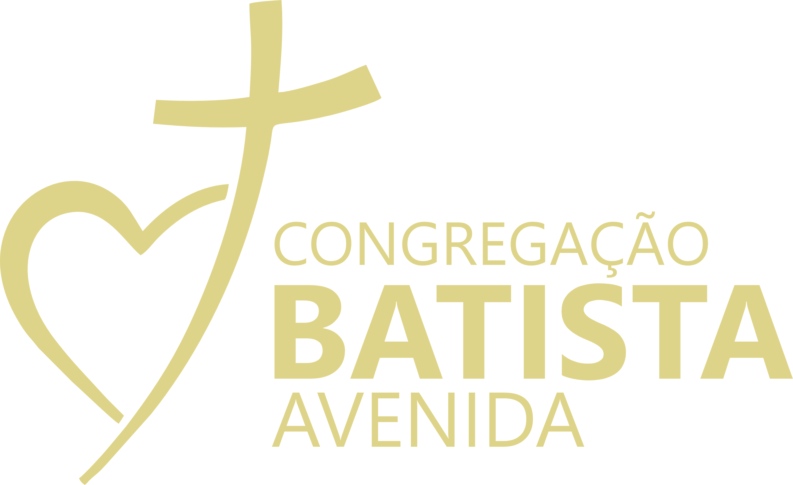

<div align="center">
  

  ### Escola de Pastores e Líderes (VEPL)
  **The ultimate ecosystem for church leadership and ministry excellence.**

  [](https://laravel.com)
  [](https://tailwindcss.com)
  [](LICENSE)
  [](https://github.com/RabbitVisual)

  *Capacitando o corpo de Cristo através de alta performance, design premium e teologia bíblica.*
</div>

---

## 📖 Visão Geral

A **VEPL (Escola de Pastores e Líderes)** é uma plataforma avançada de gestão e capacitação ministerial. Diferente de sistemas genéricos de gestão de igrejas, a VEPL foi desenhada sob o conceito de **Monolito Modular**, unificando a governança institucional (Tesouraria, Ativos, Eventos) com a jornada de crescimento espiritual (Academia, Mentoria, Louvor e Bíblia).

O sistema é o braço tecnológico definitivo para ministérios que buscam excelência operacional sem abrir mão da essência bíblica.

---

## 🎨 O Padrão Vertex (Vertex Standard)

O desenvolvimento da VEPL segue rigorosos padrões de qualidade para garantir uma experiência de usuário excepcional:

- **Elegância Corporativa**: Design focado em legibilidade ("book-like"), glassmorphism sutil e interfaces didáticas.
- **Performance Nativa**: Sem CDNs externos. Fontes e ativos são servidos localmente para máxima velocidade e privacidade.
- **In-App Assistant**: Integração com assistentes inteligentes contextualizados por página para guiar pastores e alunos.
- **FontAwesome 7.1 Pro**: Ícones duotone de alta qualidade em todo o sistema.

---

## 🛠️ Stack Tecnológico

- **Core**: [Laravel 12](https://laravel.com) (PHP 8.2+)
- **Frontend**: [Tailwind CSS v4.1](https://tailwindcss.com) & [Alpine.js v3](https://alpinejs.dev)
- **Arquitetura**: Monolito Modular (Nwidart)
- **Database**: MySQL 8.0+
- **Ícones**: FontAwesome 7.1 Pro (Local)

---

## 🏗️ Ecossistema de Módulos

A VEPL é composta por **18 módulos especializados**, cada um focado em uma área crítica do ministério:

| Módulo            | Descrição                                                                                       |
| ----------------- | ----------------------------------------------------------------------------------------------- |
| **Admin**         | Núcleo do sistema: gestão de usuários, permissões (RBAC) e auditoria global.                    |
| **Academy (EBD)** | LMS avançado com gamificação, XP, níveis e trilhas de aprendizado ministerial.                  |
| **Worship**       | Gestão de louvor: repertório, escalas, ChordPro e a Academia de Levitas (Masterclasses).        |
| **Bible**         | O núcleo espiritual: múltiplas versões offline, estudos interlineares e suporte Hebraico/Grego. |
| **Sermons**       | Acervo de mensagens em vídeo e áudio com catalogação teológica.                                 |
| **Events**        | Ciclo completo de eventos: inscrições públicas, lotes, QR check-in e certificados.              |
| **Treasury**      | Gestão financeira total: fluxo de caixa, campanhas, metas e relatórios fiscais.                 |
| **Ministries**    | Estruturação de departamentos (Jovens, Mulheres, Casais, etc.).                                 |
| **SocialAction**  | Gestão de benevolência e logística de cestas (Smart Pantry).                                    |
| **Intercessor**   | Rede de oração moderada com rastreamento de compromissos em tempo real.                         |
| **Projection**    | Sistema de projeção ao vivo (letras, bíblia e slides) operado via navegador.                    |
| **MemberPanel**   | Painel exclusivo do membro para interação, dízimos e cursos.                                    |

---

## 🚀 Como Iniciar

### Pré-requisitos
- PHP 8.2+
- MySQL 8.0+
- Composer & Node.js 22+

### Instalação Rápida
```bash
# Clone o repositório
git clone https://github.com/RabbitVisual/VEPL.git
cd VEPL

# Dependências Backend
composer install
cp .env.example .env
php artisan key:generate

# Dependências Frontend
npm install
npm run build

# Banco de Dados Profissional (Cuidado em produção!)
php artisan migrate:fresh --seed
```

---

## 📜 Licença

Este projeto é de **uso privado** e está sob uma **licença proprietária**. A redistribuição, uso comercial ou modificação não são permitidos sem autorização explícita da **Vertex Solutions LTDA**. Veja o arquivo [LICENSE](LICENSE) para detalhes.

---

<div align="center">
  
  <br>
  © 2026 Vertex Solutions LTDA. Todos os direitos reservados.
  <br>
  <em>VEPL: High Performance for the Higher Calling.</em>
</div>
